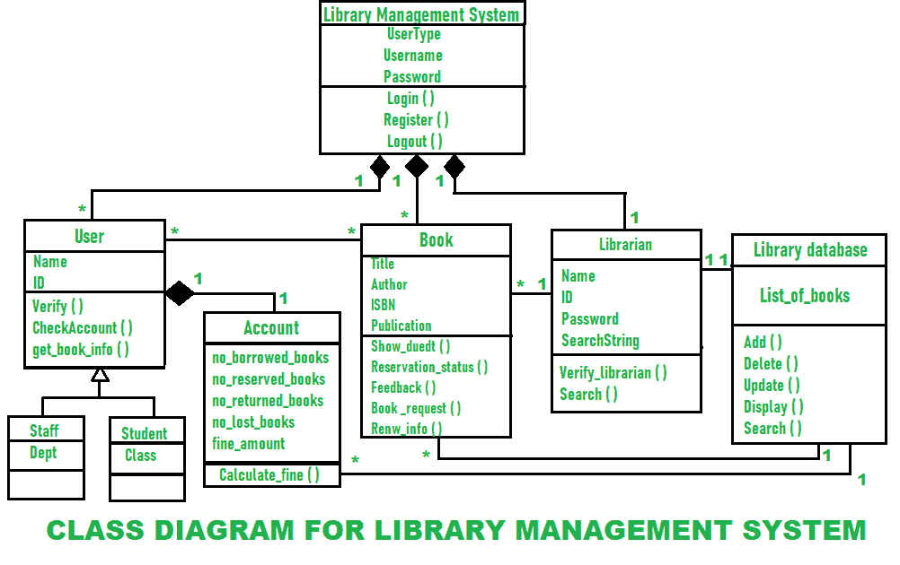

# 图书管理系统类图

> 原文: [https://www.geeksforgeeks.org/class-diagram-for-library-management-system/](https://www.geeksforgeeks.org/class-diagram-for-library-management-system/)

在[面向对象建模](https://www.geeksforgeeks.org/types-of-models-in-object-oriented-modeling-and-design/)中，主要构建块一般表示系统中不同的对象、它们的属性、它们的不同功能以及对象之间的关系。这些构件被称为**类图**。

类图通常用于软件应用程序静态视图的概念建模，以及以详细的方式将模型转换成编程代码的建模。在开发或构建软件系统时，类图被广泛使用。它们也用于数据建模。它用于显示类、类之间的关系、接口、关联等。类图中的类只是一个对象的蓝图。它简单地描述和解释了系统中不同类型的对象，以及它们之间存在的不同类型的关系。

## 图书馆管理系统的类图

聚合和多重性是设计类图时需要考虑的两个要点。让我们详细了解一下。

### 聚合

聚合只是简单地展示了一个事物可以独立于其他事物而存在的关系。它意味着在定义一个类时一起创建或组合不同的抽象。聚合在类图中表示为关系的一部分。在下面给出的图表中，我们可以看到聚合是由菱形末端指向超类的边来表示的。“图书馆管理系统”是由各种类组成的超类。

如图所示，这些类是用户类、图书类和图书管理员类。此外，对于“帐户”类，“用户”是一个超类。所有这些都共享一种关系，这些关系被称为聚合关系。

### 多重性

多重性意味着一个类的元素数量与另一个类相关联。这些关系可以是一对一、多对多、多对一或一对多。对于表示一个元素，我们使用 `1`，对于零个元素我们使用 `0`，对于多个元素我们使用 `*`。我们可以在图中看到；许多用户与许多书籍相关联，用 `*` 表示，这代表了一种**多对多**类型的关系。一个用户只有一个帐户，用 `1` 表示，这代表了一种**一对一**类型的关系。

许多书与一个图书管理员相关联，这代表了**多对一**或**一对多**类型的关系。所有这些关系都显示在图表中。

图书馆管理系统类图简单描述了图书馆管理系统类的结构、属性、方法或操作、对象之间的关系。

## 图书馆管理系统的类别

*   **图书馆管理系统类** – 管理图书馆管理系统的所有操作。它是为其设计软件的组织的核心部分。
    *   **用户类** – 管理用户的所有操作。
    *   **图书管理员类** – 管理图书管理员的所有操作。
    *   **图书类** – 管理图书的所有操作。它是系统的基本构件。
    *   **账户类** – 管理账户的所有操作。
    *   **库数据库类** – 管理库数据库的所有操作。
    *   **员工班** – 管理员工的所有操作。
    *   **学生班** – 管理学生的所有操作。

## 图书馆管理系统属性

*   **库管理系统属性** – `userType`, `username`, `password`
    *   **用户属性** – `name`, `id`
    *   **图书管理员属性** – `name`, `id`, `password`, `searchString`
    *   **图书属性** – `title`, `author`, `ISBN`, `publication`
    *   **账户属性** – `noOfBooksIssued`, `noOfBooksReserved`, `noOfBooksReturned`, `noOfBooksLost`, `noOfFineAmount`
    *   **图书馆数据库属性** – `bookList`
    *   **员工类别属性** – `department`
    *   **学生班级属性** – `class`

## 图书馆管理系统方法

*   **图书馆管理系统方法** – `login()`, `register()`, `logout()`
    *   **用户方法** – `validate()`, `checkAccount()`, `getBookInfo()`
    *   **图书管理员方法** – `validateLibrarian()`, `search()`
    *   **预订方法** – `showDueDate()`, `bookStatus()`, `feedback()`, `bookRequest()`, `renewInfo()`
    *   **核算方法** – `calculateFine()`
    *   **库数据库方法** – `add()`, `delete()`, `update()`, `display()`, `search()`

## 图书管理系统类图

