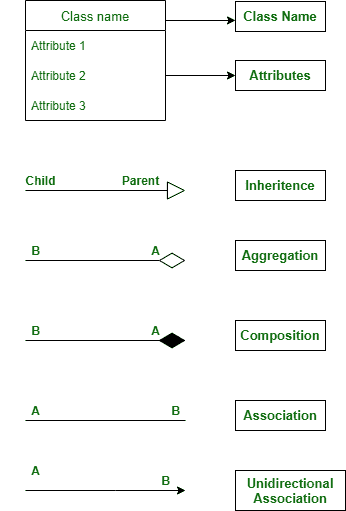

# 学校管理系统班级图

> 原文：[https://www.geeksforgeeks.org/class-diagram-for-school-management-system/](https://www.geeksforgeeks.org/class-diagram-for-school-management-system/)

类图是描述任何系统的各个模块之间关系的方式。在这里，我们看到了学校管理系统中涉及的班级和关系。

## 类

*   `SchoolAdministration` – 本课包含学校的整体细节。
*   `ClassRoom` – 这门课包含教室的细节。
*   `Student` – 这个班是两个孩子班的基础班——小学生和高中生。因为小学生是学生，高中生是学生。
*   `PrimaryStudent` – 该班为学生的子班，包含 1 班至 10 班之间的标准详情。
*   `HigherSecondaryStudent` – 该班为学生的子班，包含标准 11 班和 12 班的详细信息。
*   `Department` – 本课包含学校内部门的详细信息。
*   `Laboratory` – 本课程包含任何学校的实验室详细信息及其必要信息。
*   `Employee` – 该班是两个子班——教师和支持人员的基础班。因为教师是员工，支持人员是员工。
*   `Teacher` – 该班级是 `Employee` 的子班级，包含教师的详细信息。
*   `SupportStaff` – 该类是 `Employee` 的子类，包含非教学人员、公交司机等支持人员的详细信息。
*   `NoticeBoard` – 本课程包含布告栏的详细信息及其信息。
*   `Bus` – 该类显示每个区域的公交详情，以及特定公交和公交所到区域的司机详情。
*   `Equipment` – 该类是两个子类——实验室设备和类设备的基础类。因为实验室设备是一种设备，班级设备是一种设备。
*   `LabEquipment` – 该类是 `Equipment` 的子类，它包含实验室所需的所有设备的详细信息，如试管、显微镜、计算机等。
*   `ClassEquipments` – 本课程是“设备”的子课程，包含任何教室所需的所有设备的详细信息，如风扇、长凳、灯。
*   `Auditorium` – 本课程包含学校礼堂的详细信息以及与之相关的细节，如座位细节、活动细节等。
*   `Playground` – 本课包含任何学校操场的详细信息，也显示操场是否有人。

## 属性

*   `SchoolAdministration` – 学校名称、地址、联系电话、医学研究
*   `ClassRoom` – 班级标识、班级名称、教师、学生人数、设备标识
*   `Student` – 学生标识、学生姓名、班级标识、部门、业务
*   `Department` – 部门标识、部门名称、主管名称、成员列表
*   `Laboratory` – 实验室标识、目标标识、实验室名称、设备标识
*   `Employee` – 员工标识、员工姓名、工资、部门标识
*   `NoticeBoard` – 新闻列表，在目标名称中
*   `Bus` – 总线、驱动程序、区域列表、总线号、容量。
*   `Equipment` – 设备号，成本
*   `LabEquipment` – 设备名称、设备数量
*   `ClassEquipments` — 分类、本奇计数、派拉蒙、莱特计数
*   `Auditorium` – 总座位数、座位数、活动名称、活动日期、活动时间
*   `Playground` – 区域，班级编号

## 方法

### 1. 校长管理

*   `IsOpen()` – 这个方法是检查学校是否开放。
*   `schoolDetails()` – 此方法显示学校的详细信息，如学校名称、所在地区、所在州等。

### 2. 教室

*   `classDetails()` – 此方法包含教室的详细信息。

### 3. 学生

*   `studentDetails()` – 这包含学校中每个学生的详细信息以及他们的个人详细信息，他们属于哪个班级。
*   `payFees()` – 此方法显示每个学生的费用详细信息，并允许学生支付费用。

### 4. 部门

*   `departmentDetails()` – 本课程包含学校的各个部门，如英语、泰米尔语、艺术等。

### 5. 实验室

*   `labDetails()` – 这显示了实验室的详细信息及其主要名称。
*   `isOccupied()` – 此方法告知实验室是否有人。
*   `payFine()` – 该方法显示了某个特定学生损坏实验室任何设备的细节。

### 6. 员工

*   `employeeDetails()` – 此方法显示员工的详细信息以及他们的任命和工资详细信息。
*   `checkIn()` – 这显示特定员工是否签入学校。
*   `receiveSalary()` – 包含工资明细，显示他们是否领取了工资。

### 7. 布告栏

*   `Display()` – 这种方法是显示公告板上的所有新闻或任何事件细节或任何新信息。
*   `addContent()` – 这是向公告栏添加任何新内容。

### 8. 总线

*   `busDetails()` – 该方法包含总线的详细信息。
*   `showSeats()` – 这显示了特定公共汽车中的座位详细信息。

### 9. 设备

*   `equipmentDetails()` – 包含实验室设备的详细信息以及该级别的设备
*   `purchaseEquipment()` – 此方法用于购买设备，包含新购买设备的详细信息。
*   `repair()` – 这种方法是修理任何设备。

### 10. 礼堂

*   `bookAuditorium()` – 这种方法是由学校内部的任何部门预订礼堂，以进行任何活动或客座讲座。
*   `eventDetails()` – 该方法显示特定日期的任何事件的详细信息。
*   `showSeats()` – 此方法显示任何活动的礼堂中的可用座位。

### 11. 操场

*   `isOccupied()` – 此方法告知操场是否有人。

## 关系

### 继承

继承是子类从父类或基类获取资源的概念。在继承中，允许共享属性的类称为父类，从父类获取属性的类称为子类。继承大大减少了重新编码的需要，并允许代码重用。

> 在这里，
> *   `Student` - `PrimaryStudent`, `HigherSecondaryStudent`
> *   `Employee` - `Teacher`, `SupportStaff`
> *   `Equipment` – `LabEquipment`, `ClassEquipments`
>
> 上面提到的类遵循继承。

### 关联

关联是一种关系，在这种关系中，两个类使用彼此和它们的方法。在关联中，没有一个类是另一个类的所有者，因为两个类相互使用，仍然保留在自己的空间中。

#### 单向关联

单向关联是指一个特定的类使用另一个类及其方法，但不在该类内部组成。

> 下面提到的类遵循单向关联，
> *   `Student` 与 `ClassRoom`
> *   `Student` 和 `Bus`
> *   `Student` 和 `Playground`
> *   `Student` 和 `NoticeBoard`
> *   `SchoolAdministration` 和 `Auditorium`
>
> 学生使用教室、公共汽车、操场和告示牌，学校管理层使用礼堂。

### 聚合

聚合是一种关系，其中一个类依赖于另一个类，但即使没有另一个类也可以存在。简而言之，依赖类在物理上并不包含在独立类中。

> 下面提到的类遵循聚合，
> *   `SchoolAdministration` 和 `Student`
> *   `SchoolAdministration` 和 `Playground`
> *   `SchoolAdministration` 和 `Bus`
> *   `Teacher` 和 `Student`
>
> 没有学校，学生、操场和公共汽车也能存在。没有老师，学生也能生存。

### 成分

组合是一种关系类型，其中一个特定的类拥有另一个类。在组合中，依赖类不能在没有独立类的情况下存在，并且物理上包含在独立类中。

> 下面提到的类跟在 Composition 后面，
> *   `SchoolAdministration` 和 `Department`
> *   `Laboratory` 和 `Equipment`
>
> 没有学校，部门就不能存在。同样，没有实验室，设备也无法存在。

### 符号

### 类图

