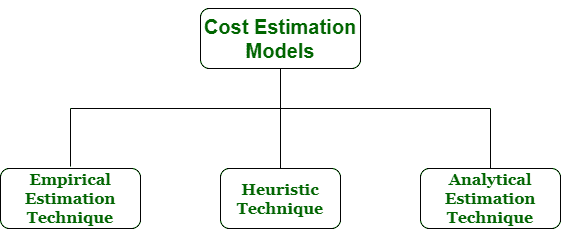

# 软件工程中的成本估算模型

> 原文：[https://www.geeksforgeeks.org/cost-estimation-models-in-software-engineering/](https://www.geeksforgeeks.org/cost-estimation-models-in-software-engineering/)

`成本估算`简单来说就是一种用来找出成本估算的技术。成本估算是在[软件工程](https://www.geeksforgeeks.org/software-engineering/)中开发和测试软件的财务支出。成本估算模型是用于估算产品或项目成本的一些数学算法或参数方程。

各种技术或模型可用于成本估算，也称为成本估算模型，如下所示：


## 1. 经验估算技术

`经验估算`是一种技术或模型，其中使用经验推导出的公式来预测数据，这些数据是软件项目规划步骤中必需且重要的部分。这些技术通常基于先前从项目中收集的数据，以及一些猜测、开发类似项目的先前经验和假设。它使用软件的大小来估算工作量。

在这种技术中，对项目参数进行有根据的猜测。因此，这些模型是基于常识的。然而，由于经验估计技术涉及许多活动，所以这种技术是形式化的。例如德尔菲法和专家判断法。

## 2. 启发式技术

`启发式`一词源于希腊语，意为“发现”。启发式技术是一种用于解决问题、学习或发现的技术或模型，它使用实用的方法来实现即时目标。这些技术灵活且简单，可以通过捷径和足够好的计算来快速做出决策，尤其是在处理复杂数据时。但使用此技术做出的决策不一定是最优的。

在这种技术中，不同项目参数之间的关系用数学方程表示。流行的启发式技术是由[建设性成本模型(`COCOMO`)](https://www.geeksforgeeks.org/software-engineering-cocomo-model/)给出的。这种技术也用于增加或加快分析和投资决策。

## 3. 分析估算技术

`分析估算`是一种用于衡量工作的技术。在这种技术中，首先将任务分解为其基本的组成部分或元素进行分析。其次，如果标准时间可从其他来源获得，则将这些时间应用于工作的每个元素或组成部分。

第三，如果没有这样的时间，那么工作是根据工作经验来估计的。在这种技术中，结果是通过对项目做出某些基本假设而得出的。因此，分析估计技术具有一定的科学依据。[霍尔斯特德的](https://www.geeksforgeeks.org/software-engineering-halsteads-software-metrics/)软件科学是基于一个分析估计模型。

```
if (condVar > someVal) {console.log("xxx")}
```