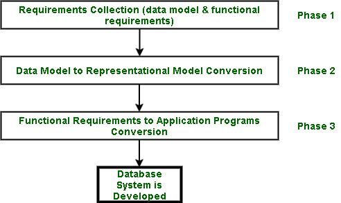

# 数据库系统的开发阶段

> 原文: [https://www.geeksforgeeks.org/development-phases-of-database-system/](https://www.geeksforgeeks.org/development-phases-of-database-system/)

数据库系统分以下几个阶段开发:

## 阶段-1: 需求收集阶段

这个阶段的目标是从涉众和用户那里收集正确的需求。只有当用户清楚地了解自己的需求时，这才是可能的。如果用户不清楚自己的需求，整个过程就会偏离轨道。整个系统建立在这一阶段的发现之上；因此，这是一个非常重要的阶段。在此阶段收集了以下两种需求:

### 1. `Data model requirements`
这些需求涉及需要存储的不同数据片段以及它们彼此之间的关系。数据模型需求使用概念级数据模型来表示，例如[实体/关系模型 (`ER model`)](https://www.geeksforgeeks.org/introduction-of-er-model/)和[统一建模语言 (`UML`)](https://www.geeksforgeeks.org/unified-modeling-language-uml-introduction/)。

**注–**
`UML` 在大规模软件开发过程中更受欢迎。

### 2. [功能需求](https://www.geeksforgeeks.org/functional-vs-non-functional-requirements/)
这涉及到正在为其开发数据库的企业所承担的日常任务和操作。例如，医院系统的功能需求将是: 获取新药、维护医生记录、维护患者记录、添加新的患者记录等。

## 阶段-2: [数据模型](https://www.geeksforgeeks.org/data-models-in-dbms/)到表示模型的转换阶段

在这个阶段，我们需要将数据模型转换为表示级模型，例如 `Relational Data Model`，并选择一个 `RDBMS` 系统（即从 `RDBMS` 系统的提供商中选择，例如 `Oracle`、`DB2`、`MySQL`）来创建数据库。

## 阶段-3: 应用程序的功能需求转换阶段

在这个阶段，高级语言 (`HLL`)，如 `C`、`C++`、`Java` 等，与 `SQL` 结合使用，与数据库通信并修改它们，以捕获企业的日常活动（正在为其开发数据库系统）。