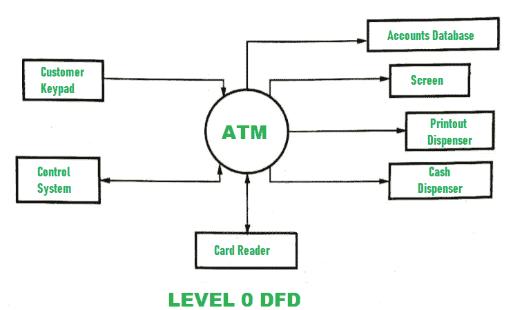
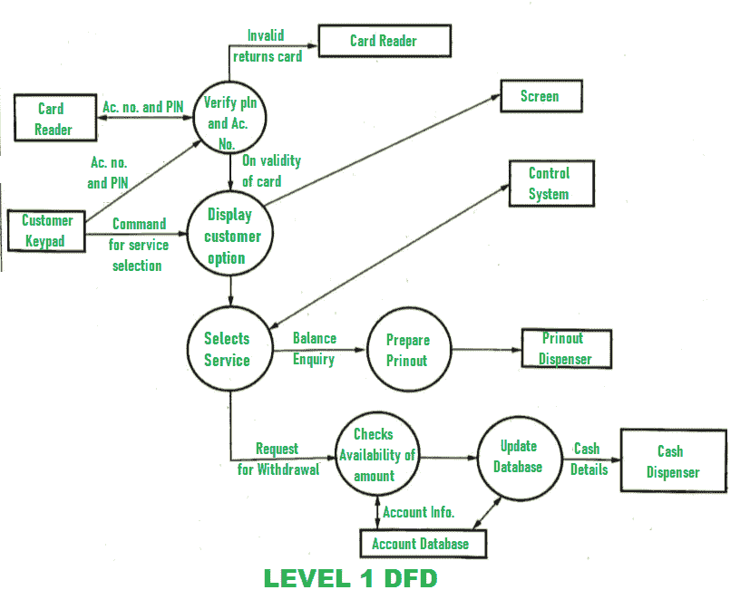

# DFD 为 ATM 系统

> 原文:[https://www.geeksforgeeks.org/dfd-for-atm-system/](https://www.geeksforgeeks.org/dfd-for-atm-system/)

自动柜员机系统的 DFD(数据流图)由两个级别的 DFD 组成。这些级别是 0 级 DFD 和 1 级 DFD。这两个级别都用来构成自动柜员机系统的 DFD。

## `Level 0 DFD`
这一级也被称为 `Context Level DFD`。在这一级，只描述了与系统交互的输入和输出。该级别的 DFD 如下所示：

## `Level 1 DFD`
在这一级，提供了关于 ATM 系统处理的更详细信息。该级别的 DFD 如下所示：

