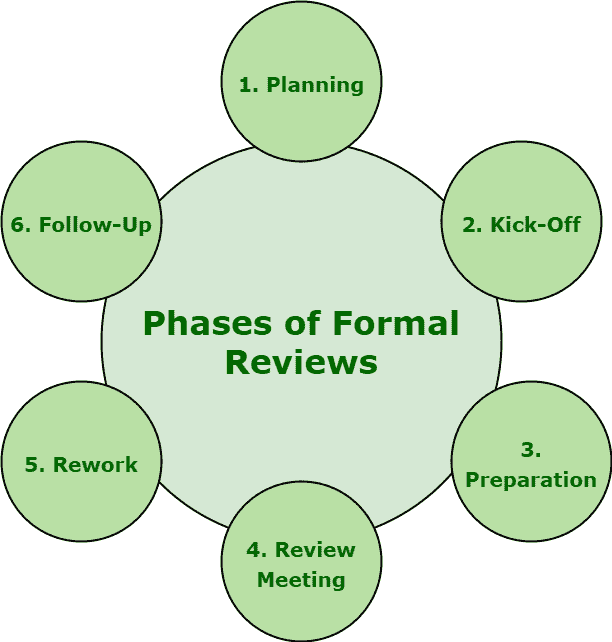

# 正式评审

> 原文: [https://www.geeksforgeeks.org/different-phases-of-formal-review/](https://www.geeksforgeeks.org/different-phases-of-formal-review/)

**正式评审**通常以零敲碎打的方式进行，包括六个必要的不同步骤。正式评审一般遵循正式流程。这也是静态测试中最重要和最基本的技术之一。

## 六个步骤

六个步骤极其重要，因为它们允许开发团队简单地确保和检查软件质量、效率和有效性。这些步骤如下:

1.  **策划:**
    对于具体评审，评审流程一般以作者向版主或评审组长简单的‘要求评审’开始。个人参与者根据他们对文档和角色的理解，简单地识别和确定缺陷、问题和评论。主持人还会执行进入检查，甚至考虑退出标准。

2.  **Kick-Off:**
    让所有人对评审文档达成共识是本次会议的主要目标。甚至进入结果和退出标准也会在这次会议上讨论。这基本上是一个可选的步骤。它还提供了团队对评审文档与其他文档之间关系的更好理解。在启动会议期间，也可以分发评审文档、源文档和所有其他相关文档。

3.  **Preparation:**
    在准备阶段，参与者借助相关文档、程序、规则和提供的检查清单，单独处理评审文档。拼写错误也会被记录在评审文档上，但不会在会议上提及。

    这些审查者通常会识别并确定，还会检查任何缺陷、问题或错误，并提供他们的意见，这些意见随后会在记录表的帮助下在审查文档时进行合并和记录。

4.  **Review Meeting:**
    此阶段通常涉及三个不同的阶段，即记录、讨论和决策。执行与评审文档相关的不同任务。

5.  **Rework:**
    作者基本上根据在评审会议中发现的缺陷和建议的改进来改进正在评审的文档。如果发现的缺陷总数超过意外水平，则需要对文档进行返工。对文档所做的更改必须易于在后续中确定，因此作者需要指明所做的更改。

6.  **Follow-Up:**
    通常，在返工之后，主持人必须确保对所有记录的缺陷、改进建议和变更请求都采取了令人满意的措施。主持人只需确保作者是否处理了所有缺陷。为了控制、处理和优化评审过程，主持人在过程的每一步都收集大量测量值。测量值的例子包括发现的缺陷总数、每页发现的缺陷总数、总体评审工作量等。