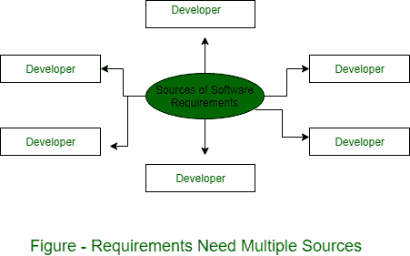

# 理解软件需求的不同来源

> 原文：[https://www.geeksforgeeks.org/different-sources-of-understanding-software-requirements/](https://www.geeksforgeeks.org/different-sources-of-understanding-software-requirements/)

软件的需求规格说明为开发系统提供了基础，这是 [SDLC](https://www.geeksforgeeks.org/software-development-life-cycle-sdlc/) 中最关键的步骤之一。虽然涉众是需求的最终来源，但是您不能依赖于单一来源所陈述的规范。

对于单一来源的需求，几乎不可能对规范进行验证，因为不会对来自各种来源的规定专业进行可比检查，这些来源包括客户、消费者、问题领域专家、关联领域专家、潜在用户、运营商、经验丰富的开发人员，甚至系统的批评者。一组知识数据产生于现有的手动或半自动系统的执行。

来自所有者、用户、操作员和其他工人的反馈。受益者也被收集起来，他们对新系统的建议和期望被记录下来。收集的数据经过集体评估和提炼，并与相关人员协商。

## `Stakeholders/Buyers`
他们是负责接受和执行软件的人员。他们可以是个人、组织、信托机构，甚至是一个国家的政府或公众。

## `User/Beneficiaries`
这些是产品预期的用户。

## `Operators`
他们是操作软件以使其服务对受益者或最终用户可用的人员。

## `Domain experts`
他们是具有软件提供服务领域（例如保险、金融、银行、通信、数据传输、网络等）经验和专业知识的专家。领域专家能够揭示产品开发中隐藏或未见的潜在需求或风险。

## `Developer`
负责开发软件以使其提供预期服务的软件工程师。他们负责软件设计、原型开发和技术可行性。他们与最终用户、买家和应用专家密切合作。

## `Automated Tools`
在新一代信息技术和软件开发范式中，有许多自动化和半自动化工具可用于确认和管理系统构建需求。此类软件也提供输入，即系统/软件需求。

## `Past Experience/Case Studies`
在相似或相同领域工作的组织可以提供其过去的经验甚至记录的案例研究。这有助于更清晰地了解需求，否则这些需求可能被隐藏。

## `Connected People/Machine/Environment`
与软件相关的人员或环境因素以及IT领域可能提供大量关于开发中涉及的约束、开发本身及其对软件环境影响的信息。

## `测试人员`
测试人员是用户行为或系统状况预测行为的良好信息来源。持续接触真实用户的输入。在这种情况下，审查员可以利用他们的经验和分析技能来提供输入。