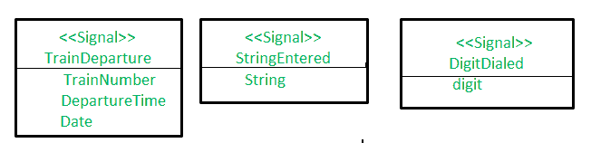
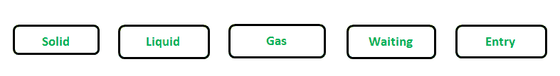

# 面向对象分析与设计中的动态建模

> 原文：[https://www.geeksforgeeks.org/dynamic-modelling-in-object-oriented-analysis-and-design/](https://www.geeksforgeeks.org/dynamic-modelling-in-object-oriented-analysis-and-design/)

动态建模描述系统中与时间和操作顺序相关的方面。它用于指定和实现系统的控制方面。动态模型借助`状态图`以图形方式表示。它也被称为`状态建模`。状态模型由多个状态图组成，每个状态图代表一个对应用程序很重要的具有时态行为的类。状态图与`事件`和`状态`有关。事件表示外部功能活动，状态表示值对象。

## 事件

事件是在特定时间特定点发生的事情，比如一个人按下按钮或者 15930 次列车离开阿姆利则。事件将信息从一个对象传递到另一个对象。

事件有三种类型：`信号事件`、`变化事件`和`时间事件`。这些解释如下。

### 信号事件

信号事件是时间上的特定事件。信号是信息从一个物体到另一个物体的明确的单向传输。信号事件是发送或接收信号的事件。当一个对象向另一个对象发送信号时，它等待确认，但确认信号是第二个对象控制下的独立信号，第二个对象可以选择发送也可以不发送。`UML` 符号是`<<signal>>`写在盒子顶部的名称里面，在另一个部分列出了所有的信号属性。例如：



### 变化事件

是由一个布尔表达式的满足引起的。变更事件的目的是，每当表达式从假变为真时，就要对表达式进行连续测试。变更事件的 `UML` 符号是关键字`when`，后面跟一个带圆括号的布尔表达式。例如：

```
when(battery power < lower limit)
when(room temperature < heating/cooling point )
```

### 时间事件

它是由绝对时间的发生或时间间隔的流逝引起的。绝对时间的 `UML` 符号是关键字`when`，后面跟一个涉及时间的带括号的表达式；时间间隔的符号是关键字`after`，后面跟一个计算时间长度的带括号的表达式。例如：

```
when(Date = mar 2, 2005)
after(50 seconds)
```

## 状态

状态是一个对象的属性值和链接的抽象。值和链接根据它们的整个行为组合成一个状态。对象根据输入事件的响应称为状态。状态对应于对象接收的两个事件之间的时间间隔。事件的状态取决于过去的事件。所以基本上，状态代表时间间隔。该状态的 `UML` 符号是一个包含可选状态名列表的圆形框，用粗体列出该状态名，将该状态名居中放在框的顶部附近，首字母大写。例如：



以下是关于状态需要记住的要点。

1.  忽略不影响对象行为的属性。
2.  类中的对象具有有限数量的可能状态。
3.  每个对象一次只能处于一种状态。
4.  在一个状态下，所有事件都被忽略，除了那些行为被明确规定的事件。
5.  事件和状态都取决于抽象层次。