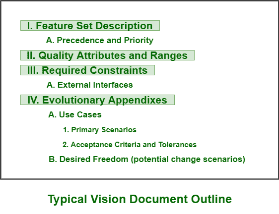
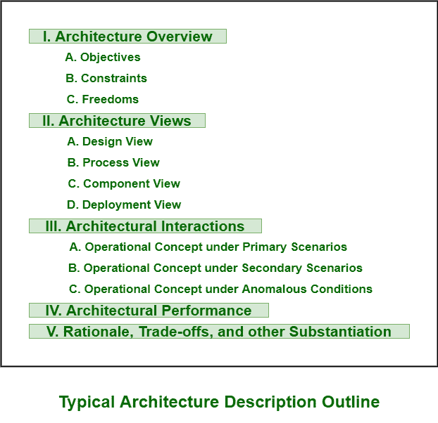

# 工程工件

> 原文:[https://www.geeksforgeeks.org/engineering-artifacts/](https://www.geeksforgeeks.org/engineering-artifacts/)

**工程工件**通常用严格的工程符号表示。这些符号可以是`统一建模语言(UML)`、编程语言或机器的可执行代码。工程工件一般有三种类型。

## 工程工件类型:

### 1. Vision Document –
`Vision Document`通常为正在开发的软件系统提供完整的愿景。它是一份描述和解释令人信服的想法、项目或其他未来状态的文档，通常针对特定的组织、产品或服务。它也支持资助机构和开发组织之间的合同。`Vision Document`是特别从用户角度考虑并专注于系统基本功能而编写的。一个好的`Vision Document`应包括两个附录：第一个应使用用例解释操作概念，第二个应解释愿景陈述中固有的变更风险。

### 2. Architecture Description –
`Architecture Description`是记录架构的工件集合，其中包括正在开发的软件架构的有组织视图。它通常从设计模型中提取，也包含设计、实现和部署集的视图。在`Architecture Description`中，架构视图通常是关键工件。

### 3. 软件用户手册–
`软件用户手册`提供了支持交付的软件非常需要的重要文档。该文档通常提供给用户。它应该包括安装程序、使用程序、指南、操作限制以及关于用户界面的说明。测试团队成员应该编写这个`用户手册`，并且应该在生命周期的早期阶段开发。这是因为`用户手册`是一个基本的机制，只是用来交流和稳定一个基本的需求子集。