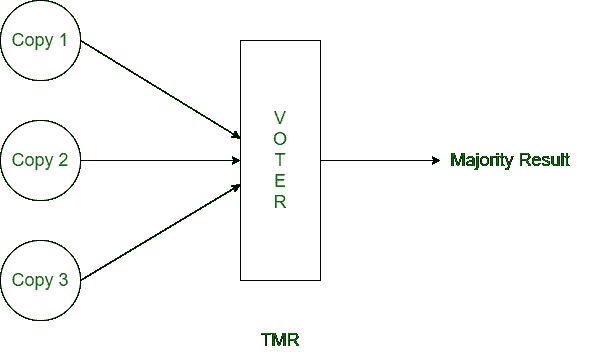
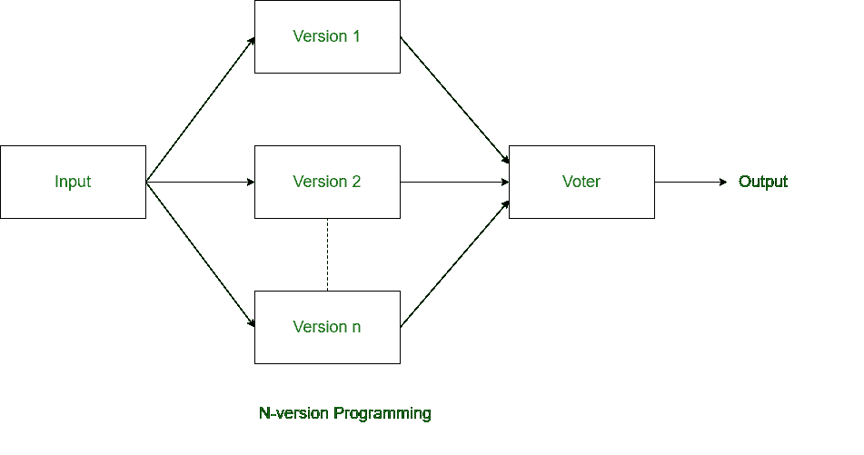
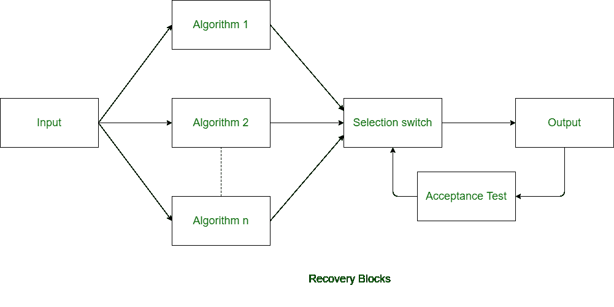
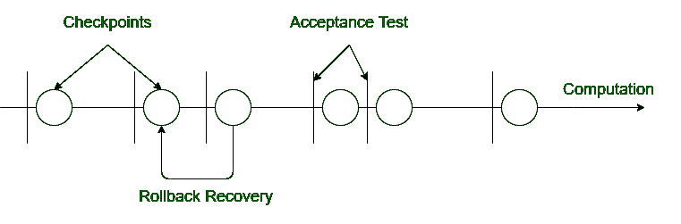

# 计算机系统中的容错技术

> 原文：[https://www.geeksforgeeks.org/fault-tolerance-techniques-in-computer-system/](https://www.geeksforgeeks.org/fault-tolerance-techniques-in-computer-system/)

**容错**是指尽管系统发生故障，系统仍以适当的方式工作的过程。即使执行了如此多的测试过程，系统仍有可能出现故障。实际上，一个系统不可能完全没有错误。因此，系统被设计成在错误可用性和故障的情况下，系统能够正常工作并给出正确的结果。

任何系统都有两个主要组件——硬件和软件。两者都可能出现故障。所以在硬件和软件上都有独立的容错技术。

## 硬件容错技术

与软件相比，硬件容错很简单。容错技术使硬件正常工作，即使系统的硬件部分出现故障也能给出正确的结果。硬件容错基本上有两种技术：

1.  **内建自测试**
    `内建自测试`代表内建自测试。系统在一定时间后反复进行自身的测试，这就是硬件容错的`内建自测试`技术。当系统检测到故障时，它会切换出故障组件并切换到冗余组件。发生故障时，系统基本上重新配置自己。

2.  **TMR**
    `TMR`是三模冗余。生成关键组件的三个冗余副本，并且这三个副本同时运行。对所有冗余副本的结果进行投票，并选择多数结果。它可以容忍一次出现一个故障。

## 软件容错技术

软件容错技术用于使软件在发生故障和失效的情况下保持可靠性。软件容错有三种技术。前两种技术很常见，基本上是硬件容错技术的改编。

1.  **N-version Programming**
    在`N-version programming`中，N个版本的软件由N个个体或开发小组开发。`N-version programming`类似于硬件容错技术中的`TMR`。在`N-version programming`中，所有冗余副本同时运行，每个处理得到的结果不同。`n-version programming`的想法基本上是在开发阶段就发现所有错误。

2.  **Recovery Blocks**
    `Recovery blocks`技术也类似于`n-version programming`，但在`recovery blocks`技术中，冗余副本仅使用不同的算法生成。在`recovery block`中，所有冗余副本不是同时运行，而是一个接一个地运行。`Recovery block`技术只能用于任务截止时间大于任务计算时间的场景。

3.  **Check-pointing and Rollback Recovery**
    这项技术与上述两种软件容错技术不同。在这项技术中，每次执行一些计算时都会对系统进行测试。这项技术在处理器故障或数据损坏时特别有用。

