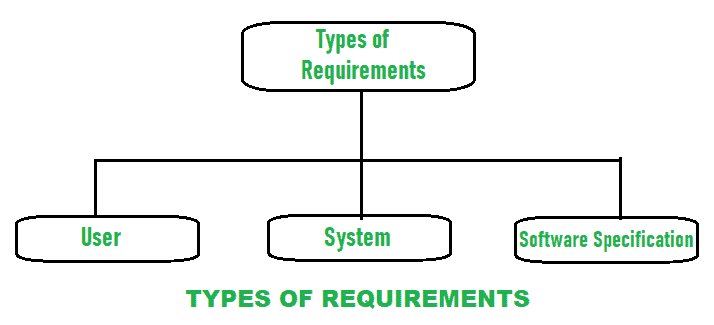

# 系统的功能性和非功能性需求

> 原文：[`https://www.geeksforgeeks.org/functional-and-non-functional-requirement-of-a-system/`](https://www.geeksforgeeks.org/functional-and-non-functional-requirement-of-a-system/)

**需求**简单来说就是需要或者想要的东西。需求工程是以适当的方式定义需求、建立需求、记录需求的过程，目的是保持系统中客户需求的质量，以及系统运行和开发的限制。这是软件工程的第一项活动。需求是需要通过软件系统的设计、产品或过程来满足的东西。要求可分为：

## 1. 用户需求
用户需求简单来说就是软件系统应该满足的用户需求。它记录在用户需求文档中(`URD`)。总的来说，语句通常是用自然语言编写的，加上对系统提供的服务及其操作限制的描述。如果用户需求清晰而简短，能够提高整体质量，提高生产率，具有可追溯性等，那么用户需求就是好的。

## 2. 系统需求
系统需求简单来说就是系统需要平稳高效的运行。它是一个结构化文档，详细描述了系统功能、服务和操作限制。它需要许多硬件和软件资源。如果这些硬件和软件资源不可用或不太可用，则可能会导致系统故障或导致性能问题。在客户和承包商之间，它被写成一份合同来定义所有需要实施以提高生产率的要求。

### `Software specification`
它是软件系统需求的详细描述，借助这些需求可以进行设计和实现以开发软件。对于软件开发人员来说，通常会编写软件规范，使开发人员更容易理解软件的整体需求。

系统的两种主要需求：

## 1. [`Functional requirements`](https://www.geeksforgeeks.org/functional-vs-non-functional-requirements/)
功能性需求是强制性的，这意味着它是必须满足的。它们通常描述和定义软件系统最终产品的特性，并简单地关注最终产品做什么。

这些是系统应该完成的要求，比如计算、数据操作等。找出功能需求并在用例中捕获是非常容易的。

系统应提供服务声明，描述系统如何对提供的输入做出反应，并应明确系统在特定情况下如何做出反应。功能需求是依赖于软件类型的需求类型，因为不同的软件有不同的功能需求，使用软件的系统严重影响软件的功能和用户满足他们的需求。用户的功能需求是高级抽象语句。一般来说，它描述了在任何需要的时候系统应该是什么样的，但是系统功能应该通过功能系统需求来详细描述。

## 2. [`Non-Functional Requirements`](https://www.geeksforgeeks.org/non-functional-requirements-in-software-engineering/)
非功能性需求不是强制性的，这意味着它们不是必须满足的。非功能性需求定义系统属性和系统性能。系统有不同的属性，可以是可靠性、响应时间、可维护性、可用性、存储需求等。

它只关注最终产品是如何工作的，找出非功能性需求并将其作为质量属性捕获并不容易也不困难。测试包括性能、压力、安全测试等。非功能性需求更不被认可，如果非功能性需求没有得到满足，那么完整的系统是没有用的。

**示例：**
产品需求、组织需求、外部需求、容量或存储需求、资源需求、整体性能需求时间等。