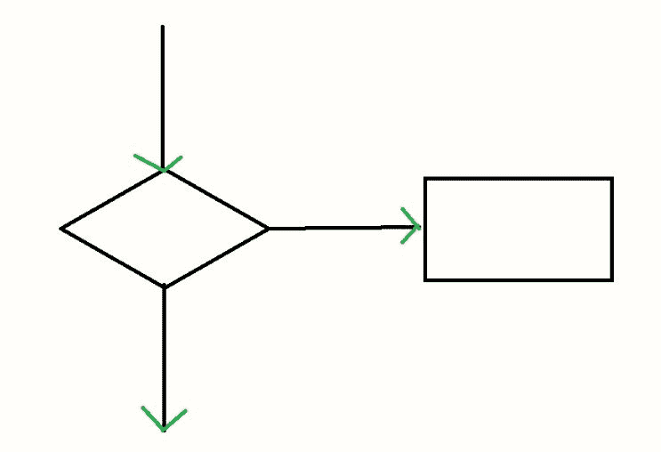
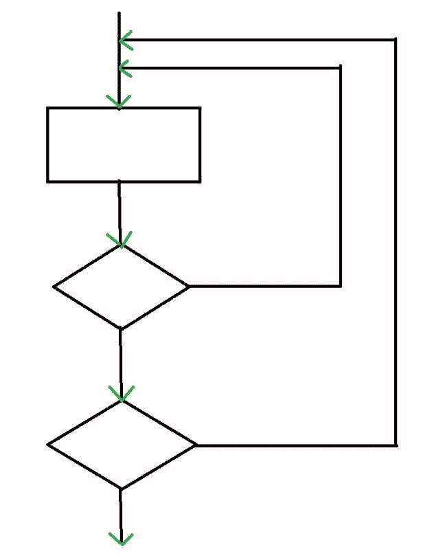
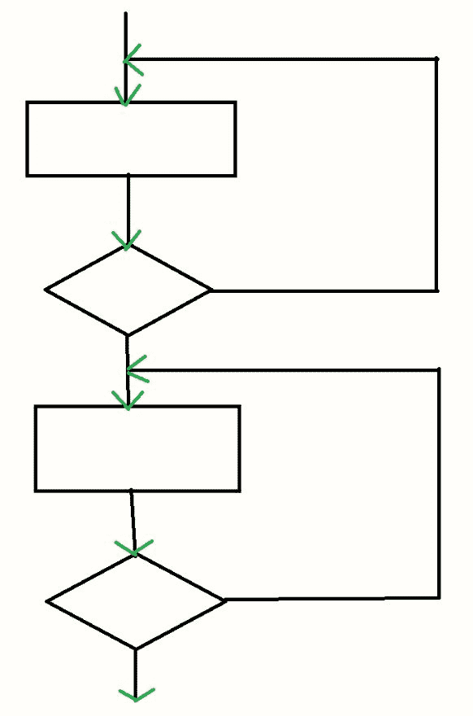
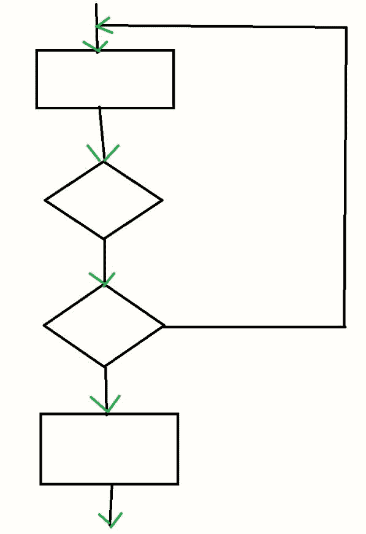

# 循环测试

> 原文: [https://www.geeksforgeeks.org/loop-software-testing/](https://www.geeksforgeeks.org/loop-software-testing/)

**循环测试**是一种[软件测试](https://www.geeksforgeeks.org/software-testing-basics/)类型，用于验证循环。它是控制结构测试的一种。循环测试是一种白盒测试技术，用于测试程序中的循环。

## 循环测试的目标

循环测试的目标是:
*   修复无限循环重复问题。
*   了解表演。
*   识别循环初始化问题。
*   确定未初始化的变量。

## 循环测试的类型

循环测试根据循环的类型进行分类:

### 简单循环测试

在简单循环中执行的测试称为简单循环测试。简单循环基本上是一个正常的`for`、`while`或`do-while`，其中给出了一个条件，循环根据条件的真和假分别运行和终止。执行这种类型的测试基本上是为了测试循环的条件是否足以在某个时间点后终止循环。

**示例:**

```
while(condition)
  {
   statement(s);
  } 
```



### 嵌套循环测试

在嵌套循环中执行的测试称为嵌套循环测试。嵌套循环基本上是一个循环内部包含另一个循环。在嵌套循环中，一个循环内部可以有有限数量的循环，从而形成一个嵌套结构。它可以是三种循环（`for`、`while`或`do-while`）中的任何一种。

**示例:**

```
while(condition 1)
  {
   while(condition 2)
    {
     statement(s);
    }
  } 
```



### 串联循环测试

在串联循环中执行的测试称为串联循环测试。它在串联循环上执行。串联循环是一个接一个的循环。它是一系列循环。嵌套循环与串联循环的区别在于，嵌套循环是循环内部包含循环，而串联循环是循环之后接着另一个循环。

**示例:**

```
while(condition 1)
  {
   statement(s);
  }
 while(condition 2)
 {
  statement(s);
 } 
```



### 非结构化循环测试

在非结构化循环中执行的测试称为非结构化循环测试。非结构化循环是嵌套循环和串联循环的组合。它基本上是一组无序的循环。

**示例:**

```
while()
  {
   for()
    {}
   while()
    {}
  } 
```



## 循环测试的优势

循环测试的优势有:
*   循环测试限制了循环的迭代次数。
*   循环测试确保程序不会进入无限循环过程。
*   循环测试持续循环中每个使用的变量的初始化。
*   循环测试有助于识别循环中的不同问题。
*   回路测试有助于确定容量。

## 循环测试的缺点

循环测试的缺点是:
*   循环测试在低级软件的错误检测中最有效。
*   循环测试在错误检测中没有用。