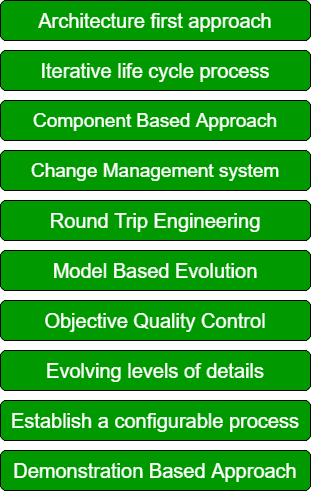

# 软件开发的现代原则

> 原文：`https://www.geeksforgeeks.org/modern-principles-of-software-development/`

软件开发有一些现代原则。通过遵循这些现代原则，我们可以开发出满足客户所有需求的有效软件。要开发一个合适的软件，应该遵循以下 10 个软件开发原则：

## 软件开发原则：

这些解释如下。

1.  **Architecture first approach:**
    在这种方法中，我们的主要目标是为我们的软件构建一个强大的架构。所有的模糊性和缺陷都在非常初级的阶段就被识别出来。此外，我们可以做出所有关于软件设计的决策，这将提高我们软件的生产力。
2.  **Iterative life cycle process:**
    在迭代生命周期过程中，我们重复这个过程一次又一次以消除风险因素。在迭代生命周期中，我们主要有四个步骤：需求收集、设计、实现和测试。所有这些步骤都重复进行，直到我们减轻风险因素。迭代生命周期过程对于通过重复上述步骤来早期缓解风险非常重要。
3.  **Component Based Approach:**
    基于组件的方法是一种广泛使用且成功的方法，在这种方法中，我们重用先前为软件开发定义的函数。我们以组件的形式重用部分代码。基于组件的 UI 开发优化了需求和设计过程，因此是重要的现代软件原则之一。
4.  **Change Management system:**
    变更管理是负责管理所有变更的过程。变更管理的主要目标是通过执行必要的变更来提高软件质量。所有实施的变更都经过测试和认证。
5.  **Round Trip Engineering:**
    在往返工程中，代码生成和逆向工程在动态环境中同时进行。两个组件被集成，以便开发人员可以轻松地在两者上工作。在往返工程中，主要特点是工件的自动更新。
6.  **Model Based Evolution:**
    基于模型的演进是软件开发的一个重要原则。基于模型的方法支持图形和文本概念的演进。
7.  **Objective Quality Control:**
    质量控制的目标是提高我们软件的质量。它涉及质量管理计划、质量指标、质量检查表、质量基线和质量改进措施。
8.  **Evolving levels of details:**
    按使用场景组计划中间发布，其详细程度不断演进。我们必须计划一个增量实现，其中我们有用例、架构和细节的演进级别。
9.  **Establish a configurable process:**
    建立一个经济上可扩展的可配置过程。单一过程并不适合所有开发，因此我们必须使用一个可以处理各种应用的可配置过程。
10. **基于演示的方法:**
    在这种方法中，我们主要关注演示。它通过对问题领域、使用的方法和解决方案进行清晰的描述，有助于提高我们软件的生产率和质量。