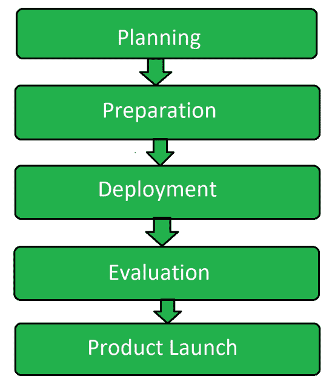

# 软件测试中的试运行测试

> 原文：[https://www.geeksforgeeks.org/pilot-testing-in-software-testing/](https://www.geeksforgeeks.org/pilot-testing-in-software-testing/)

试点测试是[软件测试](https://www.geeksforgeeks.org/software-testing-basics/)的类型，其中一组用户在最终启动或部署软件之前整体使用软件。该测试在实时操作条件下验证系统的组件或整个系统。试点测试的目的是评估研究项目的可行性、时间、成本、风险和绩效。

## 试点测试的目标

试点测试的目标是：

*   评估可行性、成本和其他属性。
*   更好地利用时间和资源。
*   找出最终用户对软件的反应。
*   去发现软件是否成功。
*   为开发团队提供另一个机会。

## 试点测试的必备条件

进行试点测试的主要必备条件是：

1.  **合适的环境：**
    任何测试过程都需要合适的环境。这是成功执行测试的基本要求。试点测试也是如此。为了执行试点测试，我们需要一个真实时用户会拥有的环境。之后，必须具备适当的硬件和软件。因此，为测试过程构建与最终用户将要面对的情况相同的环境至关重要。
2.  **正确的测试人员组：**
    在执行试点测试期间，测试团队经理必须确保有一组真正代表目标受众的正确测试人员。如果未选择正确的组，则无法成功执行试点测试。
3.  **充分的规划：**
    当涉及任何类型的测试或开发时，规划是必须的。在执行试点测试时，必须确保所有资源都以适当的度量到位。从人力到设备的所有属性都应该是充足的，不应短缺任何东西。除此之外，规划有助于创建合适的测试场景，这些场景对于创建测试环境很有用。

## 中试流程

1.  **规划：**
    这是试点测试的第一步，包括创建与测试流程相关的各种计划。这是测试过程的主要部分，因为所有进一步的步骤都源于它，并且与它有很大的关系。
2.  **准备：**
    一旦规划完成，那么为测试过程收集不同属性的准备工作就完成了。为了成功地进行测试，还需要做更多的准备。在此步骤中选择终端用户组。
3.  **部署：**
    一旦所有的准备工作完成，并且选择了一组终端用户，那么软件就被部署了。每一个终端用户被保留就是目标受众将面临的这样的状况。
4.  **评估：**
    现在从测试人员组评估结果，记录软件的响应。如果软件满足要求的任务，则采取进一步的步骤。
5.  **产品发布：**
    一旦完成测试过程的评估，发现软件符合最终用户的要求，那么软件就上市了。

## 中试优势

*   有助于猜测成功率。
*   它完善了软件。