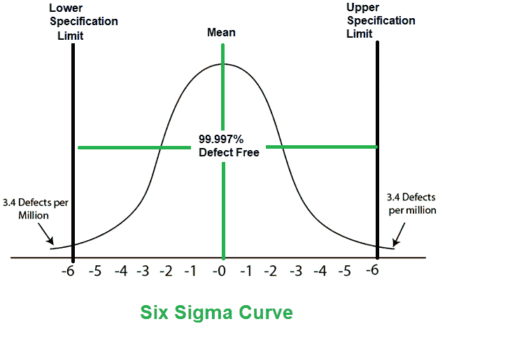
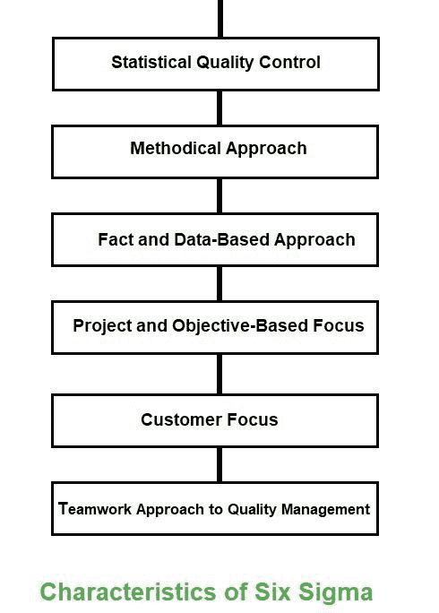

# 软件工程六适马

> 原文：[https://www.geeksforgeeks.org/six-sigma-in-software-engineering/](https://www.geeksforgeeks.org/six-sigma-in-software-engineering/)

`六适马`是生产高质量和改良产量的过程。这可以分两个阶段完成——识别和消除。确定缺陷的原因，并进行适当的消除，以减少整个过程中的变化。`六西格玛`方法是指 99.99966%的待生产产品具有相同的特征并且没有缺陷。

## 六适马的特点

`六适马`的特点如下：

1.  **统计质量控制**
    `六适马`来源于希腊字母`σ`（Sigma）表示统计中的标准偏差。标准偏差用于测量输出质量。
2.  **系统方法**
    `六适马`是在 `DMAIC` 和 `DMADV` 中应用的系统方法，可用于提高生产质量。`DMAIC` 代表设计-测量-分析-改进-控制。而 `DMADV` 代表设计-测量-分析-设计-验证。
3.  **基于事实和数据的方法**
    这种统计和系统的方法展示了该技术的科学基础。

4.  **项目和基于目标的聚焦**
    实施`六适马`流程，聚焦要求和条件。
5.  **客户焦点**
    客户焦点是`六适马`方法的基础。质量改进和控制标准基于特定的客户要求。
6.  **团队合作的质量管理方法**
    `六适马`流程要求组织为了提高质量而组织起来。

## 六个适马方法

六个适马项目中使用的两个方法是 `DMAIC` 和 `DMADV`。

*   **`DMAIC`** 用于增强现有的业务流程。`DMAIC` 项目方法有五个阶段：
    1.  规定
    2.  措施
    3.  分析
    4.  改善
    5.  控制
*   **`DMADV`** 用于创造新产品设计或工艺设计。`DMADV` 项目方法也有五个阶段：
    1.  规定
    2.  措施
    3.  分析
    4.  设计
    5.  核实