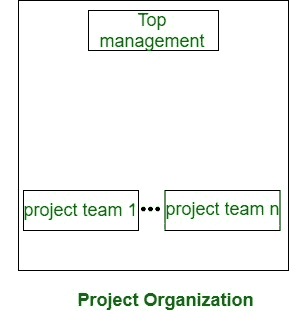
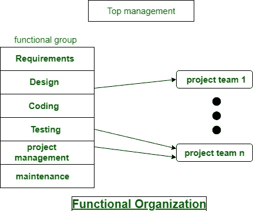

# 软件开发组织结构

> 原文：[https://www.geeksforgeeks.org/software-development-organizational-structure/](https://www.geeksforgeeks.org/software-development-organizational-structure/)

**组织结构：**
通常每个软件包开发组织随时处理很多项目。软件包组织指派完全不同的工程师小组来处理不同的软件项目。每种组织结构都有自己的优点和缺点，问题是“组织作为一个完整的结构是如何构成的？”所以每个软件包项目都要在它的时间点之前完成。

软件包开发组织的结构基本上有两种主要方式：`项目格式`和`功能格式`。这些解释如下。

## 1. 项目格式

项目开发工作人员根据他们所从事的项目进行划分（如下图所示）。在项目格式中，一个工程师小组在项目开始时被委派到该项目，并一直待到项目完成。

因此，相同的团队执行所有的生命周期活动。显然，功能性的格式比项目格式需要更多的团队间的交流，结果是一个团队应该感知到之前的团队所做的工作。

## 2. 功能格式

项目工作人员根据他们所属的功能集群进行划分。各个项目从特定的功能团队中借用工程师来承担项目的特定部分，并在该阶段完成后将他们归还到功能集群。

在功能格式中，完全不同的程序员组执行项目的不同阶段。例如，一个团队可能做必需品规格，另一个团队做规划，等等。部分完成的产品从一个团队传递到另一个团队，因为项目在发展。

因此，由于一个团队的工作成果应该被参与项目的下一个团队清楚地理解，因此有用的格式需要不同团队之间的大量沟通。这需要合理的质量文件，当每个活动。

