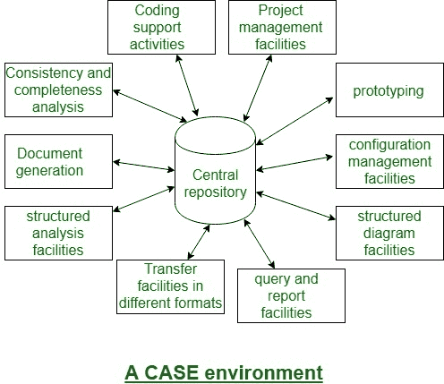

# 软件工程 | CASE 工具及其范围

> 原文：[https://www.geeksforgeeks.org/software-engineering-case-tool-and-its-scope/](https://www.geeksforgeeks.org/software-engineering-case-tool-and-its-scope/)

一个 [CASE（计算机辅助软件工程）](https://www.geeksforgeeks.org/computer-aided-software-engineering-case/)工具可以是一个通用术语，用来表示对软件工程的任何类型的机器驱动支持。在一个更严格的意义上，`CASE` 工具指任何用于自动化一些与软件开发相关的活动的工具。

可用的 `CASE` 工具种类繁多。这些 `CASE` 工具中的许多有助于部分相关的任务，如需求规范、结构化分析、设计、编码、测试等；以及其他非阶段活动，如项目管理和配置管理。

## 使用 CASE 工具的原因

使用 `CASE` 工具的主要原因有：

*   提高生产率
*   帮助以更低的成本生产更高质量的代码

## CASE 环境

虽然单个 `CASE` 工具很有帮助，但是一个工具集的真正威力往往只有将这套工具集成到一个统一的框架或环境中才能发挥出来。`CASE` 工具以它们所关注的软件开发生命周期的一个或多个阶段为特征。由于涵盖不同阶段的不同工具共享公共数据，因此需要它们通过某个中央存储库进行集成，以实现对软件开发工件相关数据的统一访问。这个中央存储库有时是信息字典，包含所有复合和基本数据的定义。

通过中央存储库，所有 `CASE` 工具在一个 `CASE` 环境中共享它们之间的公共数据。因此，`CASE` 环境为软件开发的逐步方法的自动化提供了便利。下图显示了 `CASE` 环境的示意图：

**注意：** `CASE` 环境与编程环境不同。

`CASE` 环境促进了软件开发的小阶段方法的自动化。与 `CASE` 环境不同，编程环境是集成开发环境中的一个助手，它只支持软件开发的编码部分。