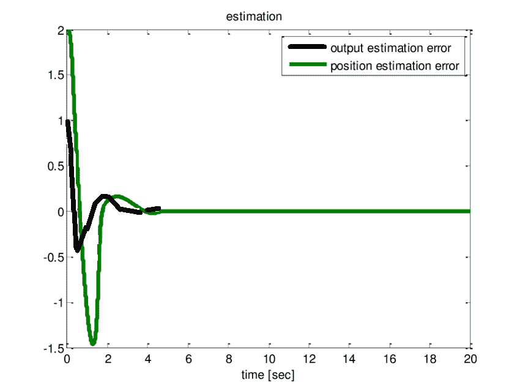

# 软件工程|曲线拟合模型

> 原文：[https://www.geeksforgeeks.org/software-engineering-curve-fitting-models/](https://www.geeksforgeeks.org/software-engineering-curve-fitting-models/)

曲线拟合群组模型使用统计回归分析来研究软件复杂性与程序中的故障数量、变更数量或故障率之间的关系。这组模型通过使用线性回归、非线性回归或时间序列分析的方法找到输入和输出变量之间的关系。例如，因变量是程序中的错误数量。自变量是维护阶段改变的模块数量、故障间隔时间、程序员技能、程序大小等。这组模型包括：误差估计、复杂性估计、故障率估计。这些解释如下。

下图是实际值与估计值的关系。



## 误差估计模型

程序中的误差数量可以通过使用线性或非线性回归模型来估计。估算程序中初始误差总数 `N` 的简单非线性回归模型可表示如下：

```
N = Σ a_{i} X_{i} + Σ b_{i} X^{2}_{i} + Σ c_{i} X^{3}_{i} + ε
```

其中 `X_i` 是第一误差因子；`a_i`、`b_i`、`c_i` 为模型的系数，`ε` 为误差项。典型的错误因素是软件复杂性度量和环境因素。大多数曲线拟合模型只涉及一个误差因素。

## 复杂性估计模型

该模型用于使用时间序列方法估计软件复杂性 `CR`。软件复杂性模型总结如下：

```
CR = a_{0} + a_{1} R + a_{2} E_{R} + a_{3} MR + a_{4} IR + a_{5} D + ε
```

其中
`R` = 发布序列号
`ER` = 发布时的环境因素 `R`
`MR` = 发布时的模块数量 `R`
`IR` = 发布间隔 `R`
`D` = 首次出现错误的天数
`ε` = 错误

这种特殊的模型在软件评估时使用，因为时间意味着模型的更多版本被发布。

## 故障率估算模型

该模型用于估算软件的故障率。给定故障时间 `t1`、`t2`，..`tn`，对第 `i` 个故障间隔的故障率的粗略估计是

```
λ_{i} = 1 / (t_{i-1} - t_{i})
```

假设故障率是单调非递增的，则可以用最小二乘法得到这个函数的估计值 `λ`，`i = 1，2，…，n`。