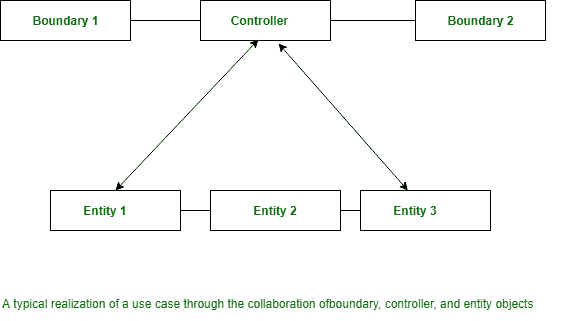

# 领域建模

> 原文：[https://www.geeksforgeeks.org/software-engineering-domain-modeling/](https://www.geeksforgeeks.org/software-engineering-domain-modeling/)

**领域建模**理解为抽象建模。站点模型可以是在缺陷域中显示的想法或对象的说明。它还捕获了这些对象之间的明显关系。此类抽象对象的示例区域单位为 `Book`、`BookRegister`、`成员Register`、`LibraryMember` 等。

建议的策略是，无论压力在哪里，只要发现需求中表达的明显想法，就快速生成一个粗略的抽象模型，而推迟深入调查。后来，在整个事件方法中，抽象模型被逐步细化和扩展。领域分析中已知的 3 种对象。

## 三种对象类型

整个领域分析中已知的对象分为三种类型：

1.  边界对象
2.  控制器对象
3.  实体对象

边界和控制器对象从使用案例图中是一致已知的，而实体对象的识别需要应用。因此，领域建模活动的关键是发现实体模型。

> 在整个领域分析中已知的各种对象的用途，以及这些对象在彼此之间移动的方式。

在整个领域分析中已知的对象的不同样式及其关系单元的区域如下：

### 边界对象

`Boundary objects` 是那些与参与者交互的对象。这些包括屏幕、菜单、表单、对话框等。`Boundary objects` 主要负责用户交互。因此，它们通常不包含任何处理逻辑。然而，它们将负责确认输入、格式化输出等。`Boundary objects` 早期被称为接口对象。然而，术语接口类别在 Java、COM/DCOM 和 UML 中具有完全不同的含义。对于边界类别的初始识别，建议是为每个参与者/用例对定义一个边界类别。

### 实体对象

这些通常保存信息，如信息表和文件，这些信息需要在用例执行后持续存在，例如 `Book`、`BookRegister`、`LibraryMember` 等。许多 `Entity objects` 是“哑服务器”。它们通常负责存储信息、检索信息以及执行一些不经常更改的基本操作。

### 控制器对象

`Controller objects` 协调一组实体对象的活动，并与边界对象交互以提供系统的整体行为。分配给控制器对象的责任与特定用例的实现密切相关。`Controller objects` 有效地将边界对象和实体对象彼此解耦，使系统能够容忍用户界面和处理逻辑的变化。

`Controller objects` 包含与用例实现相关的大部分逻辑（此逻辑可能会随时间变化）。控制器对象与边界和实体对象的典型交互如下图所示。通常，每个用例使用一个控制器对象完成。然而，有些用例是在不使用任何控制器对象的情况下完成的，即仅通过边界和实体对象。这对于仅对存储的信息进行一些简单操作的用例来说是正确的。

例如，让我们考虑图书馆数据系统（LIS）的“查询图书可用性”用例。该用例的实现仅涉及将给定的书名与目录中提供的书名进行匹配。更复杂的用例可能需要不止一个控制器对象来实现该用例。一个复杂的用例可以有多个控制器对象，如事务管理器、资源安排器、错误处理器。还有另一种情况，一个用例可以有多个控制器对象。通常，用例要求控制器对象通过多种状态进行转换。

在这种情况下，可能需要为雇佣案例的每次执行创建一个控制器对象。

