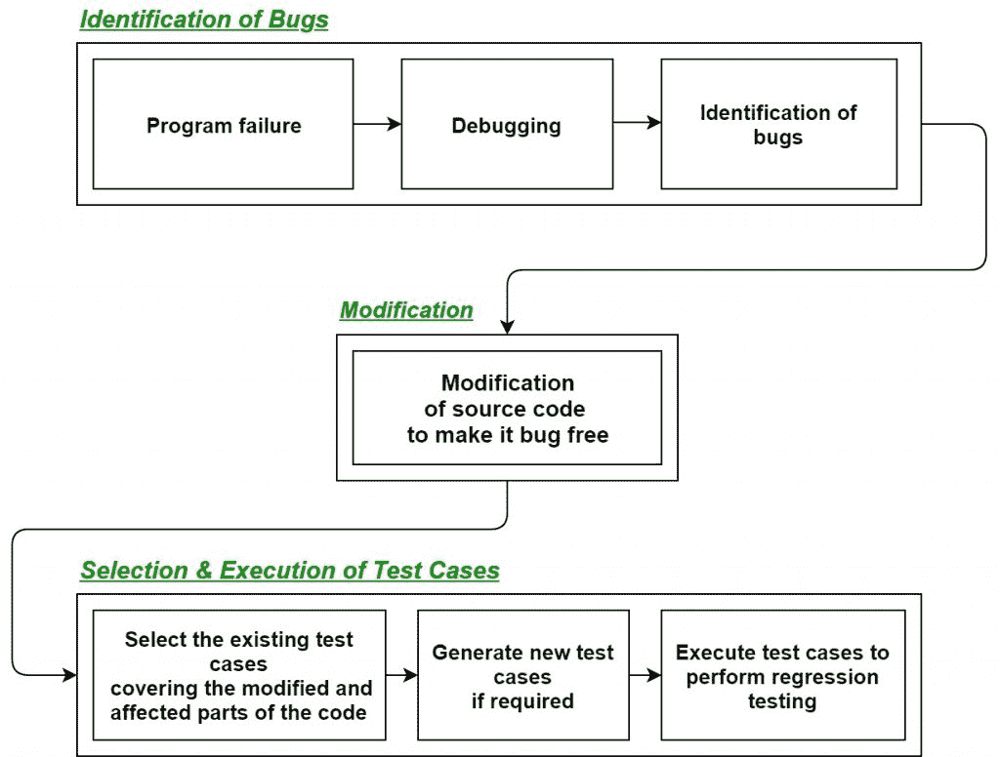
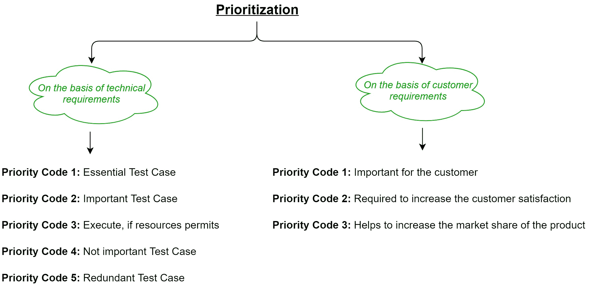

# 软件工程：回归测试

> 原文：[https://www.geeksforgeeks.org/software-engineering-regression-testing/](https://www.geeksforgeeks.org/software-engineering-regression-testing/)

## 什么是回归测试？

`回归测试`是测试代码的修改部分和可能由于修改而受到影响的部分的过程，以确保在进行修改后软件中没有引入新的错误。回归意味着某种东西的回归，在软件领域，它指的是一个 bug 的回归。

## 何时进行回归测试？

*   当一个新的功能被添加到系统中，并且代码被修改以吸收该功能并将其与现有代码集成时。
*   当在软件中发现一些缺陷，并调试代码来修复它时。
*   当修改代码以优化其工作时。

## 回归测试的过程

首先，每当我们因为任何原因对源代码进行一些修改，比如增加新的功能、优化等。那么我们的程序在执行时会因为明显的原因在之前设计的`测试套件`中失败。失败后，调试源代码，以便识别程序中的错误。在识别源代码中的错误后，进行适当的修改。然后从已经存在的`测试套件`中选择合适的`测试用例`，该`测试套件`覆盖了源代码的所有修改和受影响的部分。如果需要，我们可以添加新的`测试用例`。最后，使用选定的`测试用例`执行`回归测试`。

## 为回归测试选择测试用例的技术

### 选择所有测试用例
在这种技术中，所有的`测试用例`都是从已经存在的`测试套件`中选择的。这是最简单、最安全的技术，但效率不高。

### 随机选择测试用例
在这种技术中，`测试用例`是从现有的`测试套件`中随机选择的，但是只有当所有的`测试用例`的故障检测能力都一样好的时候才是有用的，这是非常罕见的。因此，在大多数情况下并不使用它。

### 选择修改遍历测试用例
在这种技术中，只选择那些覆盖和测试源代码的修改部分(受这些修改影响的部分)的`测试用例`。

### 选择更高优先级的测试用例
在这种技术中，优先级代码被分配给`测试套件`中的每个`测试用例`，基于它们的错误检测能力、客户需求等。分配了优先级代码后，具有最高优先级的`测试用例`被选中用于`回归测试`过程。

具有最高优先级的`测试用例`具有最高排名。例如，优先级代码为 2 的`测试用例`不如优先级代码为 1 的`测试用例`重要。

## 回归测试的工具

在`回归测试`中，我们通常从现有的`测试套件`本身中选择`测试用例`，因此，我们不需要计算它们的预期输出，并且由于这个原因，它可以很容易地自动化。自动化`回归测试`的过程将会非常有效和节省时间。

`回归测试`最常用的工具有:

*   `硒`
*   `WATIR` (红宝石中的网络应用测试)
*   `QTP` (快速测试专业人员)
*   `理性功能测试者`
*   `Winrunner` (游戏名)
*   `丝绸检验`

## 回归测试的优势

*   它确保在向系统添加新功能后没有引入新的 bug。
*   因为`回归测试`中使用的大多数`测试用例`都是从现有的`测试套件`中选择的，并且我们已经知道它们的预期输出。因此，可以通过自动化工具轻松实现自动化。
*   它有助于保持源代码的质量。

## 回归测试的缺点

*   如果不使用自动化工具，可能会耗费时间和资源。
*   即使在代码中做了很小的更改，也需要它。