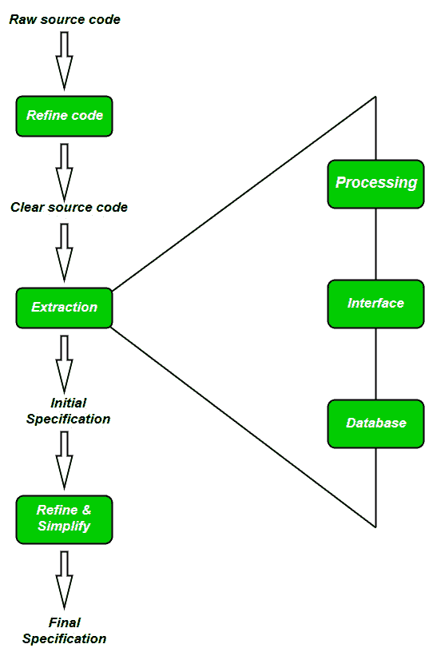

# 软件逆向工程

> 原文：[https://www.geeksforgeeks.org/software-engineering-reverse-engineering/](https://www.geeksforgeeks.org/software-engineering-reverse-engineering/)

软件逆向工程是从对产品代码的分析中恢复产品的设计、需求规格和功能的过程。它建立一个程序数据库，并由此产生信息。

逆向工程的目的是通过提高系统的可理解性来促进维护工作，并为遗留系统生成必要的文档。

## 逆向工程目标

*   应对复杂性。
*   恢复丢失的信息。
*   检测副作用。
*   综合更高的抽象。
*   促进重用。

## 软件逆向工程的步骤

1.  **收集信息：**
    此步骤侧重于收集关于软件的所有可能信息（即源代码、设计文档等）。
2.  **检查信息：**
    研究在步骤1中收集的信息，以便熟悉系统。
3.  **提取结构：**
    此步骤涉及以结构图的形式识别程序结构，其中每个节点对应某个例程。
4.  **记录功能：**
    在此步骤中，使用结构化语言（如决策表等）记录结构图中每个模块的处理细节。
5.  **记录数据流：**
    从步骤3和步骤4中提取的信息，推导出一组数据流图，以显示进程间的数据流动。
6.  **记录控制流：**
    记录软件的高级控制结构。
7.  **评审提取的设计：**
    对提取的设计文档进行多次评审，以确保一致性和正确性。这也确保设计能够代表程序。
8.  **生成文档：**
    最后，在此步骤中，记录完整的文档，包括`SRS`、设计文档、历史记录、概述等，以供将来使用。

## 逆向工程工具

如果手动进行逆向工程，将消耗大量时间和人力，因此必须由自动化工具支持。下面给出了一些工具：

*   **CIAO 和 CIA：** 软件和网络存储库的图形导航器，以及一系列逆向工程工具。
*   **Rigi：** 一个可视化的软件理解工具。
*   **Bunch：** 一款软件集群/模块化工具。
*   **GEN++：** 支持`C++`语言分析工具开发的应用生成器。
*   **PBS：** 软件书架工具，用于提取和可视化程序的架构。