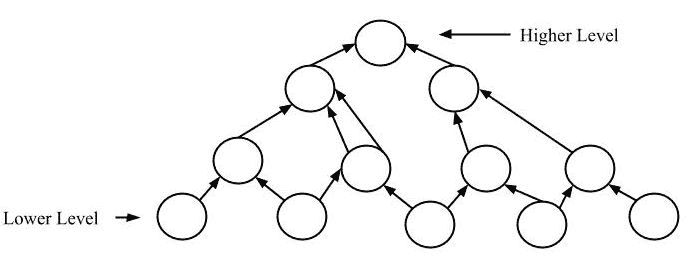
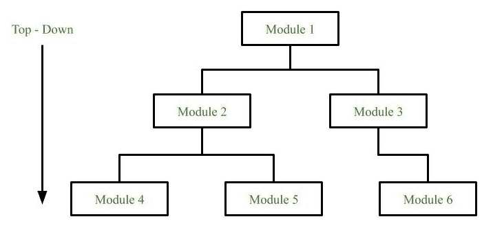

# 软件工程|系统设计策略

> 原文: [https://www.geeksforgeeks.org/software-engineering-system-design-strategy/](https://www.geeksforgeeks.org/software-engineering-system-design-strategy/)

好的系统设计是以易于开发和更改的方式组织程序模块。结构化设计技术帮助开发人员处理程序的规模和复杂性。分析师为开发人员创建关于代码应该如何编写以及代码片段应该如何组合在一起形成一个程序的说明。

## 重要性

1.  如果需要理解、组织和拼凑任何预先存在的代码。
2.  对于项目团队来说，必须编写一些代码并生成支持系统应用逻辑的原始程序是很常见的。

执行系统设计有许多策略或技术。它们是:

### Bottom-up approach

设计从最低级别的组件和子系统开始。通过使用这些组件，创建或组合下一个直接更高级别的组件和子系统。这个过程一直持续到所有组件和子系统被组合成一个单一的组件，该组件被视为完整的系统。随着设计向更高级别移动，抽象程度会越来越高。

通过使用现有系统的基本信息，当需要创建新系统时，自下而上的策略符合目的。

#### 优势

*   当通用解决方案可以重复使用时，就会产生经济效益。
*   它可以用来隐藏实现的底层细节，并与自顶向下的技术相结合。

#### 缺点

*   它与问题的结构没有那么密切的关系。
*   高质量的自下而上的解决方案很难构建。
*   它导致“潜在有用”功能的扩散，而不是最合适的功能。

### Top-down approach

每个系统被划分为几个子系统和组件。每个子系统进一步被划分为一组子系统和组件。这种划分过程有助于形成系统层次结构。完整的软件系统被视为一个单一实体，并根据其特性被划分为子系统和组件。每个子系统也进行同样的划分。

这个过程一直持续到达到系统的最低水平。设计最初是通过将系统定义为一个整体开始的，然后继续添加子系统和组件的定义。当所有的定义组合在一起时，它就变成了一个完整的系统。

对于需要从底层开发的软件解决方案，自上而下的设计最适合目的。

#### 优势

自顶向下方法的主要优点是，它对需求的强烈关注有助于使设计根据其需求做出响应。

#### 缺点

*   项目和系统边界倾向于面向应用程序规范。因此，组件重用的优势更有可能被错过。
*   系统很可能会错过结构良好的简单架构的好处。

### 混合设计

它是自上而下和自下而上设计策略的结合。这样，我们可以重用模块。