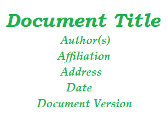

# 软件需求规格（SRS）格式

> 原文：[https://www.geeksforgeeks.org/software-requirement-specification-srs-format/](https://www.geeksforgeeks.org/software-requirement-specification-srs-format/)

为了形成一个[好的 SRS](https://www.geeksforgeeks.org/software-engineering-quality-characteristics-of-a-good-srs/) ，在这里你会看到一些可以利用的，应该考虑形成一个好的 SRS 的结构的点。这些措施如下：

## 1. 介绍
*   **(i)** 本文件的目的
*   **(ii)** 本文件的范围
*   **(iii)** 概述

## 2. 概述
## 3. 功能要求
## 4. 接口要求
## 5. 性能要求
## 6. 设计约束
## 7. 非功能属性
## 8. 初步计划和预算
## 9. 附录

**软件需求规范（SRS）格式**顾名思义，是对软件系统成功开发需要满足的软件需求的完整规范和描述。这些需求可以是功能性的，也可以是非功能性的，这取决于需求的类型。不同客户和承包商之间的互动是因为需要充分了解客户的需求。

根据交互后收集的信息，开发了软件需求分析系统，该系统描述了软件的需求，可能包括为提高产品质量和满足客户需求而需要进行的变更和修改。

### `Introduction`
*   **(i) 本文件的目的 –**
    首先，解释和说明为什么需要本文件的主要目的以及文件的目的。
*   **(ii) 本文件的范围 –**
    在本文件中，描述并解释了本文件的总体工作和主要目标及其将为客户提供的价值。它还包括开发成本和所需时间的描述。
*   **(iii) 概述 –**
    在此，说明产品的描述。这只是对产品的总结或全面回顾。

### `General description`
在此，提及了产品的通用功能，包括用户目标、用户特征、功能、优点及其重要性。它还描述了用户社区的特征。

### `Functional Requirements`
在此，充分解释了软件系统的可能结果，包括程序操作带来的影响。所有功能需求，可能包括计算、数据处理等，都按优先级排序。

### `Interface Requirements`
在此，充分描述和解释了软件接口，即软件程序如何与其他程序或用户通信，无论是通过任何语言、代码还是消息。示例可以是共享内存、数据流等。

### `Performance Requirements`
在此，解释了软件系统如何在特定条件下执行所需功能。它还解释了所需时间、所需内存、最大错误率等。

### `Design Constraints`
在此，为设计团队指定并解释了约束条件，即限制或约束。示例可能包括使用特定算法、硬件和软件限制等。

### `Non-Functional Attributes`
在此，解释了软件系统为获得更好性能所需的非功能性属性。示例可能包括安全性、可移植性、可靠性、可重用性、应用程序兼容性、数据完整性、可扩展性容量等。

### `Preliminary Schedule and Budget`
在此，解释了项目计划的初始版本和预算，包括项目开发所需的总时长和总成本。

### `附录`
在这种情况下，给出了附加信息，如信息收集地的参考资料、某些特定术语的定义、首字母缩略词、缩写等，并进行了解释。