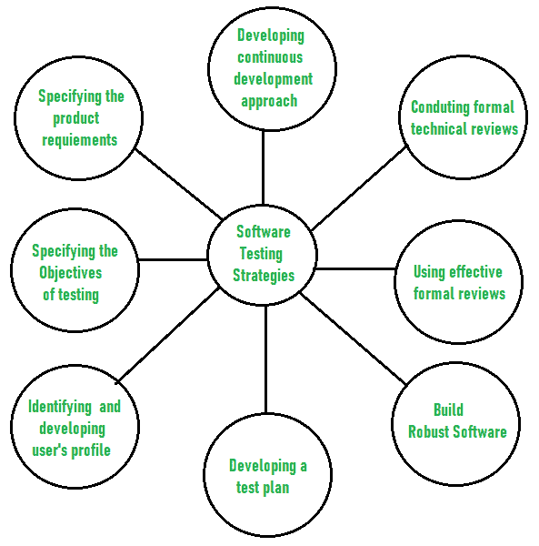

# 软件测试策略

> 原文：[https://www.geeksforgeeks.org/software-testing-strategies/](https://www.geeksforgeeks.org/software-testing-strategies/)

[软件测试](https://www.geeksforgeeks.org/software-testing-basics/)是一种调查类型，旨在找出软件中是否存在任何默认或错误，以便减少或消除错误，从而提高软件质量，并检查软件是否满足指定的要求。

根据格伦·迈尔斯的说法，软件测试有以下目标：

*   调查和检查程序以发现是否有错误以及它是否满足要求的过程称为测试。
*   当测试期间发现的错误数量很高时，这表明测试是好的，并且是好的测试用例的标志。
*   发现一个尚未被发现的未知错误是一个成功的好的测试案例的标志。

软件测试的主要目标是设计测试，使其系统地发现不同类型的错误，而不需要花费太多的时间和精力，从而减少软件开发所需的时间。

## 软件测试的总体策略

### 1. 明确量化产品需求

**Before testing starts, it’s necessary to identify and specify the requirements of the product in a quantifiable manner.**
不同特征质量的软件是存在的，例如可维护性（意味着更新和修改的能力）、概率（意味着发现和估计任何风险）和可用性（意味着客户或最终用户可以多么容易地使用它）。所有这些特征质量都应按特定顺序指定，以获得清晰无误的测试结果。

### 2. 清晰详细地说明测试目标

**Specifying the objectives of testing in a clear and detailed manner.**
有几个测试目标，例如有效性（意味着软件可以多么有效地实现目标）、任何故障（意味着无法满足要求和执行功能）以及缺陷或错误的成本（意味着修复错误所需的成本）。所有这些目标都应在测试计划中明确提及。

### 3. 识别用户类别并为每个用户建立档案

**For the software, identifying the user’s category and developing a profile for each user.**
用例描述了不同类别的用户与系统之间的交互和通信，以实现目标。以便识别用户的实际需求，然后测试产品的实际使用情况。

### 4. 制定测试计划，赋予价值并专注于快速循环测试

**制定测试计划，赋予价值并专注于快速循环测试。**
快速循环测试是一种通过识别和测量软件过程改进所需的任何变化来提高质量的测试。因此，测试计划是帮助测试人员执行快速循环测试的重要而有效的文档。

### 5. 开发能够自我测试的健壮软件

**Robust software is developed that is designed to test itself.**
软件应能够检测或识别不同类别的错误。此外，软件设计应允许自动化和回归测试，以测试软件是否因代码或程序的任何更改而对软件功能产生任何不利或副作用。

### 6. 在测试前使用有效的正式评审作为过滤器

**Before testing, using effective formal reviews as a filter.**
正式技术评审是一种识别尚未发现的错误的技术。在测试前进行的有效技术评审可以减少大量的测试工作和测试软件所需的时间，从而减少软件的总体开发时间。

### 7. 进行正式技术评审以评估测试策略和测试用例

**Conduct formal technical reviews to evaluate the nature, quality or ability of the test strategy and test cases.**
正式技术评审有助于检测测试方法中任何未填补的空白。因此，有必要通过技术评审员评估测试策略和测试用例的能力和质量，以提高软件质量。

### 8. 为测试过程制定持续改进的方法

**For the testing process, developing a approach for the continuous development.**
作为统计过程控制方法的一部分，应使用已测量的测试策略进行软件测试，以在软件开发过程中测量和控制质量。