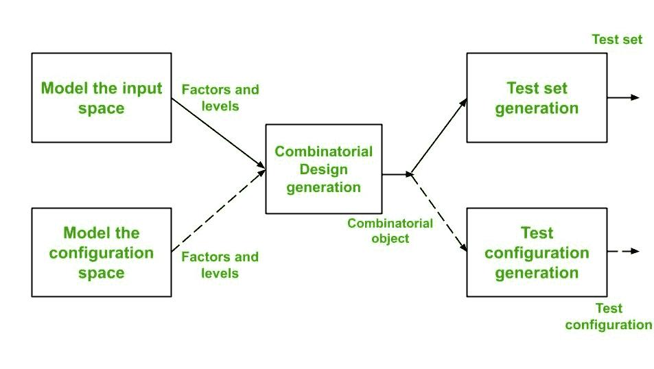
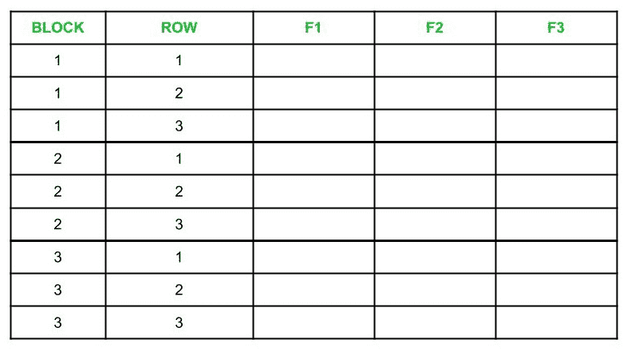
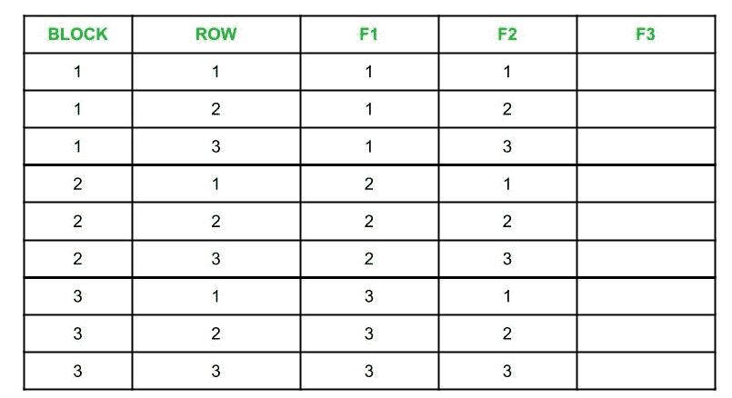
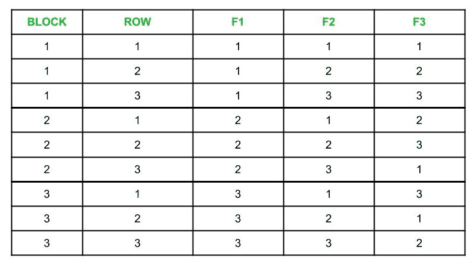

# 组合测试中的测试配置生成

> 原文：[https://www.geeksforgeeks.org/test-configuration-generation-in-combinatorial-testing/](https://www.geeksforgeeks.org/test-configuration-generation-in-combinatorial-testing/)

测试配置生成是组合测试设计过程的重要组成部分。组合设计流程如下图所示：



从上图可以看出，组合测试设计过程有 3 个主要步骤：

*   输入空间和配置空间的建模。
*   借助组合设计程序生成组合对象。得到的组合对象是一系列因素和层次。
*   使用组合对象生成测试集或测试配置。

**注：**
输入变量称为`因子`，可分配给因子的值称为`级`。

## 测试设计算法

为了设计测试配置，我们使用了测试设计算法。该算法将 `n` 个因子（输入变量）作为输入，并输出一组因子组合，从而覆盖所有级别对。测试设计算法有以下步骤：

1.  **重新标记因子：**
    给定的因子必须首先重新标记为 `F1`、`F2`、`F3`、…..`Fn`，这样：

    ```
    |F1| >= |F2| >= |F3| >= .........|Fn-1| >= |Fn|

    Let b = |F1| and k = |F2|

    Here, |Fi| is the number of levels in Factor Fi
    ```

2.  **准备表格：**
    创建一个包含 `n` 列的表格，标签为 `F1`、`F2`、`F3`、…..`Fn`，以及 `(b x k)` 行，分为 `b` 个块。这里，每个块包含 `k` 行。下表是 `n = b = k = 3` 的示例：

    

3.  **填充列 `F1` 和 `F2`：**
    我们在块 1 中用 1 填充 `F1` 列，在块 2 中用 2 填充，其他块类似。对于 `F2` 列，我们在块 1 的第 1 到 `k` 行中填充序列 1, 2, 3 …. `k`，并在其余块中重复此操作。下表是一个示例：

    

4.  **寻找 `k` 阶的 MOLS 并填充剩余列：**
    在填充列之前，我们必须首先理解 MOLS 以及如何找到它们。

    MOLS（相互正交的拉丁方）用于从一个完整的集合中选择因子组合的子集。`n` 阶拉丁方是一个 `n×n` 矩阵，其中没有一个元素在行和列中出现超过一次。

    **例-1：**
    如果 `S = {X，Y}`，那么 2 阶拉丁方将为：

    ```
    X  Y
    Y  X
    ```

    和

    ```
    Y  X
    X  Y
    ```

    **示例-2：**
    如果 `S = {1，2，3}`，则 3 阶拉丁方将为：

    ```
    1  2  3
    2  3  1
    3  1  2
    ```

    和

    ```
    2  3  1
    1  2  3
    3  1  2
    ```

    和

    ```
    2  1  3
    3  2  1
    1  3  2
    ```

    要构建拉丁方，创建第一行 `n` 个不同的元素，并通过置换第一行来填充其他行。例如，
    如果 `S = {1，2，3，4}`，那么拉丁方可以是：

    ```
    1  2  3  4
    2  3  4  1
    3  4  1  2
    4  1  2  3
    ```

    要创建 `MOLS`，让 `M1` 和 `M2` 成为两个拉丁方块，每个都是 `n` 阶。
    让 `M1(i，j)` 和 `M2(i，j)` 分别表示拉丁方 `M1` 和 `M2` 中第 `i` 行和第 `j` 列的元素。现在，我们从 `M1` 和 `M2` 创建一个 `n×n` 矩阵 `L`，这样 `L(i，j)` 就是 `M1(i，j) M2(i，j)`，也就是说，我们将 `M1` 和 `M2` 的相应元素并置。
    如果 `L` 中的每个元素恰好出现一次，即它是唯一的，那么 `M1` 和 `M2` 被称为 `n` 阶相互正交的拉丁方。

    例如，

    ```
    Consider M1 =   2  3  1    and, M2 =   1  2  3
                    3  1  2                3  1  2
    ```

    所以，`L` 的构造如下：

    ```
    L =     21  32  13
            33  11  22
    ```

    因为 `L` 中的元素是唯一的，所以，`M1` 和 `M2` 是 3 阶的 MOLS。

    **注：**
    当 `n` 为素数或素数的幂时，则 `MOLS(n)` 包含 `n -1` 个 MOLS。
    同样，对于 `n = 2` 和 `n = 6`，MOLS 不存在，但是，对于大于 2 的所有其他值，它们存在。

    现在，为了填充剩余的列，我们可以找到 `k` 阶的 MOLS。将这些 MOLS 编号为 `M1`、`M2` 等等。
    这里，`s < k` 代表 `k > 1`，其中 `s` = 阶的 MOLS 数，用 `M1` 第 1 列的元素填充 `F3` 列的第 1 块，用 `M1` 第 2 列的元素填充第 2 块，以此类推。
    如果 `b > k`，则重用 `M1` 列来填充剩余 `(b-k)` 块中的行。使用 MOLS `M2` 至 `Ms`，对 `F4` 至 `Fn` 列重复此过程。如果 `s < n–2`，则我们可以通过随机选择因子值来填充剩余列。

    例如，

    ```
    If n = k = 3
    ```

    那么三阶 MOLS 是：

    ```
    M1 =     2  3  1    and, M2 =    3  1  2
             3  1  2                 2  3  1
    ```

    我们可以使用这些 MOLS 填充表格的剩余列。为了更好地理解，请参考下表。

    

5.  **检查是否满足约束：**
    如果没有给出约束，则应跳过步骤 5 和 6。否则，不满足给定约束的行中的条目应被标记。约束可能如下给出：
    *   Safari 浏览器只支持 Mac OS。
    *   火狐浏览器在 Windows、Linux 上工作。
    *   Windows 操作系统只支持局域网和 PPP 协议。

6.  **删除不满足给定约束的配置：**
    必须删除表中用方框突出显示的配置。这是通过以下两步过程来完成的，即删除它们并保持成对覆盖：
    1.  修改高亮显示的行，以保持约束。
    2.  添加新的配置，覆盖在替换突出显示的行时未覆盖的对。

7.  **用给定的因子值替换列中的数字：**
    在此步骤中，我们最终通过将表中列的值替换为因子的实际值来获得测试配置。例如，
    如果 `F1` 是一个叫做操作系统的因素，`F1` 的级别包括 `{MacOs、Windows、Linux}`
    那么如果列 `F1` 具有如下值：

    ```
    1
    2
    3
    ```

    然后，它们应该被替换如下：

    ```
    MacOS
    Windows
    Linux
    ```

    其中 `MacOS`、`Windows` 和 `Linux` 分别代表 1、2 和 3。

**对所有列执行此步骤后，获得的表将包含最终测试配置。**