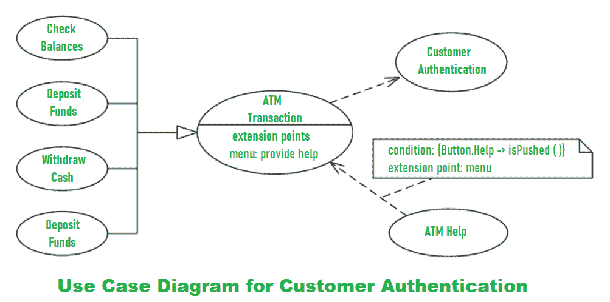
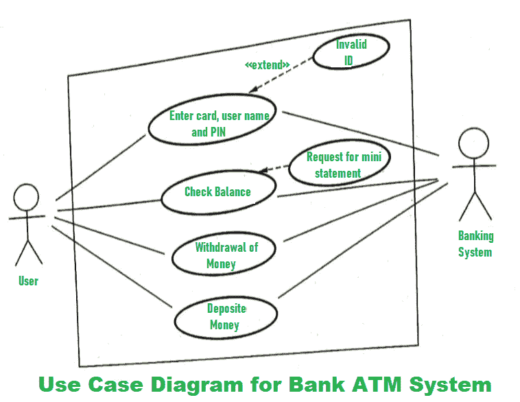
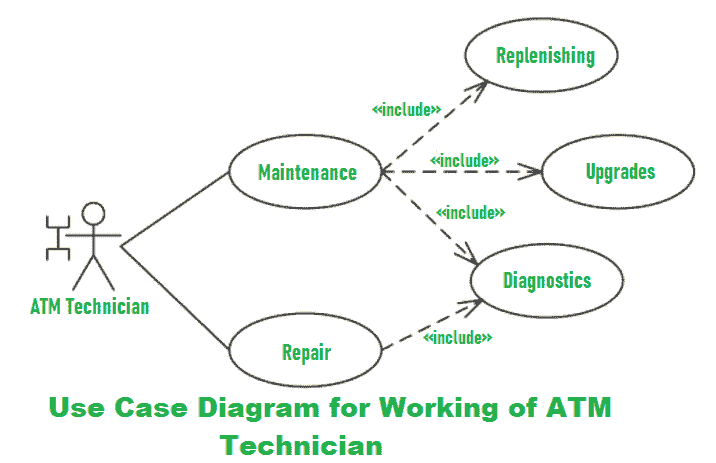

# 银行 ATM 系统用例图

> 原文: [https://www.geeksforgeeks.org/use-case-diagram-for-bank-atm-system/](https://www.geeksforgeeks.org/use-case-diagram-for-bank-atm-system/)

**自动柜员机(ATM)** 又称 ABM(自动银行机)是一种银行系统。该银行系统允许客户或用户进行金融交易。这些交易可以在公共场所进行，不需要店员、出纳员或银行出纳员。借助**用例图**，可以解释自动柜员机的工作和描述。

我们将了解自动柜员机系统用例图的设计。系统的一些场景如下。

## Step-1
用户将塑料 ATM 卡插入银行 ATM 时即通过认证。然后输入用户名和 PIN（个人识别码）。对于每笔 ATM 交易，客户认证用例都是必需且关键的。因此，它以包含关系显示。客户认证的用例图示例如下：

## Step-2
用户检查银行余额，如果需要，也会要求提供关于银行余额的迷你对账单。然后用户根据需要取款。如果他们想存钱，也可以这样做。完成操作后，用户关闭会话。银行 ATM 系统的用例图示例如下：

## Step-3
如果银行 ATM 出现任何错误或需要维修，则由 ATM 技术员完成。ATM 技术员负责银行 ATM 的维护、硬件、固件或软件的升级以及现场诊断。ATM 技术员工作的用例图示例如下：

