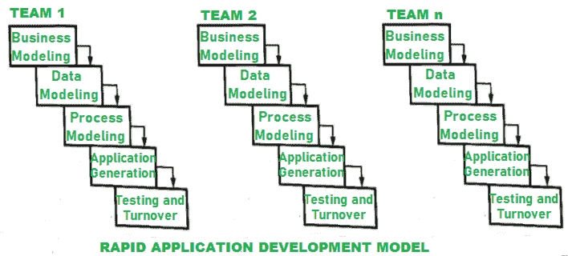

# RAD 模型各阶段

> 原文:[https://www.geeksforgeeks.org/various-phases-of-rad-model/](https://www.geeksforgeeks.org/various-phases-of-rad-model/)

[快速应用开发(`RAD`)](https://www.geeksforgeeks.org/steps-in-rapid-application-development-rad-model/) 模型是一种并行建立或开发组件的增量式软件过程模型。

`RAD` 负责组件的可重用性和软件的并行开发。因此，软件开发所需的时间减少，并导致软件的快速开发，这将导致产品快速交付给最终用户。在这种模式下，项目的开发周期很短，规模也很小。

20 世纪 80 年代，IBM 首次提出了快速应用开发模型。与瀑布模型相比，该模型的开发使用基于组件的构造，速度非常快。在使用该模型之前，了解项目的需求以完全满足用户的需求并有项目范围的限制是非常必要和重要的，以便在给定的时间内开发出功能完整、没有任何错误或缺陷的系统。

`RAD` 模型的各个阶段是:

## 1. Business Modeling –
在业务建模中，识别信息流并在不同业务功能之间进行建模。它简单地描述了你的业务如何产生可支付的支票，即如何赚钱，并解释了你将如何增加产品的价值或质量，以及以适当的成本向客户交付有价值的产品。

以下信息由业务职能部门收集:
*   推动业务流程的信息，这意味着在开发期间和开发之前收集的信息是提高质量以发展成功业务所必需的。
*   在建模期间生成的关于整体开发结果的信息类型，以便在需要任何更改或修改时，可以提高质量。
*   产生或制造信息的信息产生者。
*   关于信息如何传递的信息流或流向，以便在出现问题时能够解决。
*   信息处理者，负责处理识别出的信息，并在需要时进行更改。

## 2. Data Modeling –
在此阶段，在业务模型中收集的信息根据不同的类别进行分类，并用于定义可用的数据对象。识别所有存在的数据对象的特征，这些特征对业务开发很有用。在不同类型的数据对象之间存在连接它们的关系，这种关系在此类建模中被定义或解释。

## 3. Process Modeling –
在此阶段，必要的数据对象被转换或转化为所需的可用信息或过程。这些过程非常重要，因为它们有助于从数据对象中提取或获取信息，以便在不出现任何问题的情况下进行适当的处理所需的任何更改，并负责实现业务功能。在此阶段，可以根据需要对项目开发进行更改和优化，以提高价值和质量。

## 4. Application Generation –
为了创建或开发软件，可以使用不同的自动化工具。为了非常快速地增加软件开发以减少开发时间，`RAD` 利用可重用的组件，或者在不可用时开发可重用组件。

## 5. 测试和周转–
`RAD` 使用可重复使用的组件，因此减少了测试所需的工作量。但是在软件开发过程中，如果在测试过程中添加了新的组件，那么测试这些新添加的组件是必须的，并且是必不可少的，这样如果发现任何错误，就可以将其删除。所有接口的测试对于确保项目开发的安全没有任何错误同样重要。

在 `RAD` 模型中，开发或建立全功能系统需要完全理解需求。使用可重用组件，可以完成应用程序开发。如果可重用组件可用，`RAD` 会使用它们，但是如果它们较少或不可用，那么它会使用自动化工具来创建所需的组件。

`RAD Model` 减少了开发所需的时间，增加了组件的可重用性，利用客户的反馈来提高产品质量，非常灵活，适应客户和其他权威机构建议的变化和技术来增加开发，由于其原型性质，缺陷较少。但是它也有一些缺点，比如它需要大量的人来从事项目，它需要高度投入的、忠诚的开发人员和客户朝着那里工作，使用 `RAD` 模型的项目需要大量的资源，因此生产成本会很高，如果没有适当的模块化，即修改程序或改变代码，那么 `RAD` 项目就会失败，使用 `RAD` 模型的项目很难采用新技术和改变。