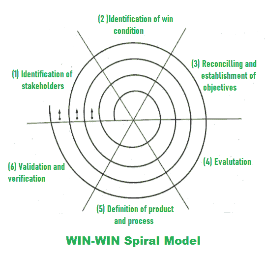

# WIN-WIN 螺旋模型的各个阶段

> 原文：[https://www.geeksforgeeks.org/various-stages-of-win-win-spiral-model/](https://www.geeksforgeeks.org/various-stages-of-win-win-spiral-model/)

[`螺旋模型`](https://www.geeksforgeeks.org/software-engineering-spiral-model/)通常显示原型模型的重复性质，并控制线性顺序模型的适当明确的方法。[`螺旋模型`](https://www.geeksforgeeks.org/software-engineering-spiral-model/)也被称为元模型，因为所有其他过程模型都包含在[`螺旋模型`](https://www.geeksforgeeks.org/software-engineering-spiral-model/)中。

[`瀑布模型`](https://www.geeksforgeeks.org/software-engineering-classical-waterfall-model/)也是用[`螺旋模型`](https://www.geeksforgeeks.org/software-engineering-spiral-model/)的单回路来表示的。为了在实际产品建立之前开发原型，[`螺旋模型`](https://www.geeksforgeeks.org/software-engineering-spiral-model/)使用原型方法。[`进化模型`](https://www.geeksforgeeks.org/software-engineering-evolutionary-model/)也受到[`螺旋模型`](https://www.geeksforgeeks.org/software-engineering-spiral-model/)的支持，因为沿着螺旋的迭代代表进化水平，使用它可以构建一个完整的系统。可以使用原型方法在[`螺旋模型`](https://www.geeksforgeeks.org/software-engineering-spiral-model/)中降低风险。从[`瀑布模型`](https://www.geeksforgeeks.org/software-engineering-classical-waterfall-model/)来看，采用了系统化的适当开发方法。

为了获得项目需求，客户沟通在[`螺旋模型`](https://www.geeksforgeeks.org/software-engineering-spiral-model/)中非常重要和必要，[`WIN-WIN 模型`](https://www.geeksforgeeks.org/various-stages-of-win-win-spiral-model/)也建议和支持与客户进行良好和适当的沟通。在实际操作中，客户和开发者必须面对简单地意味着妥协的协商过程。当双方都同意时，谈判才会成功。这就是所谓的[`WIN-WIN`](https://www.geeksforgeeks.org/various-stages-of-win-win-spiral-model/)局面。

*   **Customer’s win means –**
    Obtaining the system that fulfill most of the requirements of customers.
*   **Developer’s win means –**
    Getting the work done by fulfilling the realistic requirements of customers in a given deadline and achievable budgets.

在螺旋的每个通道的开始，谈判活动以[`WIN-WIN`](https://www.geeksforgeeks.org/various-stages-of-win-win-spiral-model/)螺旋模式进行。

下图显示了可以在[`WIN-WIN`](https://www.geeksforgeeks.org/various-stages-of-win-win-spiral-model/)螺旋模型中执行的各种活动：

### 1. 识别利益相关者

### 2. 利益相关者决心尽最大努力实现或获得双赢

### 3. 为赢得条件而奋力拼搏的利益相关者的谈判
软件项目团队为双赢的结果而努力。然后确定下一级目标、约束和替代方案。

### 4. 评估与风险分析
对过程和产品进行评估，然后分析、解决或降低风险，使之变得容易。

### 5. 定义下一级产品和流程
为正常工作定义下一级产品和流程。

### 6. 验证过程和产品定义
必须验证过程和产品定义。

### 7. 审查与评论
审查产品并给出必要的重要评论。

有三个锚点可以在[`WIN-WIN`](https://www.geeksforgeeks.org/various-stages-of-win-win-spiral-model/)螺旋模型中定义，如下所示：

### 1. 生命周期目标
[`LCO`](https://www.geeksforgeeks.org/various-stages-of-win-win-spiral-model/)定义了软件工程活动所必需的目标。

### 2. 生命周期架构
[`LCA`](https://www.geeksforgeeks.org/various-stages-of-win-win-spiral-model/)定义了可以按照设定的所有目标生产的软件架构。

### 3. 初始运行能力
[`IOC`](https://www.geeksforgeeks.org/various-stages-of-win-win-spiral-model/)代表具有所有初始所需运行能力的软件。