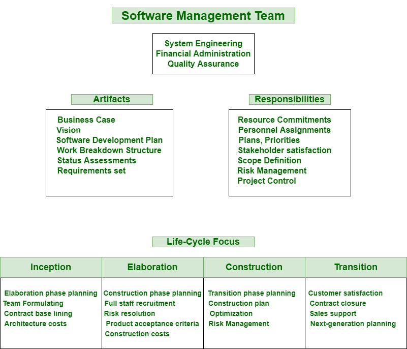
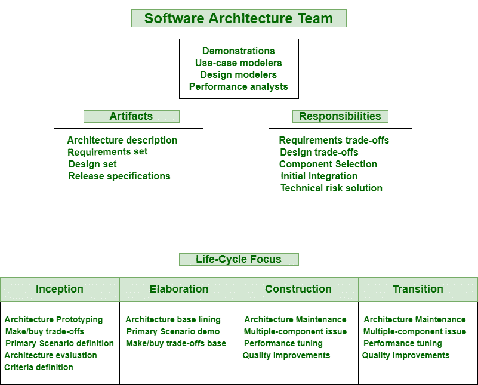
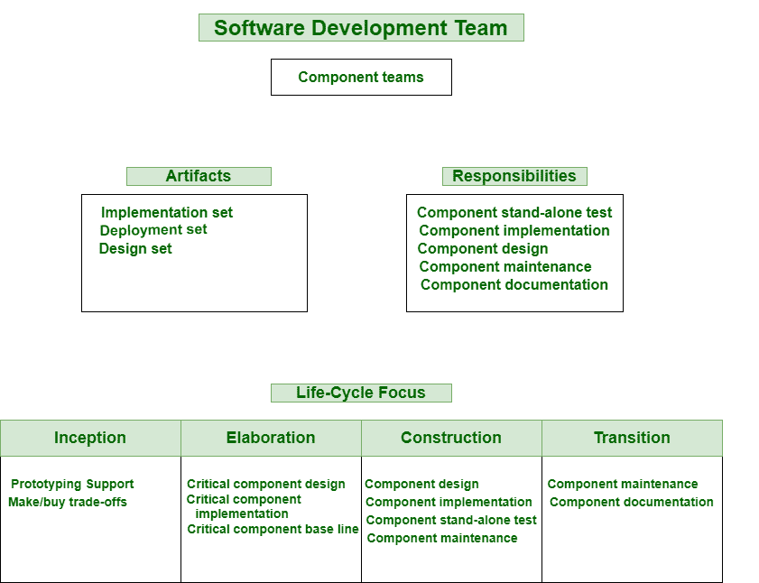
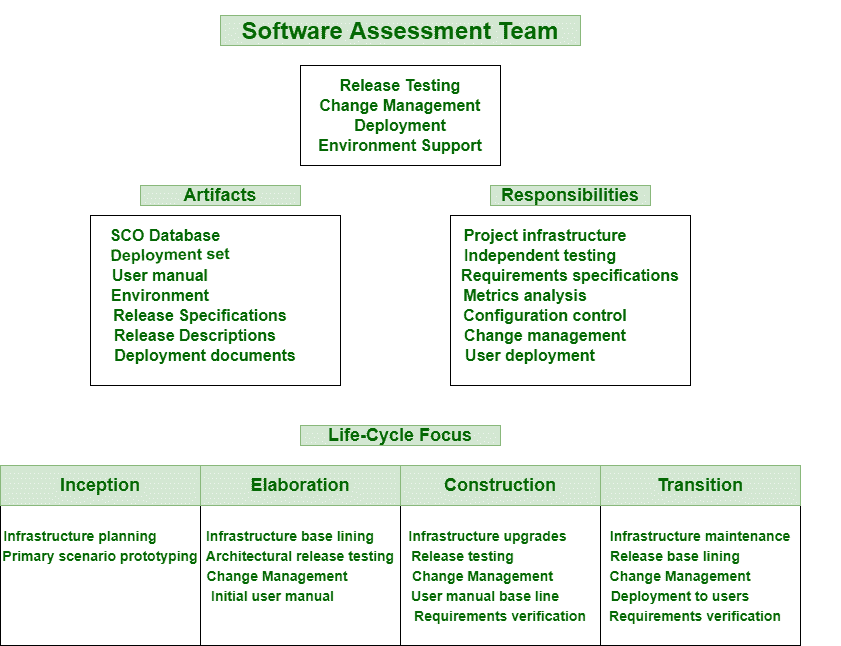

# 项目组织中的各个团队

> 原文：[https://www.geeksforgeeks.org/various-teams-in-project-organization/](https://www.geeksforgeeks.org/various-teams-in-project-organization/)

**项目组织**是由专家单独创建，不同部门工作的项目结构。所有这些人员通常在项目经理的领导下工作。它简单地映射了所有项目级角色和[职责](https://www.geeksforgeeks.org/project-organizations-and-their-responsibilities/)。项目结构可以根据特定项目组织的规模和条件进行修改。

该组织的重要特点如下：

## 1. `Software Management Team`

`Software Management Team` 通常是积极参与者，有助于更好地协作、生产和管理软件项目。他们负责交付新软件或升级现有产品所需的资源和过程。

他们维护功能、质量，改进处理，在不同目标的利益相关者或供应商之间协商合同。这个团队只需掌控质量的所有方面。

## 2. `Software Architecture Team`

`Software Architecture Team` 拥有许多技能，如经验（在软件开发中产生过程视图、组件视图、部署视图，在应用领域中产生设计视图和用例视图）、更好的沟通技能（以便他们能够说服、理解、挖掘真实的问题和难题、说服持怀疑态度的人并销售架构）、目标导向、领导力（必须有一些领导技能，如技术领导力）等。

架构团队共享一个共同的目标或一小组目标，这些目标必须对架构团队和他们的环境明确定义。这通常是架构的责任。

## 3. `Software Development Team`

`Software Development Team` 通常在软件开发中应用他们的工程知识和各种[编程语言](https://www.geeksforgeeks.org/introduction-to-programming-languages/)的知识。该团队由设计师、软件开发人员、项目经理和更高级别的测试人员组成。

该团队通常包括几个子团队，专门负责需要通用技能集的各种组件组。开发团队只是负责维护单个组件的质量，甚至包括开发、测试和维护的所有组件。

## 4. `Software Assessment Team`

`Software Assessment Team` 通常检查组织使用的软件过程在实现目标方面是否有效和高效，这简单地基于过程模型。

这个团队确定需要改进的地方，甚至提出改进的计划。确保独立的质量观点和开发活动的并发性是使用独立团队进行软件评估的两个主要原因。现代开发过程应该采用面向用例的测试或者基于能力的测试。