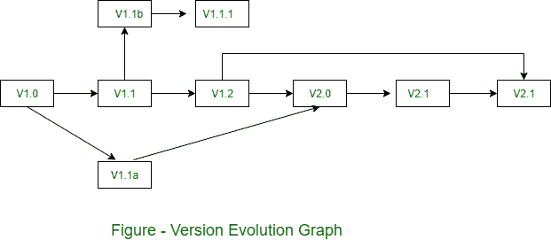

# 项目中的版本控制

> 原文：[https://www.geeksforgeeks.org/version-control-in-project/](https://www.geeksforgeeks.org/version-control-in-project/)

版本控制将过程和工具结合起来，以管理在软件工程过程中创建的不同版本的配置项。

软件版本是软件配置项（源代码、文档、数据）的集合。每个版本可能由不同的变体组成。版本控制活动分为四个子活动：

## 1. 识别新版本

当一个软件配置项（`SCI`）的基线发生变更时，它将获得一个新的版本号。每个先前的版本将被存储在兼容的目录中，如 `version 0`、`version 1`、`version 2` 等。

## 2. 编号方案

编号方案将采用以下格式：

```
version X.Y.Z ....
```

第一个字母（`X`）表示整个 `SCI`。因此，对整个配置项所做的更改，或者大到足以保证该项目的全新发布的更改，将导致第一个数字增加。

第二个字母（`Y`）表示 `SCI` 的一个组成部分。如果对一个组件进行了更改或对多个组件进行了小的更改，该数字将依次增加。

第三个字母（`Z`）表示 `SCI` 组件的一部分。只有将组件分成单独的部分时，此编号才可见。在这种详细程度下所做的更改将需要第三位数字的连续更改。

## 3. 可见性

版本号可以显示在框架中，或标题下方。此决策取决于团队是为支持框架的浏览器编码所有文档，还是允许使用不支持框架的浏览器。

无论哪种情况，版本号都将始终可用。

## 4. 跟踪

跟踪不同版本列表的最佳方式是使用如图所示的版本开发图。



例如，如果我们需要跟踪每个更新的项目进度，那么我们可以在每次变更时分配一个版本号。