# VS Code：用 C++ 构建、运行和调试

> 原文：[https://www.geeksforgeeks.org/vs-code-build-run-and-debug-in-c/](https://www.geeksforgeeks.org/vs-code-build-run-and-debug-in-c/)

在本文中，我们将讨论断点调试所需的 [VS Code 设置](https://www.geeksforgeeks.org/how-to-setup-competitive-programming-in-visual-studio-code-for-c/)。首先创建一个配置 VS Code 的文件 `launch.json`，在[调试过程](https://www.geeksforgeeks.org/software-engineering-debugging/)开始时启动 [GDB 调试器](https://www.geeksforgeeks.org/gdb-step-by-step-introduction/)。然后创建一个文件 `tasks.json`，告诉 VS Code [如何构建(编译)程序](https://www.geeksforgeeks.org/compile-32-bit-program-64-bit-gcc-c-c/)。最后，对控制台设置进行一些更改，并实现构建和调试。

## 程序

下面是演示目的的代码：

### C++

```cpp
// C++ program to find the value of
// the pow(a, b) iteratively
#include <bits/stdc++.h>
using namespace std;

// Driver Code
int main()
{
    int a, b, pow = 1;

    // Input two numbers
    cin >> a >> b;

    // Iterate till b from 1
    for (int i = 1; i <= b; i++) {
        pow = pow * a;
    }

    // Print the value
    cout << pow;
}
```

## Launch.json

该文件与调试器的名称、调试器的路径、当前 CPP 文件的目录以及关于数据的控制台等信息相关。以下是文件中的代码：

```json
{
    // Use IntelliSense to learn 
    // about possible attributes.
    // Hover to view descriptions 
    // of existing attributes.
    // For more information, visit: 
    // https://go.microsoft.com/fwlink/?linkid=830387
    "version": "0.2.0",
    "configurations": [
        {
            "name": "g++.exe - Build and debug active file",
            "type": "cppdbg",
            "request": "launch",
            "program": "${fileDirname}\\${fileBasenameNoExtension}.exe",
            "args": [],
            "stopAtEntry": false,
            "cwd": "${workspaceFolder}",
            "environment": [],
            "externalConsole": true,
            "MIMode": "gdb",
            "miDebuggerPath": "C:\\MinGW\\bin\\gdb.exe",
            "setupCommands": [
                {
                    "description": "Enable pretty-printing for gdb",
                    "text": "-enable-pretty-printing",
                    "ignoreFailures": true
                }
            ],
            "preLaunchTask": "C/C++: g++.exe build active file"
        }
    ]
}
```

### `launch.json` 中的重要术语

您可以完全使用上面给出的代码，也可以自动使用机器中生成的代码。在这两种情况下，你都必须采取一些预防措施。首先，确保属性 `"externalConsole"` 被标记为 `true`（我们将在本主题后面理解其意义）。然后检查属性 `"miDebuggerPath"` 是否正确指向 `gdb` 调试器。让我们详细讨论这些属性：

1.  **`name`** 和 **`type`**：这些都是相当不言自明的，这些都是指 `launch.json` 的名称和类型。
2.  **`request`**：说明 `JSON` 文件的类型。
3.  **`program`**：存储 `launch.json` 文件所针对的程序的详细地址。
4.  **`cwd`**：表示当前工作目录。请注意，`launch.json` 文件中的所有地址都是通用格式，它们并不特定于任何文件。
5.  **`externalConsole`**：由于无法在 VS Code 的集成终端中处理输入/输出，因此使用外部控制台。所以设置为 `true`。
6.  **`miDebuggerPath`**：指向调试器的位置，这个会因用户而异。
7.  **`preLaunchTask`**：这包含 `tasks.json` 文件的名称。

### 步骤

*   转到屏幕左侧的运行选项卡，然后单击运行和调试。
    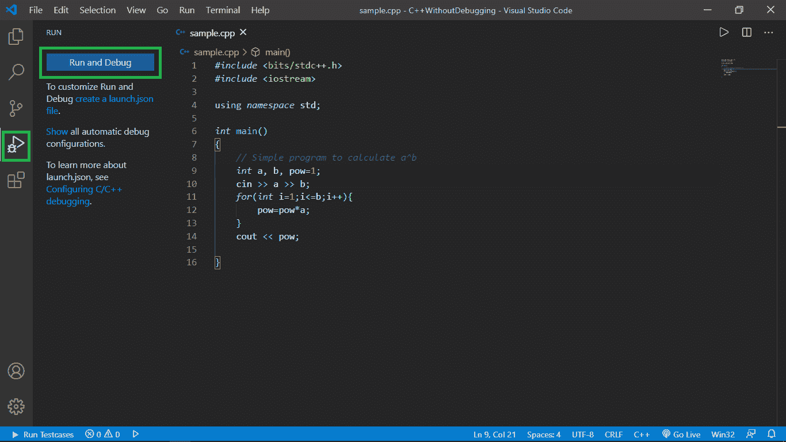
*   您将被要求选择调试器，选择 C++(GDB/LLDB)。*注意只有在您的电脑中安装并配置了 MinGW 时，此选项才会出现。(参考 [本](https://www.geeksforgeeks.org/how-to-setup-competitive-programming-in-visual-studio-code-for-c/) 篇安装配置 MinGW)。*
    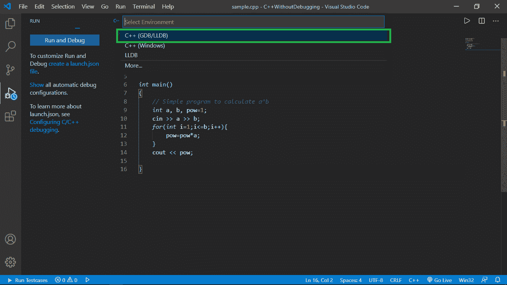
*   然后选择“g++.exe – 构建和调试活动文件”。*指 g++ GNU C++ 编译器。*
    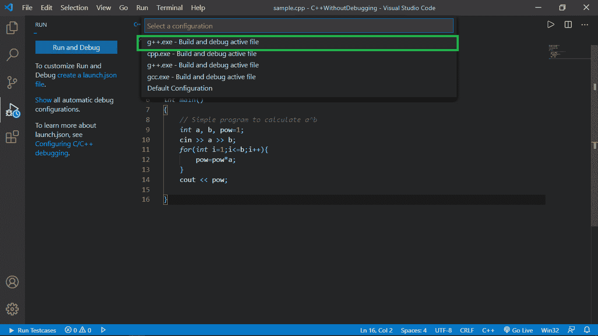
*   之后会出现一个 `Launch.json` 文件，您可以使用它，也可以使用我上面提供的文件。再次确保 `externalConsole` 标记为 `true`，并且 `miDebuggerPath` 设置正确。
    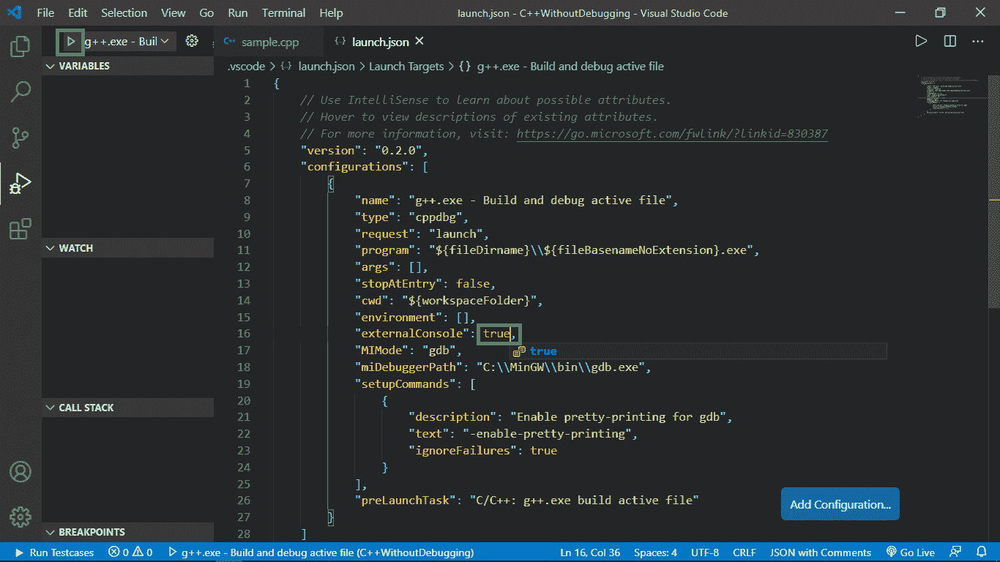
*   之后，点击屏幕左上角的播放按钮，进入 `tasks.json` 文件。

## Tasks.json

这个文件包含一些信息，比如用于编译的命令、编译器的地址、与 `launch.json` 中相同的标签以及其他一些信息。以下是文件中的代码：

```json
{
    "version": "2.0.0",
    "tasks": [
        {
            "type": "shell",
            "label": "C/C++: g++.exe build active file",
            "command": "C:\\MinGW\\bin\\g++.exe",
            "args": [
                "-std=c++11",
                "-O2",
                "-Wall",
                "-g",
                "${file}",
                "-o",
                "${fileDirname}\\${fileBasenameNoExtension}.exe"
            ],
            "options": {
                "cwd": "${workspaceFolder}"
            },
            "problemMatcher": [
                "$gcc"
            ],
            "group": {
                "isDefault": true,
                "kind": "build"
            }
        }
    ]
}
```

### `tasks.json` 中的重要术语

上面提到的 `tasks.json` 文件完全可以不用谨慎使用。但是，唯一需要注意的是，`tasks.json` 的 `label` 应该与 `launch.json` 的 `preLaunchTask` 匹配，下面我们来详细讨论一些术语：

*   **`label`**：这是 `tasks.json` 文件特有的，被 `launch.json` 用来在执行之前调用 `tasks.json`。
*   **`command`**：这指向 `g++` 编译器应用程序，因为它将用于编译。
*   **`args`**：这些参数和命令在连接时看起来就像是我们用于编译 CPP 文件和创建可执行文件的命令，如下所示：
    > `g++ -std=c++11 -O2 -Wall -g ${file} -o ${fileDirname}\${fileBasenameNoExtension}.exe`

### 步骤

*   从 `launch.json` 的最后一步开始，我们已经点击了左上角的播放按钮，现在出现了一个对话框，显示当前目录中没有 `tasks.json` 文件。所以我们需要创建一个，所以点击 **配置任务**。
    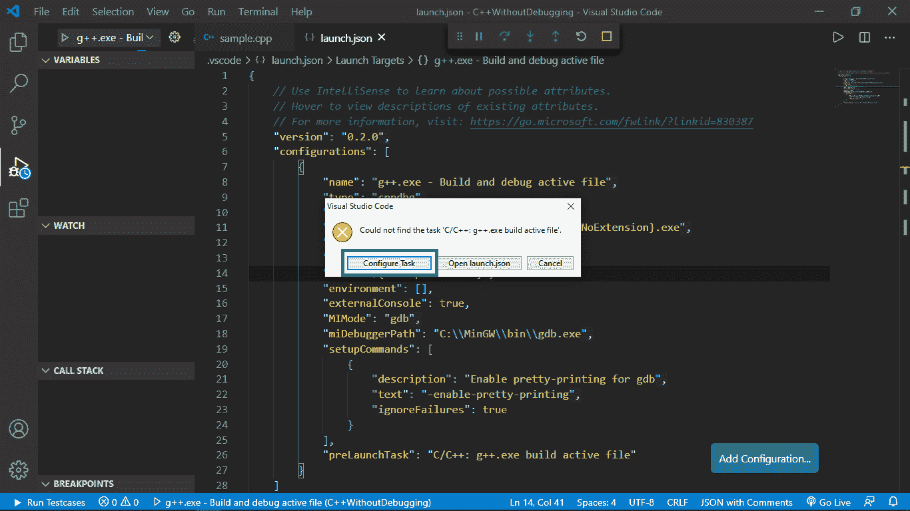
*   然后点击从模板创建任务文件。
    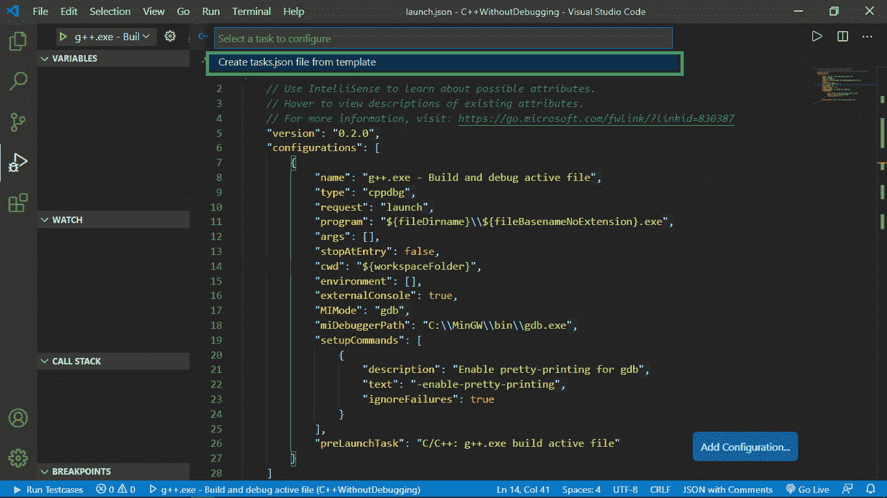
*   然后点击其他上的。
    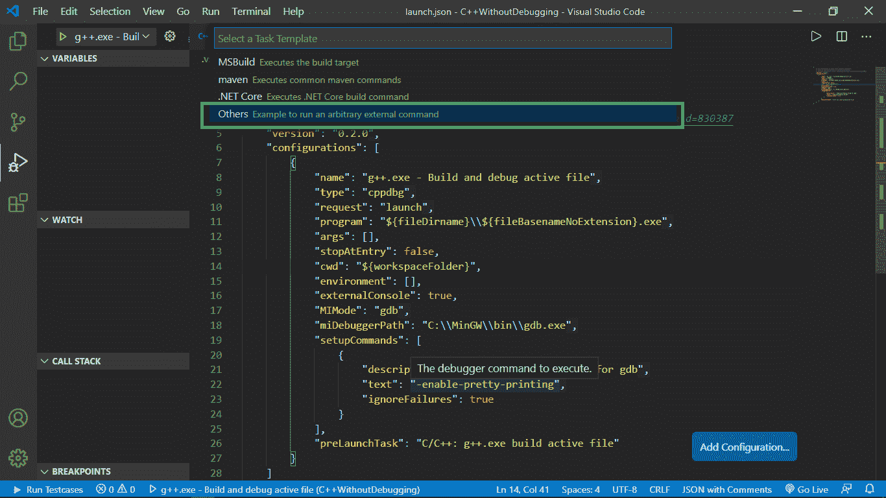
*   将上面提供的代码粘贴到新创建的 `tasks.json` 文件中。在这样做之前，请确保删除现有代码。
    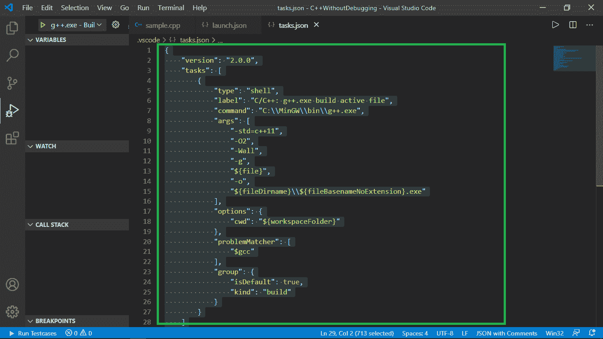

## 控制台调整

### 步骤

*   已经提到的一点是 `launch.json` 中的 `externalConsole` 必须是 `true`。
*   现在，在我们的程序中包含 `conio.h` 头文件，并在我们的 [main() 函数](https://www.geeksforgeeks.org/executing-main-in-c-behind-the-scene/)的最后调用 `_getch()` 方法。这将阻止命令提示符在执行完成后立即消失，以便我们有时间检查输出，直到我们按下任何字符。现在代码变成了：

### C++

```cpp
// C++ program to find the value of
// the pow(a, b) iteratively
#include <bits/stdc++.h>
#include <conio.h>
using namespace std;

// Driver Code
int main()
{
    int a, b, pow = 1;

    // Input two numbers
    cin >> a >> b;

    // Iterate till b from 1
    for (int i = 1; i <= b; i++) {
        pow = pow * a;
    }

    // Print the value
    cout << pow;

    _getch();
}
```

*   在我们想要检查/调试的某行代码处放置一个红色的断点。
*   然后我们点击屏幕左上角的播放按钮开始构建。
    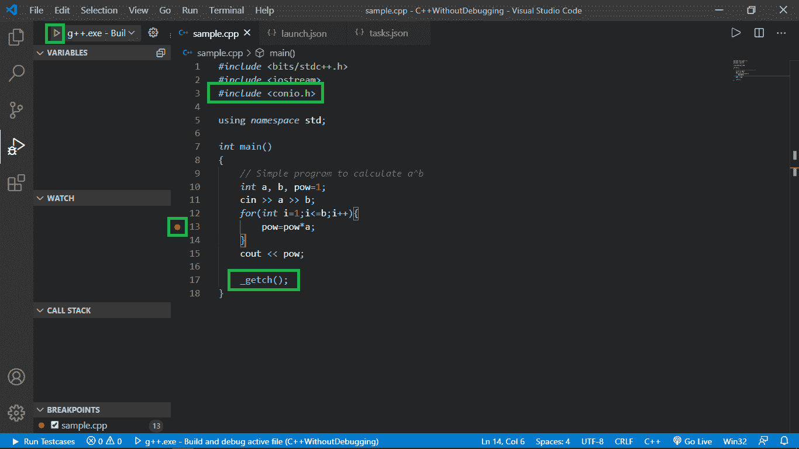

## 断点调试

### 步骤

*   在出现的命令提示符下，我们输入所需的输入，然后按回车键。
    
*   我们注意到执行从开始，它在提到的断点处暂停。
    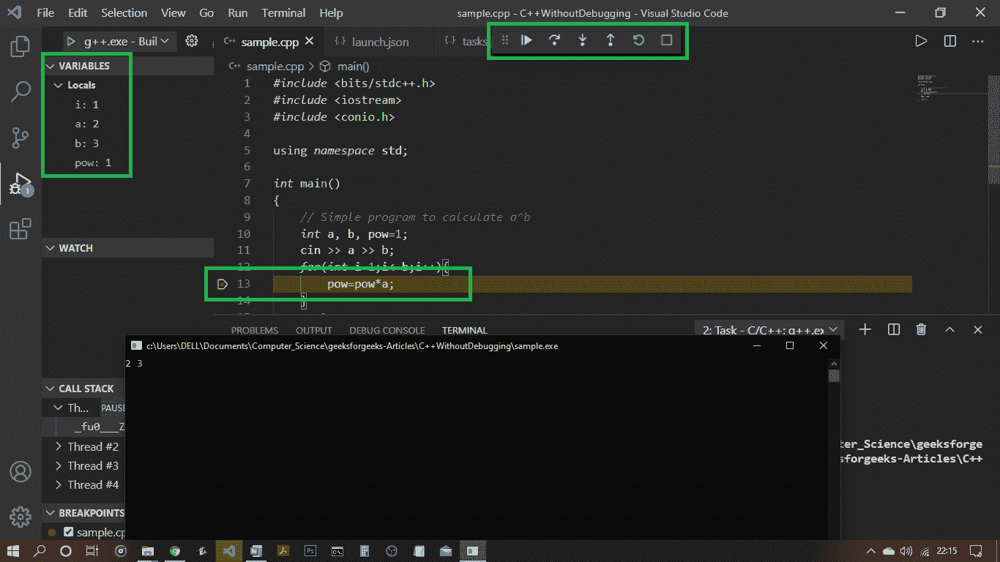
*   现在有了一些选择，我们可以继续，跨过，踏入，走出，或者重新开始执行。你可以做任何你想做的事情来调试你的代码。
*   另外，请注意屏幕左侧上执行时间时所有变量的值。
    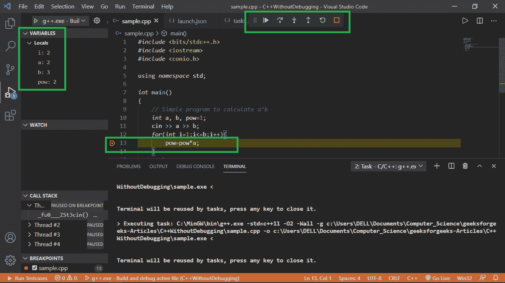
*   想调试多少就调试多少，然后整个执行完毕后，转到 [命令提示符](https://www.geeksforgeeks.org/command-line-arguments-in-c-cpp/) 注意那里的输出。
    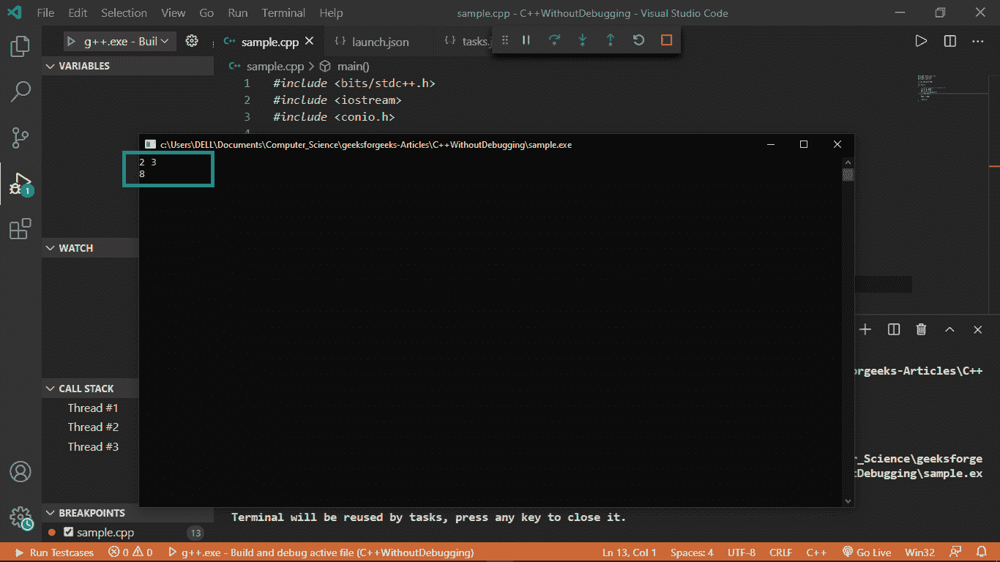
*   检查完输出后，按任意键关闭命令提示符。