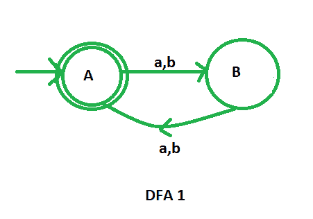
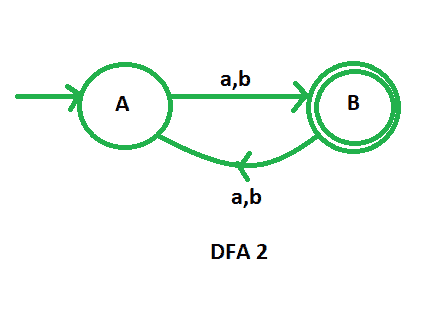
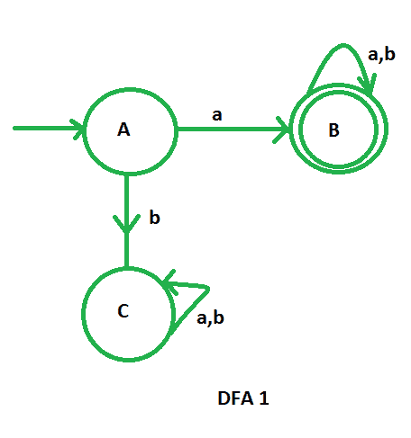
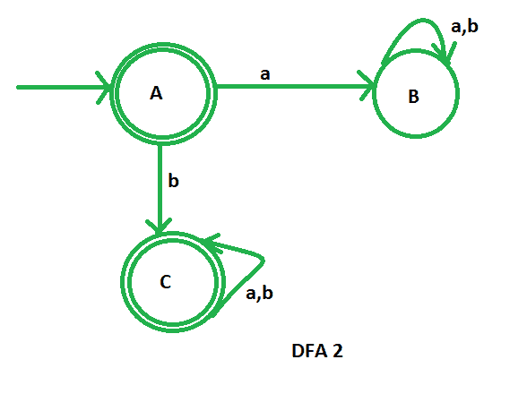

# DFA 中的互补过程

> 原文: [https://www.geeksforgeeks.org/complementation-process-in-dfa/](https://www.geeksforgeeks.org/complementation-process-in-dfa/)

先决条件 – [设计有限自动机](https://www.geeksforgeeks.org/designing-finite-automata-from-regular-expression/)

假设我们有一个由 (`Q`, `Σ`, `δ`, `q0`, `F`) 定义的 DFA，它接受语言 `L1`。那么，接受语言 `L2` 的 DFA，其中 `L2 = L1` 的补集，定义如下：

```
( Q, Σ, δ, q0, Q-F )
```

DFA 的补集可以通过**使非最终状态成为最终状态来获得，反之亦然**。补集 DFA `L2` 所接受的语言是 `L1` 语言的补集。

## 示例-1

`L1`：偶数长度 `{a, b}` 上的所有弦的集合

```
L1 = {ε, ab, aa, abaa, aaba, ....}
```

`L2`：奇数长度 `{a, b}` 的所有弦的集合

```
L2 = { a, b, aab, aaa, bba, bbb, ...}
```

在这里，我们可以看到 `L2 = L1` 的补集。

让我们首先绘制接受偶数长度字符串的 `L1` 的 DFA。



现在，为了设计 `L2` 的 DFA，我们只需要补充上面的 DFA。我们将把非最终状态更改为最终状态，将最终状态更改为非最终状态。



这是我们必需的补充 DFA。

## 示例-2

`L1`：以‘a’开头的 `{a, b}` 上所有字符串的集合。

```
L1 ={ a, ab, aa, aba, aaa, aab, ..}
```

`L2`：不以‘a’开头的 `{a, b}` 上所有字符串的集合。

```
L2 ={ ε, b, ba, bb, bab, baa, bba, ...}
```

在这里，我们可以看到 `L2 = L1` 的补集。

让我们首先绘制 `L1` 的 DFA，它接受 `{a, b}` 上以“a”开头的所有字符串的集合。



现在，为了设计 `L2` 的 DFA，我们只需要补充上面的 DFA。我们将把非最终状态更改为最终状态，将最终状态更改为非最终状态。



这是我们必需的补充 DFA，它接受不以“a”开头的字符串。

## 注

常规语言在补集下闭合（即常规语言的补集也将是常规的）。