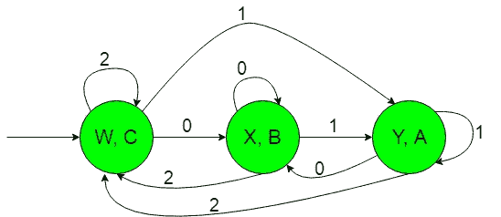
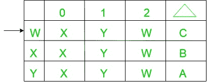
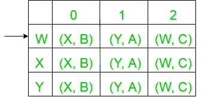
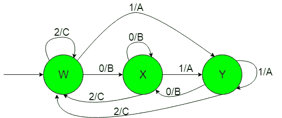

# 如果输入以“1”、“0”或“无”结束，则生产“A”、“B”或“C”的机器的构造

> 原文：[https://www.geeksforgeeks.org/construction-of-the-machines-that-produce-a-b-or-c-if-input-ends-with-1-0-or-nothing/](https://www.geeksforgeeks.org/construction-of-the-machines-that-produce-a-b-or-c-if-input-ends-with-1-0-or-nothing/)

## 先决条件
[米莱和摩尔机器](https://www.geeksforgeeks.org/mealy-and-moore-machines/)、[米莱机器和摩尔机器的区别](https://www.geeksforgeeks.org/difference-between-mealy-machine-and-moore-machine/)

## 问题
以`{0，1}`上的一组所有字符串作为输入，如果输入以“1”结尾，则产生“A”作为输出的机器的构造，或者如果输入以“0”结尾，则产生“B”作为输出的机器的构造。

假设：
```
Ε = {0, 1, 2} and 
Δ = {A, B, C}  
```
其中`ε`和`δ`分别是输入和输出字母表。

## 说明
所需摩尔机构造如下：


在上图中，初始状态`“w”`在获得`“2”`作为输入时，它保持自身状态并打印`“C”`作为输出，在获得`“1”`作为输入时，它传输到状态`“Y”`并打印`“A”`作为输出，在获得`“0”`作为输入时，它传输到状态`“X”`并打印`“B”`作为输出，以此类推。

因此，如果输入以“1”结尾，上面的摩尔机器可以容易地产生“A”作为输出，或者如果输入以“0”结尾，则产生“B”作为输出，否则产生“C”。

上面的摩尔机器将`{0，1}`上的所有字符串集作为输入，如果输入以“1”结尾，则产生“A”作为输出，如果输入以“0”结尾，则产生“B”作为输出，否则产生“C”作为输出。

现在我们需要把上面摩尔机的过渡图转换成等价的 Mealy 机过渡图。

## 从摩尔机到美利机的转换
所需转换的步骤如下：

### Step-1: Formation of State Transition Table of the above Moore machine


在上表中，状态`‘W’`、`‘X’`和`‘Y’`位于第一列，在获得`‘0’`作为输入时，它们分别转换到`‘X’`、`‘X’`和`‘X’`状态（位于第二列），在获得`‘1’`作为输入时，它们分别转换到`‘Y’`、`‘Y’`和`‘Y’`状态（位于第三列），在获得`‘2’`作为输入时，它们分别转换到`‘W’`、`‘W’`和`‘W’`状态（位于第四列）。在第五列`Δ`下，是第一列状态对应的输出。表中，箭头（`→`）表示初始状态。

### Step-2: Formation of Transition Table for Mealy machine from above Transition Table of Moore machine
下面的转换表将借助上表及其条目，通过使用第一列状态的对应输出，并将它们相应地放置在第二列和第三列中来形成。


在上表中，第一列的状态如`‘W’`，在获得`‘0’`作为输入时，它转换到状态`‘X’`并给出`‘B’`作为输出；在获得`‘1’`作为输入时，它转换到状态`‘Y’`并给出`‘A’`作为输出；在获得`‘2’`作为输入时，它转换到状态`‘W’`并给出`‘C’`作为输出，第一列的其余状态依此类推。表中，箭头（`→`）表示初始状态。

### Step-3: Then finally we can form the state trasition diagram of Mealy machine with help of it’s above transition table
所需的图如下所示：


上述 Mealy 机以`{0, 1}`上的所有字符串集作为输入，如果输入以`‘1’`结尾则产生`‘A’`作为输出，如果输入以`‘0’`结尾则产生`‘B’`作为输出，否则产生`‘C’`作为输出。

## 注意
当从摩尔转换到米莱机时，摩尔和米莱机的状态数保持不变，但是在米莱到摩尔转换的情况下，它给出的状态数并不相同。