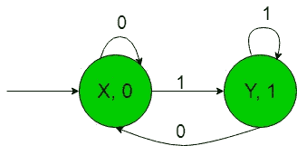
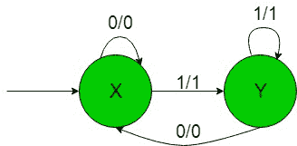

# 构造产生二进制数模2余数的机器

> 原文: [https://www.geeksforgeeks.org/construction-of-the-machines-to-produce-residue-modulo-2-of-binary-numbers/](https://www.geeksforgeeks.org/construction-of-the-machines-to-produce-residue-modulo-2-of-binary-numbers/)

## 先决条件
- [Mealy 和 Moore 机器](https://www.geeksforgeeks.org/mealy-and-moore-machines/)
- [Mealy 机器和 Moore 机器的区别](https://www.geeksforgeeks.org/difference-between-mealy-machine-and-moore-machine/)

在本文中，我们将看到一些带输出的有限自动机的设计，即 Moore 和 Mealy 机器。

## 问题描述
以二进制数 `{0, 1}` 为输入，构造一个机器，其输出为输入数模 `2` 的余数。也就是说，当二进制输入（属于 `{0, 1}`）对应的十进制数除以 `2` 时，机器给出的输出是余数。

假设：
```
Ε = {0, 1} and 
Δ = {0, 1} 
```
其中 `Ε` 和 `Δ` 分别是输入和输出字母表。

## Moore 机器构造
所需的 Moore 机器构造如下：



在上图中，初始状态 `X` 在获得 `0` 作为输入时，它保持自身状态，并打印 `0` 作为输出；在获得 `1` 作为输入时，它转移到状态 `Y`，并打印 `1` 作为输出。其余状态的行为类似。

**示例**：当输入字符串为 `10` 时，由于二进制输入 `10` 的十进制等效值为 `2`，`2` 除以 `2` 的余数为 `0`，因此上述 Moore 机器产生 `0` 作为输出。因此，该 Moore 机器可以很容易地产生以 `2` 为模的余数作为输出，即当 `{0, 1}` 上的二进制输入的等效十进制数除以 `2` 时，它给出的输出是余数。

## Mealy 机器构造
所需的 Mealy 机器构造如下：



在上图中，初始状态 `X` 在获得 `0` 作为输入时，它保持自身状态，并打印 `0` 作为输出；在获得 `1` 作为输入时，它转移到状态 `Y`，并打印 `1` 作为输出。状态 `Y` 在获取 `1` 作为输入时，它保持自身状态，并打印 `1` 作为输出；在获取 `0` 作为输入时，它返回初始状态 `X`，并打印 `0` 作为输出。

**示例**：当输入字符串为 `10` 时，以上 Mealy 机器产生 `0` 作为输出，因为二进制输入 `10` 的十进制等价物为 `2`，`2` 除以 `2` 的余数为 `0`。因此，该 Mealy 机器可以很容易地产生以 `2` 为模的余数作为输出，也就是说，当 `{0, 1}` 上二进制输入的等价十进制数除以 `2` 时，它给出的输出是余数。