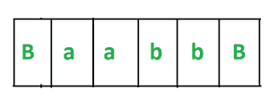
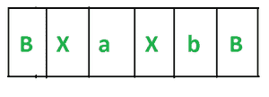
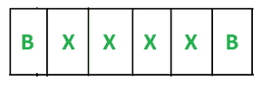
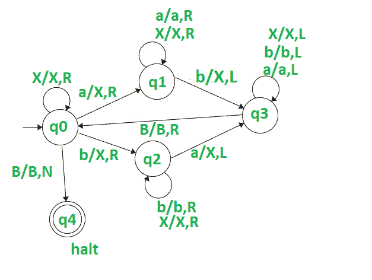

# 为相等数量的 a 和 b 设计图灵机

> 原文:[https://www . geeksforgeeks . org/design-a-turing-machine-for-equal-number-as-and-bs/](https://www.geeksforgeeks.org/design-a-turing-machine-for-equal-number-of-as-and-bs/)

**先决条件–**[图灵机](https://www.geeksforgeeks.org/turing-machine-in-toc/)

**任务:**
我们的任务为相等数量的 `a` 和 `b` 设计一个图灵机。

**分析:**
这里主要要分析的是由相等数量的 `a` 和 `b` 组成的字符串可以有 4 种类型–
这里的 `n` 是 `a` 或 `b` 的计数。

```
a) a^n b^n like aabb
b) b^n a^n like bbaa
c) (ab)^n like abab
d) (ba)^n like baba
```

**示例:**

```
Input-1 :  aabb
Output : Yes
Input-2 : bababa
Output : Yes
Input-3 : aabbbb
Output : No
Input-4 : aaabbaa
Output : No
```

**进场:**

*   我们必须从左到右扫描输入。
*   将扫描中的第一个 `a` 和第一个 `b` 转换为 `X`，然后在第二圈将第二个 `a` 和第二个 `b` 转换为 `X` 等等。我们必须重复这个过程，直到我们把所有的 `a` 和 `b` 转换成 `X`。
*   在 `a` 和 `b` 之间扫描的字符不会改变。

让我们通过使用字符串 `aabb` 来理解这种方法——

1.  从左侧扫描输入。
2.  我们的字符串看起来像这样 –
    [](https://media.geeksforgeeks.org/wp-content/uploads/20201103192905/Capture1-300x110.PNG)
3.  现在我们看到，我们在第一个位置得到第一个 `a`，在第三个位置得到第一个 `b`。我们将这些 `a` 和 `b` 转换为 `X`。
    现在字符 `a` 位于 `a` 和 `b` 之间。所以它将保持不变。当我们读第一个 `b` 时，我们把指针向左移动。指针将向左移动，直到变成空白(`Blank(B)`)。现在我们的字符串看起来像这样–
    [](https://media.geeksforgeeks.org/wp-content/uploads/20201103193145/Capture2-300x108.PNG)
4.  我们的指针位于空白(`Blank(B)`)。我们再次从左到右扫描输入，并将第二个 `a` 和第二个 `b` 转换为 `X`。当我们读到第二个 `b` 时，我们将指针向左移动。指针将向左移动，直到遇到空白(`Blank(B)`)。现在我们的字符串看起来像这样 –
    [](https://media.geeksforgeeks.org/wp-content/uploads/20201103193509/Capture3-300x100.PNG)
5.  我们重复这个过程，直到所有的 `a` 和 `b` 都转换成 `X`。
6.  正如我们看到的，我们把所有的 `a` 和 `b` 转换成 `X`。因此我们的机器将停止运转。
7.  当我们分析这个过程时，我们看到我们成对地将 `a` 和 `b` 转换成 `X`，即在第 3 点，我们将 `a` 和 `b` 的第一个出现转换成 `X`，然后在第 4 点，我们将 `a` 和 `b` 的第二个出现转换成 `X`。如果 `a` 和 `b` 的数量不等，那么在这种情况下，一些 `a` 或 `b` 将留在我们的字符串中，否则，所有的字符都将被转换成 `X`。因此，它会给我们一个点来证明我们的条件，即我们的字符串由相等数量的 `a` 和 `b` 组成。

**图灵机:**
[](https://media.geeksforgeeks.org/wp-content/uploads/20201103194032/article91.PNG)