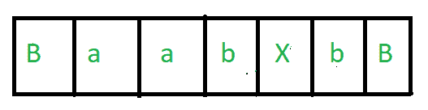
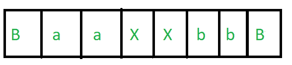
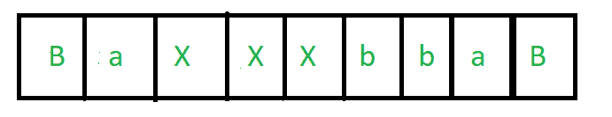
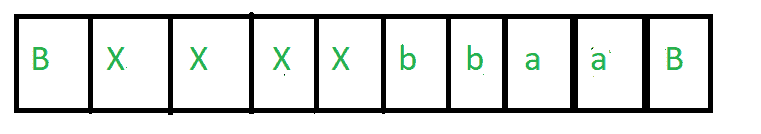
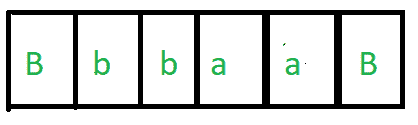
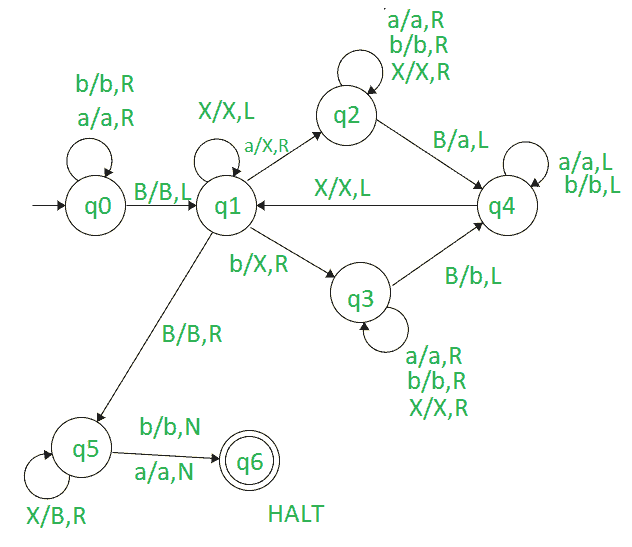

# 设计图灵机反转由 a 和 b 组成的字符串

> 原文: [https://www.geeksforgeeks.org/design-turing-machine-to-reverse-string-consisting-of-as-and-bs/](https://www.geeksforgeeks.org/design-turing-machine-to-reverse-string-consisting-of-as-and-bs/)

## 先决条件: 图灵机

## 任务:
我们的任务是设计一个图灵机来反转由 `a` 和 `b` 组成的字符串。

## 示例:
```
Input-1 : aabb
Output-1 : bbaa

Input-2 : abab
Output-2 : baba
```

## 做法:
基本思路是从右向左读输入，用字母表替换 `Blank(B)`，用 `X` 替换字母表。当我们读完所有的 `a` 和 `b`，用空白替换所有的 `X`，我们就得到所需的字符串。

让我们以 `aabb` 为例来理解这种方法。

### 步骤 1
第一个任务是我们必须将指针向右移动，以便我们可以从右向左读取字符串。为此，我们从左向右读取所有的 `a` 和 `b`，当我们得到第一个 `Blank(B)` 时，我们将指针转向左侧，这样我们就得到了最右边的字符。

### 步骤 2
现在会有两种情况 –
*   我们得到的字符是 `a`。
*   我们得到的字符是 `b`。

### 步骤 3
在这个例子中，我们得到的第一个字符是 `b`，即 `aabb` 的最后一个字符。我们将 `b` 替换为 `X` 并制造一个 `Blank(B)`。一个额外的 `Blank` 会自动附加在末尾。我们的字符串看起来像这样 –
[](https://media.geeksforgeeks.org/wp-content/uploads/20201020211859/pic1.PNG)

### 步骤 4
现在我们必须获取第二个字符。为此，我们将指针从右向左移动，并一直移动，直到在 `X` 之后得到一个 `a` 或 `b`。在这种情况下，我们得到 `b`。现在我们重复相同的任务，即用 `X` 替换那个 `b`，并将指针从该位置向右移动，直到得到一个 `Blank(B)`。当我们得到一个 `Blank(B)` 时，我们用在这个案例中得到的字符 `b` 替换它，一个 `Blank(B)` 会自动附加在末尾。我们的字符串看起来像这样 –
[](https://media.geeksforgeeks.org/wp-content/uploads/20201020212137/pic2.PNG)

### 步骤 5
现在我们必须获取第三个字符。为此，我们将指针从右向左移动，并一直移动，直到在 `X` 之后得到一个 `a` 或 `b`。在这种情况下，我们得到 `a`。现在我们重复相同的任务，即用 `X` 替换那个 `a`，并将指针从该位置向右移动，直到得到一个 `Blank(B)`。当我们得到一个 `Blank(B)` 时，我们用在这个案例中得到的字符 `a` 替换它，一个 `Blank(B)` 会自动附加在末尾。我们的字符串看起来像这样 –
[](https://media.geeksforgeeks.org/wp-content/uploads/20201020212512/pic3.PNG)

### 步骤 6
类似地，我们获取最后一个字符 `a`，并执行与上述步骤中描述的相同任务。我们的字符串将看起来像这样 –
[](https://media.geeksforgeeks.org/wp-content/uploads/20201020212743/pic4.PNG)

### 步骤 7
现在我们看到我们已经遍历了所有四个字符，并按顺序得到了字符 `bbaa`，它是 `aabb` 的反转，即在移除所有 `X` 后，我们得到了所需的字符串。

### 步骤 8
为了去掉所有的 `X`，我们将所有的 `X` 替换为空白 `B`，即在替换 `X` 后，我们得到 4 个空白 `B`，相当于一个空白 `B`。这意味着我们得到了最后的字符串。
[](https://media.geeksforgeeks.org/wp-content/uploads/20201020213008/pic5.PNG)

## 图灵机:
