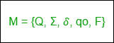

# DFA 和 NFA 的区别

> 原文: [https://www.geeksforgeeks.org/difference-between-dfa-and-nfa/](https://www.geeksforgeeks.org/difference-between-dfa-and-nfa/)

先决条件 – [有限自动机](https://www.geeksforgeeks.org/introduction-of-finite-automata/)

## DFA

`DFA` 是指确定性有限自动机。有限自动机 (`FA`) 被认为是确定性的，如果对应于一个输入符号，则只有一个合成状态，即只有一个转换。
确定性有限自动机由五个元组组成，

其中，
`Q`: 有限控制中存在的非空有限状态集 (`q0`, `q1`, `q2`, …)。
`Σ`: 输入符号的非空有限集合。
`δ`: 它是一个带有两个参数的转换函数，一个状态和一个输入符号，它返回一个状态。
`q0`: 是起始状态，是 `Q` 中的状态之一。
`F`: 是属于 `Q` 的集合中最终状态/接受状态的非空集合。

## NFA

`NFA` 指的是非确定有限自动机。如果在同一个输入符号上，从一个状态有一个以上可能的转换，那么有限自动机 (`FA`) 被认为是不确定的。
非确定性有限自动机也是五元组的集合，

其中，
`Q`: 一组非空有限状态。
`Σ`: 一组非空的有限输入符号。
`δ`: 它是一个转换函数，从 `Q` 中取一个状态，从 `Σ` 中取一个输入符号，并返回 `Q` 的子集。
`q0`: `NFA` 的初始状态和 `Q` 的成员。
`F`: `Q` 的最终状态和成员的非空集合。

## DFA 和 NFA 的区别

| 序号 | DFA | NFA |
| :--- | :--- | :--- |
| 1 | `DFA` 代表确定性有限自动机。 | `NFA` 代表不确定有限自动机。 |
| 2 | 对于字母表的每个符号表示，`DFA` 中只有一个状态转换。 | 没有必要根据某个符号来说明 `NFA` 是如何反应的。 |
| 3 | `DFA` 不能使用空字符串转换。 | `NFA` 可以使用空字符串过渡。 |
| 4 | `DFA` 可以理解为一台机器。 | `NFA` 可以理解为多个小机器同时计算。 |
| 5 | 在 `DFA` 中，下一个可能的状态被清楚地设置。 | 在 `NFA`，每对状态和输入符号可以有许多可能的下一个状态。 |
| 6 | `DFA` 更难构建。 | `NFA` 更容易建造。 |
| 7 | 如果字符串终止于不同于接受状态的状态，`DFA` 将拒绝该字符串。 | 如果所有的树枝都枯死或拒绝弦，`NFA` 就会拒绝弦。 |
| 8 | 执行输入字符串所需的时间更少。 | 执行输入字符串所需的时间更多。 |
| 9 | 所有 `DFA` 都是 `NFA` 的。 | 并非所有 `NFA` 都是 `DFA`。 |
| 10 | `DFA` 需要更多的空间。 | `NFA` 比 `DFA` 需要更少的空间。 |
| 11 | 可能需要死状态。 | 不需要死状态。 |
| 12 | `δ: Q × Σ -> Q` 即下一个可能的状态属于 `Q`。 | `δ: Q × Σ -> 2^Q` 即下一个可能的状态属于 `Q` 的幂集。 |