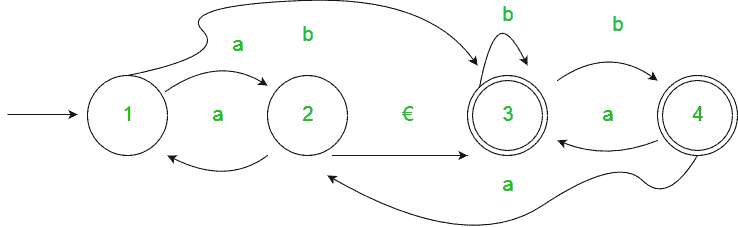
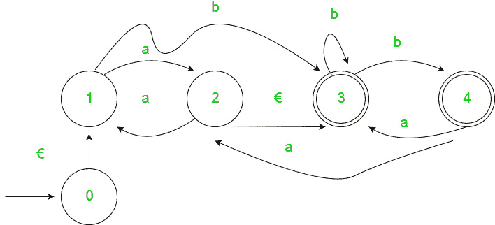
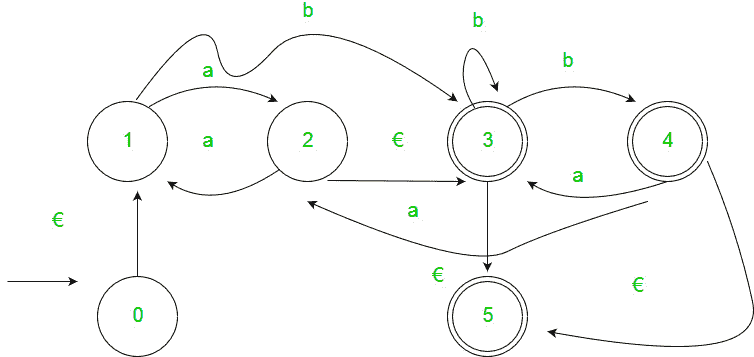
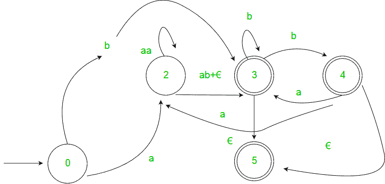
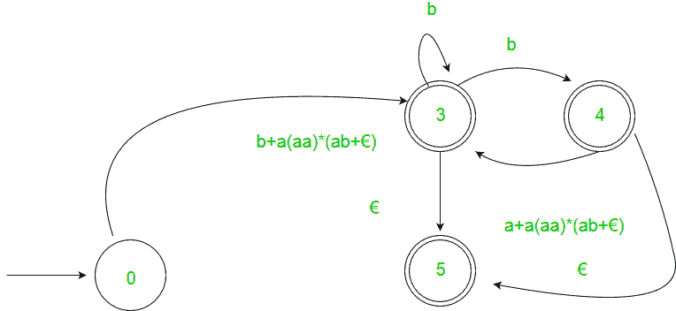
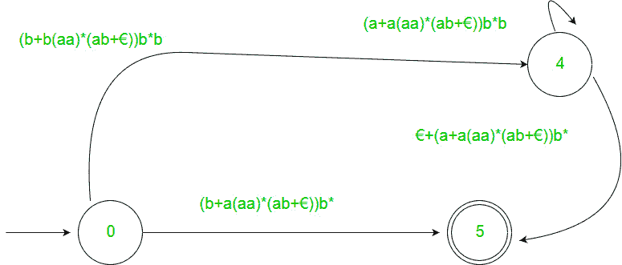
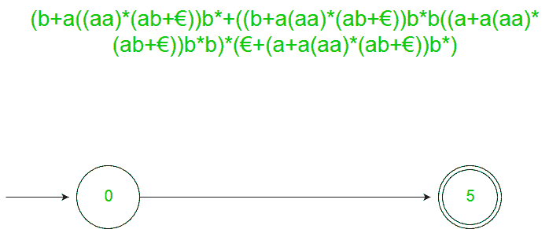
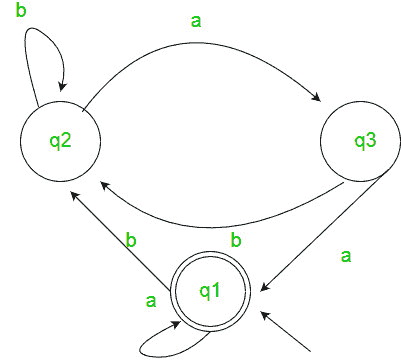

# 从有限自动机生成正则表达式

> 原文: [https://www.geeksforgeeks.org/generating-regular-expression-from-finite-automata/](https://www.geeksforgeeks.org/generating-regular-expression-from-finite-automata/)

先决条件–[FA 介绍](https://www.geeksforgeeks.org/toc-finite-automata-introduction/)、[正则表达式、语法和语言](https://www.geeksforgeeks.org/regular-expressions-regular-grammar-and-regular-languages/)、[从正则表达式设计 FA](https://www.geeksforgeeks.org/designing-finite-automata-from-regular-expression/)

将 FA 转换为正则表达式有两种方法：

## 1. 状态消除法

*   **步骤 1：**
    如果开始状态是接受状态或有转换，则添加新的不接受开始状态，并在新的开始状态和以前的开始状态之间添加`€`转换。
*   **步骤 2：**
    如果存在多个接受状态，或者如果单个接受状态已经转变出来，则添加一个新的接受状态，使所有其他状态都不接受，并添加一个从每个以前的接受状态到新的接受状态的`€`转变。
*   **步骤 3：**
    依次针对每个未启动未接受状态，消除该状态并相应更新转换。

**例：**


**解：**
**第一步**


**第二步**


**第三步**








## 2. 阿登定理

让 `P` 和 `Q` 为 2 个正则表达式。如果 `P` 不包含空字符串，那么在 `R` 中的以下等式，即 `R = Q + RP`，通过 `R = QP*` 有唯一的解。

**假设：**

*   转换图不应该有`€`移动。
*   它必须只有一个初始状态。

**利用阿登定理寻找确定性有限自动机的正则表达式：**

1.  为了得到自动机的正则表达式，我们首先为所有状态创建如下形式的方程：
    ```
    q1 = q1*w11 + q2*w21 + … + qn*wn1 + €  (q1 是初始状态)
    q2 = q1*w12 + q2*w22 + … + qn*wn2
    .
    .
    .
    qn = q1*w1n + q2*w2n + … + qn*wnn
    ```
    其中 `wij` 是表示从 `qi` 到 `qj` 的边的标签集合的正则表达式。

**注意：** 对于平行边，表达式中会有很多该状态的表达式。

2.  然后我们求解这些方程，得到 `qi` 的方程，用 `wij` 表示，这个表达式就是所需的解，其中 `qi` 是最终状态。

**例：**


**解：**
此处初始状态为 `q2`，最终状态为 `q1`。
三种状态 `q1`，`q2`，`q3` 的方程如下：
```
q1 = q1*a + q3*a + €  (€ 此举是因为 q1 是初始状态)
q2 = q1*b + q2*b + q3*b
q3 = q2*a
```
求解过程：
```
q2 = q1*b + q2*b + q3*b
   = q1*b + q2*b + (q2*a)*b  (q3 的替代值)
   = q1*b + q2*(b + ab)
   => q2 = q1*b*(b + ab)*

q1 = q1*a + q3*a + €
   = q1*a + q2*aa + €  (q3 的替代值)
   = q1*a + q1*b*(b + ab)*aa + €
   = q1*(a + b(b + ab)*aa) + €
   => q1 = €(a + b(b + ab)*aa)*
   = (a + b(b + ab)*aa)*
```
因此，正则表达式为 `(a+b(b+ab)*aa)*`。

## GATE CS 角题

练习下列问题将帮助你测试你的知识。所有的问题在前几年的 GATE 考试或 GATE 模拟考试中都被问过。强烈建议你练习一下。

1.  [GATE CS 2008，问题 52](https://www.geeksforgeeks.org/gate-gate-cs-2008-question-52/)
2.  [GATE CS 2007，问题 74](https://www.geeksforgeeks.org/gate-gate-cs-2007-question-74/)
3.  [GATE CS 2014(第 1 集)，第 25 题](https://www.geeksforgeeks.org/gate-gate-cs-2014-set-1-question-25/)
4.  [GATE CS 2014(第 1 集)，第 65 题](https://www.geeksforgeeks.org/gate-gate-cs-2014-set-1-question-46/)
5.  [GATE IT 2006，问题 5](https://www.geeksforgeeks.org/aptitude-gate-it-2006-question-5/)
6.  [GATE CS 2013，第 33 题](https://www.geeksforgeeks.org/gate-gate-cs-2013-question-33/)
7.  [GATE CS 2012，第 12 题](https://www.geeksforgeeks.org/gate-gate-cs-2012-question-16/)