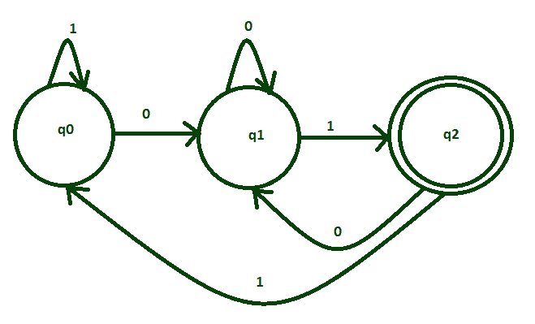
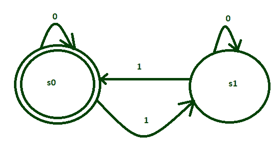
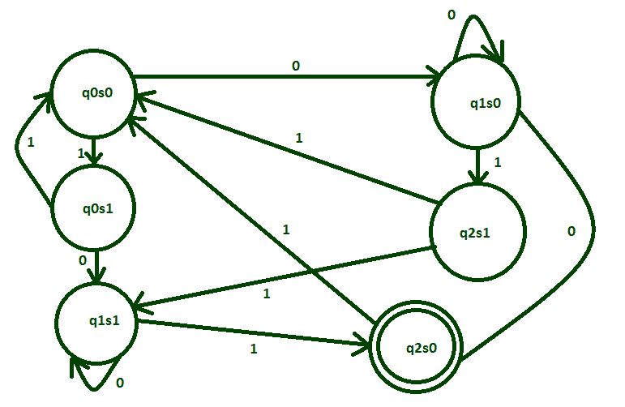

# 两个 DFA 的相交过程

> 原文: [https://www.geeksforgeeks.org/intersection-process-of-two-dfas/](https://www.geeksforgeeks.org/intersection-process-of-two-dfas/)

## 先决条件

[设计有限自动机](https://www.geeksforgeeks.org/designing-finite-automata-from-regular-expression-set-1/)

## 例子

让我们用一个例子来理解两个 DFA 的交集。
为 `{0, 1}` 上的字符串集设计一个 DFA，使其以 `01` 结尾，并且具有偶数个 `1`。
将形成两种所需的语言:

```
L1= {01, 001, 101, 0101, 1001, 1101, ....} 
L2= {11, 011, 101, 110, 0011, 1100, .....}
```

```
L = L1 and L2 = L1 ∩ L2 
```

### 语言 `L1`

这是语言 `L1` 的状态转换图：



它接受结尾为 `01` 的所有字符串。

### 语言 `L2`

这是语言 `L2` 的状态转换图：



它接受所有具有偶数个 `1` 的字符串。

### `L1 ∩ L2`

`L1` 和 `L2` 的交集可以用 `{0, 1}` 上的字符串所接受的语言来解释，使其以 `01` 结束，并且具有偶数个 `1`。

```
L = L1 ∩ L2
= {1001, 0101, 01001, 10001, ....}
```



因此，正如我们看到的，`L1` 和 `L2` 已经通过交集过程被组合，并且这个最终的 DFA 接受所有具有偶数个 `1` 并且以 `01` 结尾的语言。