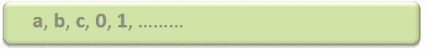
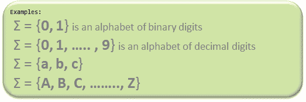

# 计算理论介绍

> 原文: [https://www.geeksforgeeks.org/introduction-of-theory-of-computation/](https://www.geeksforgeeks.org/introduction-of-theory-of-computation/)

`自动机`理论（也称`计算理论`）是计算机科学和数学的一个理论分支，主要处理关于简单机器的计算逻辑，简称自动机。

自动机使科学家能够理解机器如何计算函数和解决问题。发展自动机理论的主要动机是发展描述和分析离散系统动态行为的方法。

自动机起源于与“自动化”密切相关的“自动机”一词。

现在，让我们了解一下计算理论中重要且常用的基本术语。

## 符号

`符号`（通常也称为`字符`）是最小的积木，可以是任何字母、数字或图片。



## 字母

`字母`（`σ`）是一组符号，总是有限的。



## 字符串

`字符串`是由一些字母表中的符号组成的有限的序列。一个字符串一般表示为`w`，字符串的长度表示为`|w|`。

注：`σ*`是所有可能的字符串的集合（通常是字符串的幂集，这里不必是唯一的，或者我们可以说是多集的），所以这意味着`语言`是`σ*`的子集。

```
Empty string is the string with 
zero occurrence of symbols, 
represented as ε.
```

```
Number of Strings (of length 2) 
that can be generated over the alphabet {a, b} -
 -   -
                     a   a
                     a   b
                     b   a
                     b   b

Length of String |w| = 2
Number of Strings = 4

Conclusion:
For alphabet {a, b} with length n, number of 
strings can be generated = 2<sup>n</sup>.
```

注：如果`σ`的个数用`|σ|`表示，那么长度为 n 的字符串，可能超过`σ`的是`|σ|<sup>n</sup>`。

## 语言

`语言`是一组字符串，选自一些`σ*`，或者我们可以说——语言是`σ*`的子集。可以在`σ`上构成的语言可以是有限或无限的。

```
Example of Finite Language: 
          L1 = { set of string of 2 }
         L1 = { xy, yx, xx, yy }

Example of Infinite Language:
         L1 = { set of all strings starts with 'b' }
         L1 = { babb, baa, ba, bbb, baab, ....... }
```