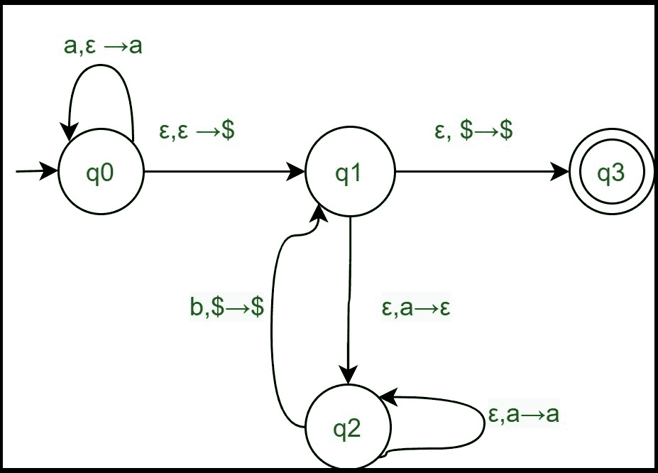

# 队列自动机介绍

> 原文：[https://www.geeksforgeeks.org/introduction-to-queue-automata/](https://www.geeksforgeeks.org/introduction-to-queue-automata/)

我们已经知道[有限自动机](https://www.geeksforgeeks.org/introduction-of-pushdown-automata/)可以用来接受正则语言，[下推自动机](https://www.geeksforgeeks.org/introduction-of-pushdown-automata/)可以用来识别上下文无关语言。

队列自动机（QDA）是一种非确定性自动机，类似于下推自动机，但有一个队列而不是堆栈，这有助于队列自动机识别上下文无关语言之外的语言。

QDA 是一个 6 元组 `M = (Q, σ, Γ, δ, q_0, F)`

其中

1.  `Q` 是有限状态的集合。
2.  `σ` 是有限输入字母的集合。
3.  `Γ` 是有限队列字母表的集合。
4.  `δ : Q × σ_ε × Γ_ε → P(Q × Γ_ε )`。
5.  `q_0 ∈ Q` 是开始状态。
6.  `F ⊆ Q` 是接受状态的集合。

## 接受一根字符串

如果 `w` 可以写成 `w = w_1w_2w_3 ... w_m`，则 QDA `M = (Q, σ, Γ, δ, q_0, F)` 接受输入 `w`，其中每个 `w_i ∈ σ_ε` 都存在状态 `r_0, r_1, r_2, ..., r_m ∈ Q` 和字符串 `s_0, s_1, s_2, ..., s_m ∈ Γ*`，满足以下条件：

1.  `r_0 = q_0` 和 `s_0 = ε`。
2.  对于 `0 ≤ i ≤ m-1`，`(r_{i+1}, b) = δ(r_i, w_{i+1}, a)`，其中 `a, b ∈ Γ_ε`，`s_i = ta`，`s_{i+1} = bt` 和 `t ∈ Γ*`。
3.  `r_m ∈ F`。

## 例：定义语言的队列自动机 `{a^n b^n | n ≥ 0}`

### 解：

`Q = {q0, q1, q2, q3}`，`σ = {a, b}`，`Γ = {a, b, $}`。

而过渡函数由下式给出：
```
δ(q0, a, ε) = {(q0, a)}
δ(q0, ε, ε) = {(q1, $)}
δ(q1, ε, a) = {(q2, ε)}
δ(q2, ε, a) = {(q2, a)}
δ(q2, b, $) = {(q1, $)}
δ(q1, ε, $) = {(q3, $)}
```



让我们看看这个自动机是如何为 `aabb` 工作的。

| 步骤 | 状态 | 输入 | 过渡函数 | 队列（从左输入） | 移动后的状态 |
| :--- | :--- | :--- | :--- | :--- | :--- |
| 1 | q0 | aabb | δ(q0, a, ε)={(q0, a)} | a | q0 |
| 2 | q0 | abb | δ(q0, a, ε)={(q0, a)} | aa | q0 |
| 3 | q0 | bb | δ(q0, ε, ε)={(q1, $)} | $aa | q1 |
| 4 | q1 | bb | δ(q1, ε, a)={(q2, ε)} | $a | q2 |
| 5 | q2 | bb | δ(q2, ε, a)={(q2, a)} | $a | q2 |
| 6 | q2 | b | δ(q2, b, $)={(q1, $)} | $ | q1 |
| 7 | q1 | b | δ(q1, ε, a)={(q2, ε)} | $ | q2 |
| 8 | q2 | ε | δ(q2, b, $)={(q1, $)} | $ | q1 |
| 9 | q1 | ε | δ(q1, ε, $)={(q3, $)} | $ | q3 |