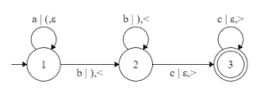

# L 图以及它们在 TOC 中所代表的内容

> 原文: [https://www.geeksforgeeks.org/l-graphs-and-what-they-represent-in-toc/](https://www.geeksforgeeks.org/l-graphs-and-what-they-represent-in-toc/)

先决条件 – [有限自动机简介](https://www.geeksforgeeks.org/toc-finite-automata-introduction/)

所有的编程语言都可以表示为一个有限自动机。`C`，`Paskal`，`Haskell`，`C++`，它们都有特定的结构，语法，可以用一个简单的图来表示。大多数图表都是 `NFA` 的或 `DFA` 的。但是 `NFA` 和 `DFA` 确定了最简单的语言群：常规语言群 [ [乔姆斯基层次结构](https://www.geeksforgeeks.org/toc-chomsky-hierarchy/) ]。这给我们留下了一个问题：所有其他类型的语言呢？答案之一是[图灵机](https://www.geeksforgeeks.org/turing-machine/)，但是图灵机很难想象。这就是为什么在这篇文章中，我将告诉你一种叫做 `L 图`的有限自动机。

为了理解 `L 图`是如何工作的，我们需要知道 `L 图`决定了什么类型的语言。简单来说，`L 图`表示语言的上下文相关类型 [以及上下文相关组包含的所有其他类型]。如果你不知道“上下文相关”是什么意思，让我给你看一个语言的例子，它可以用一个 `L 图`来表示，而不是用任何更简单的有限自动机来表示。

这种语言就是 `L = \{ a^nb^nc^n | n \geqslant 1 \}`。对应的 `L 图`如下所示：

```

```

如您所见，符号“`|`”后面的括号控制符号“`a`”后面的符号数。这就引出了所有 `L-图`都具有的两个特征：所有 `L-图`都有多达两个相互独立且来自输入符号的括号组，两个括号组都必须是正确的 [来自 `Dyck 语言`的字符串]，以便给定 `L-图`接受输入符号的字符串。

你可以看到一个 `L 图`只是一个有限自动机的版本，增加了几个括号组。为了帮助您理解为什么由 `L 图`确定的语言是上下文相关的，请检查上面显示的 `L 图`必须接受哪些字符串。

```
abc: \{\varepsilon, \varepsilon, \varepsilon\} \rightarrow \{a, (, \varepsilon} \rightarrow \{ab, (), <\} \rightarrow \{abc, (), <>\}\\* a^2b^2c^2: \{\varepsilon, \varepsilon, \varepsilon\} \rightarrow \{a, (, \varepsilon\} \rightarrow \{aa, ((, \varepsilon\} \rightarrow \{aab, ((), <\} \rightarrow \{aabb, (()), <<\} \rightarrow \{aabbc, (()), <<>\} \rightarrow \{aabbcc, (()), <<>>\}\\* a^5b^5c^5: \{\varepsilon, \varepsilon, \varepsilon\} \rightarrow \{a, (, \varepsilon\} \rightarrow \ldots \rightarrow \{aaaaa, (((((, \varepsilon\} \rightarrow \{aaaaab, (((((), <\} \rightarrow \ldots \rightarrow \{aaaaabbbbb, ((((())))), <<<<<\} \rightarrow \{aaaaabbbbbc, ((((())))), <<<<<>\} \rightarrow \ldots \rightarrow \{aaaaabbbbbccccc, ((((())))), <<<<<>>>>>\}
```

最后，我想补充另外三个我将在未来使用的定义。这些定义对于假设 [及其未来的证明或反证] 非常重要。参考 – [假设(语言规则性)和算法(NFA 的 L 图)](https://www.geeksforgeeks.org/theory-of-computation-hypothesis-language-regularity-and-algorithm-l-graph-to-nfa/)

如果两个括号字符串都是正确的，我们将把 `L 图`中的路径称为中性路径。如果一个中立路径 `T` 可以这样表示，`T = T_1T_2T_3`，其中 `T_1` 和 `T_3` 为循环，`T_2` 为中立路径 (`T_1`、`T_2` 或 `T_3` 可以为空)，则 `T` 称为嵌套。我们也可以说这三个 (`T_1`、`T_2`、`T_3`) 是一个巢，或者说 `T_1` 和 `T_3` 在路径 `t` 上形成一个巢。

`(\omega, d)-核心`在 `L-图 G` 中，定义为 `核心(G，\omega，d)`，是一组 `(\omega, d)-经典`。`(\omega、d)-canon`，其中 `\omega` 和 `d` 为正整数，是一条最多包含 `m`、`m \leqslant \omega`、中性圈和最多 `k`、`k \leqslant d` 的路径，可以这样表示嵌套：`T_1_1...T_1_kT_2_1T_3_1...T_3_k` 是路径的一部分 `T`、`T_i_l`、`i = 1` 或 `3`、`1 \leqslant l \leqslant k` 是圈，每条路径 `T_1_jT_2_jT_3_j` 都是一个嵌套，其中 `T_2_j = T_1_(_j_-_1_)T_2_(_j_-_1_)T_3_(_j_-_1_)`、`2 \leqslant j \leqslant k-1`。

最后一个定义是关于一个上下文无关的 `L 图`。如果 `G` 只有一个括号组 (`L 图`中的所有规则都只有这两个中的一个：`['符号' | '括号'，？]` 或 `['符号' |？，'括号']`)。

`Dyck 语言`的定义。`\Sigma_(` 和 `\Sigma_)` 是不相交的字母。存在一个双射 (第一个集合中的每个元素匹配第二个集合中的一个且只有一个元素的函数) `\phi: \Sigma_( \rightarrow \Sigma_)`。那么由语法 `S \rightarrow \varepsilon | aSbS`、`a \in \Sigma_(, b = \phi(a)` 定义的语言，我们就称之为 `Dyck 语言`。