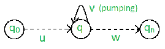

# 计算理论中的泵引理

> 原文：[https://www.geeksforgeeks.org/pumping-lemma-in-theory-of-computation/](https://www.geeksforgeeks.org/pumping-lemma-in-theory-of-computation/)

有两个泵浦引理，定义为：
1. 常规语言
2. 上下文无关语言

## 正则语言的泵引理

对于任意正则语言 `L`，存在整数 `n`，使得对于所有 `x ∈ L` 且 `|x| ≥ n`，存在 `u, v, w ∈ Σ*`，使得 `x = uvw`，并且：
(1) `|uv| ≤ n`
(2) `|v| ≥ 1`
(3) 对于所有 `i ≥ 0`: `uv^i w ∈ L`

这意味着，如果一个字符串 `v` 被‘泵送’，即如果 `v` 被插入任何次数，得到的字符串仍然保留在 `L` 中。

泵送引理被用作语言不规则性的证明工具。因此，如果一种语言是正则的，它总是满足泵引理。如果至少存在一个泵送字符串不在 `L` 中，那么 `L` 肯定不是正则的。
与此相反的情况可能并不总是正确的。也就是说，如果泵引理成立，并不意味着语言是正则的。

比如我们证明 `L_01 = { 0^n 1^n | n ≥ 0 }` 是不规则的。
让我们假设 `L` 是正则的，然后通过泵引理遵循上面给出的规则。
现在，设 `x ∈ L` 且 `|x| ≥ n`，所以，通过泵引理，存在 `u, v, w`，使得 (1)–(3) 成立。

我们表明，对于所有的 `u, v, w`，(1)–(3) 都不成立。
如果 (1) 和 (2) 成立，则 `x = 0^n 1^n = uvw`，且 `|uv| ≤ n` 和 `|v| ≥ 1`。
所以，`u = 0^a`，`v = 0^b`，`w = 0^c 1^n`，其中：`a + b ≤ n`，`b ≥ 1`，`c ≥ 0`，`a + b + c = n`。
但是，然后 (3) 在 `i = 0` 时失败：
`uv^0 w = uw = 0^a 0^c 1^n = 0^{a+c} 1^n ∉ L`，因为 `a+c ≠ n`。

## 上下文无关语言的泵引理

对于任何语言 `L`，我们将其字符串分成五个部分，抽取第二个和第四个子字符串。
泵引理在这里也是用来证明一种语言不是上下文无关语言（CFL）的工具。因为，如果任何一个字符串不满足它的条件，那么语言就不是 CFL。
因此，如果 `L` 是 CFL，则存在整数 `n`，使得对于所有 `x ∈ L` 且 `|x| ≥ n`，存在 `u, v, w, x, y ∈ Σ*`，使得 `x = uvwxy`，并且：
(1) `|vwx| ≤ n`
(2) `|vx| ≥ 1`
(3) 对于所有 `i ≥ 0`: `uv^i wx^i y ∈ L`

上例，`0^n 1^n` 就是 CFL，因为任何一根弦都可以是两个地方抽的结果，一个为 0，一个为 1。
我们来证明一下，`L_012 = { 0^n 1^n 2^n | n ≥ 0 }` 不是上下文无关的。
我们假设 `L` 是上下文无关的，那么通过泵引理，上面给出的规则就遵循了。
现在，设 `x ∈ L` 且 `|x| ≥ n`，所以，通过泵引理，存在 `u, v, w, x, y`，使得 (1)–(3) 成立。
我们表明，对于所有 `u, v, w, x, y`，(1)–(3) 都不成立。

如果 (1) 和 (2) 成立，则 `x = 0^n 1^n 2^n = uvwxy`，其中 `|vwx| ≤ n` 且 `|vx| ≥ 1`。
(1) 告诉我们，`vwx` 不同时包含 0 和 2。因此，要么 `vwx` 没有 0，要么 `vwx` 没有 2。
假设 `vx` 没有 0，通过 (2)，`vx` 包含 1 或 2。因此 `uwy` 有‘n’个 0，`uwy` 要么有小于‘n’个 1，要么有小于‘n’个 2。
但是 (3) 告诉我们 `uwy = uv^0 wx^0 y ∈ L`。
所以，`uwy` 有相等数量的 0，1 和 2，给了我们一个矛盾。`vwx` 没有 2 的情况类似，也给了我们一个矛盾。因此，`L` 不是上下文无关的。

资料来源：约翰·E·霍普克罗夫特，拉杰夫·莫特瓦尼，杰弗里·乌尔曼（2003 年）。《自动机理论、语言和计算导论》。

本文由`尼鲁帕姆·辛格`供稿。

如果发现有不正确的地方，或者想分享更多关于上述话题的信息，请写评论。