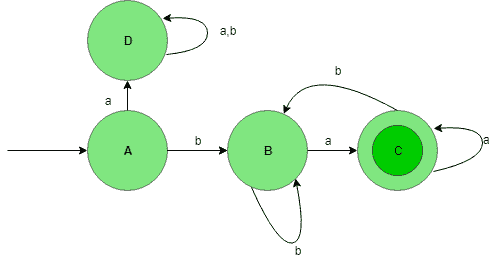
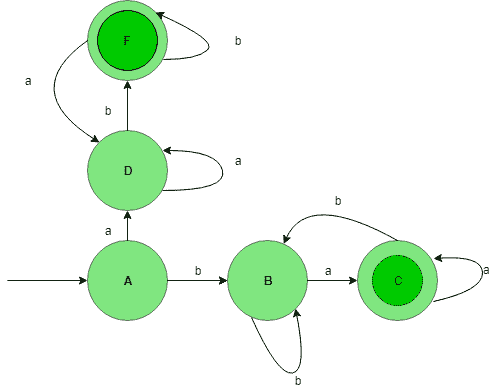

# DFA 中的联合流程

> 原文: [https://www.geeksforgeeks.org/union-process-in-dfa/](https://www.geeksforgeeks.org/union-process-in-dfa/)

## 先决条件
- [设计有限自动机](https://www.geeksforgeeks.org/designing-finite-automata-from-regular-expression/)

让我们借助下面的例子来理解确定性有限自动机(DFA)中的并集过程。

## 例子：设计语言的 DFA
为 `{a, b}` 上的字符串集设计一个 DFA，使语言的字符串以不同的符号开始和结束。将形成两种期望的语言：

```
L1 = {ab, aab, aabab, .......}
L2 = {ba, bba, bbaba, .......}
```

- `L1` = {以 `a` 开头，以 `b` 结尾}
- `L2` = {以 `b` 开头，以 `a` 结尾}

则 `L = L1 ∪ L2` 或 `L = L1 + L2`。

### 语言 `L1` 的状态转换图


这个 DFA 接受所有以 `a` 开头，以 `b` 结尾的字符串。这里，状态 `A` 是初始状态，状态 `C` 是最终状态。

### 语言 `L2` 的状态转换图


这个 DFA 接受所有以 `b` 开始，以 `a` 结束的字符串。这里，状态 `A` 是初始状态，状态 `C` 是最终状态。

## 并集结果
现在，取 `L1` 和 `L2` 语言的并集，给出以不同元素开始和结束的语言的最终结果。

### `L1 ∪ L2`


由此可见，`L1` 和 `L2` 已经通过并集过程进行了合并，最终的 DFA 接受所有包含以不同符号开始和结束的字符串的语言。

**注：** 从上面的例子我们也可以推断出正则语言在并集下是闭的（即两个正则语言的并集也是正则的）。