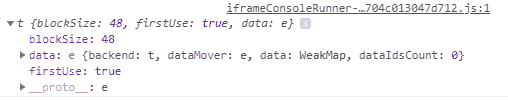
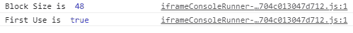

# TensorFlow.js TF.backend() 函数

> 原文：[https://www.geeksforgeeks.org/tensorflow-js-tf-backend-function/](https://www.geeksforgeeks.org/tensorflow-js-tf-backend-function/)

**TensorFlow.js** 是谷歌开发的开源库，用于在浏览器或节点环境中运行机器学习模型和深度学习神经网络。它还帮助开发人员用 JavaScript 语言开发 ML 模型，并且可以直接在浏览器或 Node.js 中使用 ML。

`tf.backend()` 函数用于获取当前浏览器的当前后端。

## 语法

```
tf.backend()
```

## 参数

不接受任何参数。

## 返回值

返回内核包。

## 示例 1

### JavaScript

```
// Setting the backend
tf.setBackend("cpu")

// Getting the backend using
// backend method
console.log(tf.backend())
```

**输出：**



## 示例 2

### JavaScript

```
// Setting the backend
tf.setBackend("cpu")

// Getting the backend using
// backend method
console.log("Block Size is ",tf.backend().blockSize)
console.log("First Use is ",tf.backend().firstUse)
```

**输出：**



**参考：** [https://js.tensorflow.org/api/latest/#Backends](https://js.tensorflow.org/api/latest/#Backends)