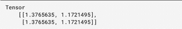
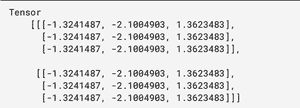
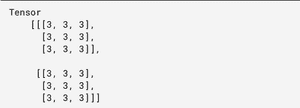
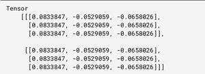

# TensorFlow.js `tf.layers.dense()` 函数

> 原文: [https://www.geeksforgeeks.org/tensorflow-js-tf-layers-dense-function/](https://www.geeksforgeeks.org/tensorflow-js-tf-layers-dense-function/)

`tf.layers.dense()` 是 TensorFlow.js 库的一个内置函数。该函数用于创建完全连接的层，其中每个输出都依赖于每个输入。

## 语法

```
tf.layers.dense(args)
```

## 参数

该函数将 `args` 对象作为参数，该参数可以具有以下属性:

*   `units`: 定义输出空间维度的正数。
*   `activation`: 指定使用哪个激活功能。
*   `useBias`: 指定是否应用偏置。
*   `kernelInitializer`: 指定哪个初始化器用于密集内核权重矩阵。
*   `biasInitializer`: 指定该层的偏置向量。
*   `inputShape`: 将输入形状定义为 `inputShape`。
*   `kernelConstraint`: 指定内核的约束。
*   `biasConstraint`: 偏置向量的具体约束。
*   `kernelRegularizer`: 指定应用于稠密核权重矩阵的正则化器函数。
*   `biasRegularizer`: 指定应用于偏置向量的正则化函数。
*   `activityRegularizer`: 指定应用于激活的正则化函数。
*   `inputShape`: 如果定义了该参数，它将创建另一个输入层插入到该层之前。
*   `batchInputShape`: 如果定义了这个参数，它会创建另一个输入图层，插入到这个图层之前。
*   `batchSize`: 用于构造 `batchInputShape`，如果尚未指定。
*   `dtype`: 指定该图层的数据类型。此参数的默认值为 `"float32"`。
*   `name`: 指定该图层的名称。
*   `trainable`: 指定是否通过拟合更新该层的权重。
*   `weights`: 指定图层的初始权重值。
*   `inputType`: 用于表示输入类型，其值可以是 `"float32"` 或 `"int32"` 或 `"bool"` 或 `"complex64"` 或 `"string"`。

## 返回值

返回 `Dense` 对象。

## 例 1

```javascript
import * as tf from "@tensorflow/tfjs"

// Create a new dense layer
const denseLayer = tf.layers.dense({
   units: 2,
   kernelInitializer: 'heNormal',
   useBias: true
});

const input = tf.ones([2, 3]);
const output = denseLayer.apply(input);

// Print the output
output.print()
```

**输出:**



## 例 2

```javascript
import * as tf from "@tensorflow/tfjs"

// Create a new dense layer
const denseLayer = tf.layers.dense({
   units: 3,
   kernelInitializer: 'heNormal',
   useBias: false
});

const input = tf.ones([2, 3, 3]);
const output = denseLayer.apply(input);

// Print the output
output.print()
```

**输出:**



## 例 3

```javascript
import * as tf from "@tensorflow/tfjs"

// Create a new dense layer
const denseLayer = tf.layers.dense({
   units: 3,
   kernelInitializer: 'ones',
   useBias: false
});

const input = tf.ones([2, 3, 3]);
const output = denseLayer.apply(input);

// Print the output
output.print()
```

**输出:**



## 例 4

```javascript
import * as tf from "@tensorflow/tfjs"

// Create a new dense layer
const denseLayer = tf.layers.dense({
   units: 3,
   kernelInitializer: 'randomUniform',
   useBias: false
});

const input = tf.ones([2, 3, 3]);
const output = denseLayer.apply(input);

// Print the output
output.print()
```

**输出:**



**参考:** [https://js.tensorflow.org/api/latest/#layers.dense](https://js.tensorflow.org/api/latest/#layers.dense)