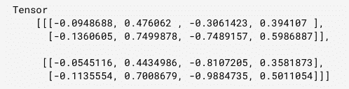

# TensorFlow.js `tf.layers.gru()` 函数

> 原文: [https://www.geeksforgeeks.org/tensorflow-js-tf-layers-gru-function/](https://www.geeksforgeeks.org/tensorflow-js-tf-layers-gru-function/)

TensorFlow.js 是谷歌开发的开源库，用于在浏览器或节点环境中运行机器学习模型和深度学习神经网络。

`tf.layers.gru()` 函数用于创建仅由一个 `GRUCell` 组成的 RNN 层，该层的应用方法对一系列输入张量进行操作。输入张量的形状必须至少是 2D，第一维必须是时间步长。GRU 是门控循环单元。

## 语法

```
tf.layers.gru(args)
```

## 参数

*   **args**: 指定给定的配置对象。
    1.  **recurrentActivation**: 指定将用于重复步骤的激活函数。该参数的默认值为硬 sigmoid。
    2.  **implementation**: 指定实现方式。它可以是 `1` 或 `2`。为了获得卓越的性能，建议实施。

## 返回值

返回一个图层。

## 示例 1

### JavaScript

```
// Importing the tensorflow.js library 
const tf = require("@tensorflow/tfjs");

// Create a RNN model with gru Layer
const RNN = tf.layers.gru({units: 8, returnSequences: true});

// Create an input which will have 5 time steps
const input = tf.input({shape: [5, 10]});
const output = RNN.apply(input);

console.log(JSON.stringify(output.shape));
```

**输出:**

```
[null, 5, 8]
```

## 示例 2

### JavaScript

```
// Importing the tensorflow.js library 
const tf = require("@tensorflow/tfjs");

// Create a new model with gru Layer
const rnn = tf.layers.gru({units: 4, returnSequences: true});

// Create a 3d tensor
const x = tf.tensor3d([
    [
        [1, 2],
        [3, 4],
    ],
    [
        [5, 6],
        [7, 8],
    ],
]);

// Apply gru layer to x
const output = rnn.apply(x);

// Print output
output.print()
```

**输出:**



## 参考资料

[https://js.tensorflow.org/api/1.0.0/#layers.gru](https://js.tensorflow.org/api/1.0.0/#layers.gru)