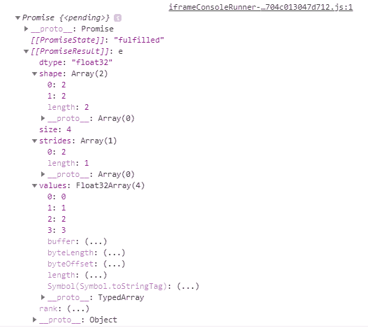
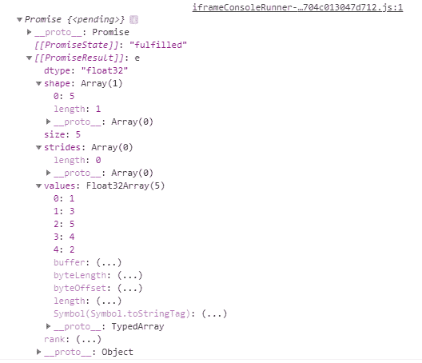

# TensorFlow.js `tf.Tensor` 类 `buffer()` 方法

> 原文：[https://www.geeksforgeeks.org/tensorflow-js-tf-tensor-class-buffer-method/](https://www.geeksforgeeks.org/tensorflow-js-tf-tensor-class-buffer-method/)

**TensorFlow.js** 是谷歌开发的开源库，用于在浏览器或节点环境下运行机器学习模型和深度学习神经网络。它还帮助开发人员用 JavaScript 语言开发 ML 模型，并且可以直接在浏览器或 Node.js 中使用 ML。

`tf.Tensor` 类的 `buffer()` 方法用于返回一个 `tf.TensorBuffer` 的承诺（Promise），该缓冲区保存着底层数据。

## 语法

```
buffer()
```

## 参数

不接受任何参数。

## 返回值

返回 `Promise<tf.TensorBuffer>`。

## 示例 1：创建二维张量

```javascript
const a = tf.tensor2d([[0, 1], [2, 3]])

console.log(a.buffer())
```

**输出：**



## 示例 2

```javascript
const a = tf.tensor([1, 3, 5, 4, 2])

console.log(a.buffer())
```

**输出：**



## 参考

[`https://js.tensorflow.org/api/latest/#tf.Tensor.buffer`](https://js.tensorflow.org/api/latest/#tf.Tensor.buffer)