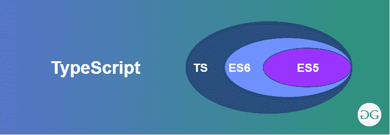

# 如何使用命令行执行 TypeScript 文件？

> 原文: [https://www.geeksforgeeks.org/how-to-execute-typescript-file-using-command-line/](https://www.geeksforgeeks.org/how-to-execute-typescript-file-using-command-line/)



[`TypeScript`](https://www.geeksforgeeks.org/hello-world-in-typescript-language/) 是一种开源编程语言。它由微软开发和维护。TypeScript 在语法上遵循 JavaScript，但增加了更多功能。它是 JavaScript 的超集。为了执行或运行任何类型脚本文件，首先需要安装节点，并使用它在本地系统中全局安装类型脚本。

## Syntax:

要检查节点是否安装好，运行命令如果没有就必须先[安装](https://www.geeksforgeeks.org/installation-of-node-js-on-windows/)它:

```bash
node -v
```

现在安装 TypeScript，使用:

```bash
npm install -g typescript
```

安装 TypeScript 后，创建一个 `.ts` 文件，例如下面给出的 `greet.ts`:

### 例:

```typescript
var greet: string = "Greetings";
var geeks: string = "GeeksforGeeks";
console.log(greet + " from " + geeks);
// save the file as hello.ts
```

### 输出:

```
Greetings from GeeksforGeeks
```

## 过程 1:

这个 TypeScript 文件 `greet.ts` 将在运行时创建一个同名的 JavaScript 文件。要运行任何类型的脚本文件，有几种方法:

**步骤 1:** 首先，使用以下命令运行 TypeScript 文件。这将从 TypeScript 自动创建一个同名的 JavaScript 文件。

```bash
tsc helloWorld.ts
```

**步骤 2:** 现在运行 JavaScript 文件，`greet.ts` 文件将被执行:

```bash
node helloWorld.js
```

## 程序 2:

您可以使用管道符 `|` 和 `&&` 合并这两个命令，如下所示:

**在 Windows:**

```bash
tsc greet.ts | node greet.js
```

**在 Linux 或 MacOS 中:**

```bash
tsc helloWorld.ts && node helloWorld.js
```

## 步骤 3:

您也可以使用以下命令安装 `ts-node` 以及 TypeScript:

### 安装:

```bash
npm install -g ts-node
```

### 运行:

```bash
ts-node helloWorld.ts
```

**输出:** 使用三种方式中的任何一种，输出将保持不变。

```
Greetings from GeeksforGeeks
```