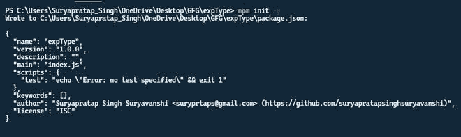
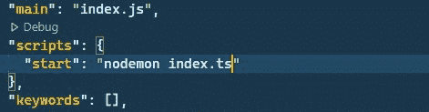
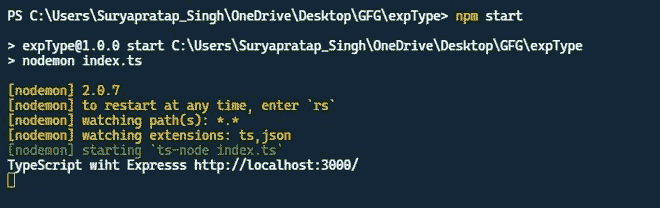
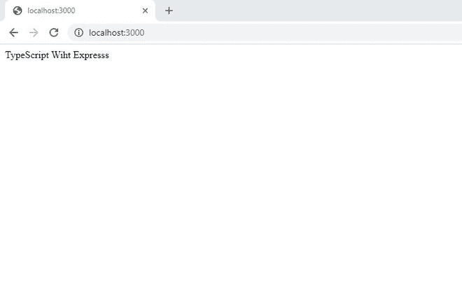

# 如何在 TypeScript 中使用 Express？

> 原文：[https://www.geeksforgeeks.org/how-to-use-express-in-typescript/](https://www.geeksforgeeks.org/how-to-use-express-in-typescript/)

在本文中，我们将看到如何在 `TypeScript` 中使用 `Express`。`TypeScript` 是 `JavaScript` 的超集，它提供了 `JavaScript` 的类型标记，所以我们可以处理我们的服务器，并且非常适合未来的扩展。`Express` 是 `web` 框架，有助于在 `Node.js` 的帮助下创建服务器端处理。

## 先决条件

*   [`NodeJS`](https://www.geeksforgeeks.org/introduction-to-nodejs/) 和 `Express` 的基础知识。
*   `TypeScript` 的基本知识。

## 在 TypeScript 中创建 Express 服务器的步骤

### 步骤 1：初始化项目

使用以下命令用您的工作文件夹启动 `package.json` 文件。

```bash
npm init -y
```

**注意：** `-y` 标志用于进行默认配置。

创建 `package.json` 文件后，下面将输出。



### 步骤 2：安装所需模块

*   为我们的服务器增加一个 `express` 模块。

```bash
npm install express
```

*   添加 `TypeScript` 和 `ts-node` 在 `NodeJS` 上运行 `TypeScript`。

```bash
npm i typescript ts-node nodemon --save-dev
```

**注意：** `--save-dev` 用于添加开发依赖关系。

*   添加类型声明。

```bash
npm i @types/node @types/express
```

### 步骤 3：配置 TypeScript

用下面的代码创建一个 `tsconfig.json` 文件。

```json
{
  "compilerOptions": {
    "target": "es6",
    "module": "commonjs",
    "rootDir": "./",
    "outDir": "./build",
    "esModuleInterop": true,
    "strict": true
  }
}
```

### 步骤 4：修改 `package.json`

在 `package.json` 文件中做如下修改，直接运行 `TypeScript` 脚本。



### 步骤 5：创建服务器文件

用下面的代码创建一个 `index.ts` 文件。在这里，我们用 `TypeScript` 创建了一个最小的 `Express` 服务器。这里，文件名是 `index.ts`。

```typescript
// Import the express in typescript file
import express from 'express';

// Initialize the express engine
const app: express.Application = express();

// Take a port 3000 for running server.
const port: number = 3000;

// Handling '/' Request
app.get('/', (_req, _res) => {
    _res.send("TypeScript Wiht Expresss");
});

// Server setup
app.listen(port, () => {
    console.log(`TypeScript with Express
          http://localhost:${port}/`);
});
```

### 步骤 6：启动服务器

使用以下命令启动服务器。

```bash
npm start
```

### 输出

我们将在终端屏幕上看到以下输出。



### 步骤 7：查看结果

打开浏览器，转到 `http://localhost:3000`，我们会看到如下输出。



## 参考

*   如果你想了解更多关于 `TypeScript` 的知识，请参考 [TypeScript 简介](https://www.geeksforgeeks.org/introduction-to-typescript/) 一文。
*   如果你想了解更多关于 `Express` 的知识，请参考 [Express 简介](https://www.geeksforgeeks.org/introduction-to-express/) 一文。